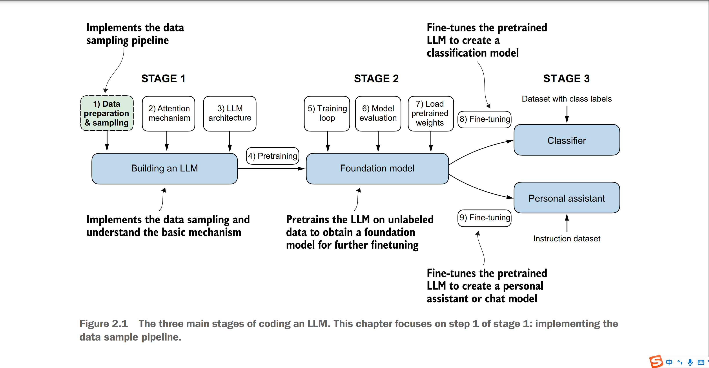
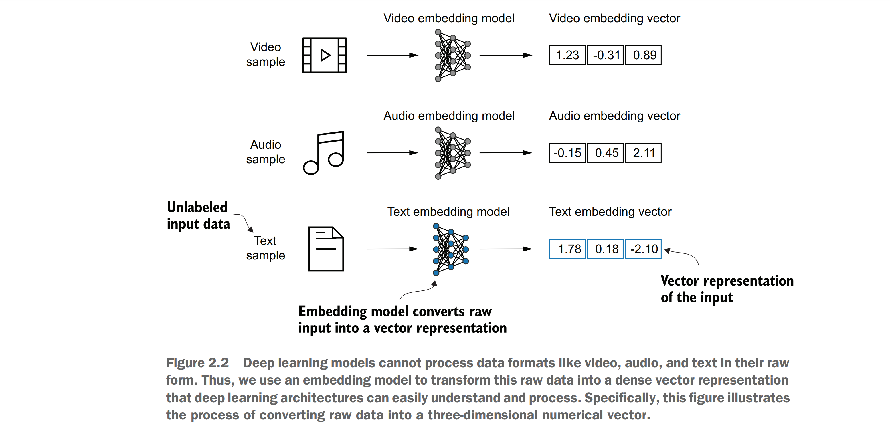
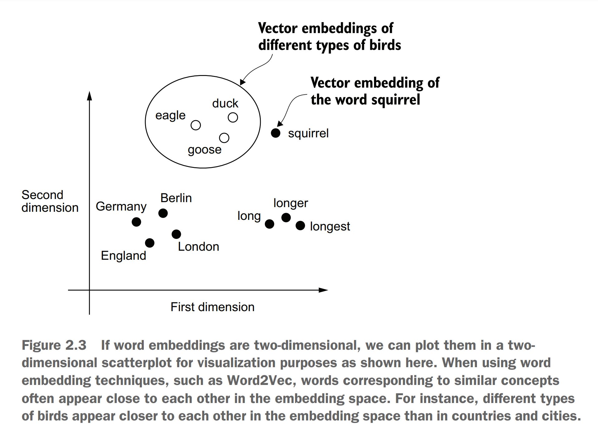

# 本章包含
- 为大语言模型训练准备文本数据
- 将文本拆分为词和字的标记
- 字节对编码作为一种更加高级的文本分词方式
- 采用滑动窗口进行训练样本采样
- 将分词转换为向量用来输入大语言模型
&nbsp;&nbsp;&nbsp;&nbsp;到目前位置我们已经介绍了大语言模型的一般架构并且了解了它是在大量的文本上进行预训练的。具体来说，我们将重点研究基于Transformer并仅具有解码器功能的大语言模型，它们是GPT和其他流行的GPT类大模型的基础。
&nbsp;&nbsp;&nbsp;&nbsp;在预训练的过程中，大语言模型逐字处理文本。通过使用下一个词的预测方式来训练数百万到数十亿参数的大语言模型将会是模型产生出色的能力。这一些模型可以进一步微调以遵循一般指令或执行特定的任务。但是在我们实施和训练大语言模型之前，我们需要准备训练数据集，如图2.1中所示。

你将会续写到如何为训练大语言模型准备输入文本。这包含将文本拆分为单词和字词标记(token),这些标记将会被编码为大语言模型所需要的向量表示。你也会学到像字节对编码这样高级的文本分词方法，他在GPT等流行的大语言模型中被广泛使用。最后我们将实现一种采样和数据加载策略来产生大语言模型训练所需的输入输出对。

## 2.1理解词嵌入
深度神经网络包含大语言模型无法直接处理原始的文本。因为文本时离散的，它与实现和训练神经网络的数学操作不兼容。因此我们需要一种方式将单词表示成连续的向量。
&nbsp;&nbsp;&nbsp;&nbsp;***注意***：对于在计算环境中不熟悉向量和张量的读者，可以在附录A的第A.2.2节了解更多相关信息。
将数据转换为向量格式的概念通常被成为嵌入。通过使用特定的神经网络层或者其他预训练的神经网络模型，我们可以嵌入不同的数据类型比如视频，音频和文本，如图2.2所示。但是值得注意的是不同的数据类型需要特定的嵌入模型。例如为文本设计的嵌入模型就不适用于音频和视频的嵌入。

其核心在于，嵌入是一种将离散对象(如单词，图像甚至整个文档)映射到连续的向量空间中的点的技术，嵌入的主要目的是为了将非数字数据转换为神经网络可以处理的格式。
&nbsp;&nbsp;&nbsp;&nbsp;虽然次嵌入是文本嵌入最常见的形式，但是还有其他的如句子，段落甚至整个文档的嵌入。句子或者段落的嵌入在检索增强型生成中备受欢迎。检索增强型生成结合了生成(如文本生成)和检索(如搜索外部知识库)两个过程，在生成文本时提取相关信息，这是一种超出本书范围的技术。由于我们的目前是训练类似GPT的大语言模型，这些模型学习一次产生一个单词，我们将聚焦在单词嵌入。
&nbsp;&nbsp;&nbsp;&nbsp;为了生存词嵌入已经开发除了一些算法和框架。其中一个比较早且最受欢迎的例子就是Word2Vec方法。Word2Vec通过训练神经网络架构来生成词嵌入，具体做法是通过预测目标词汇的上下文或者反过来根据上下文预测目标词汇。Word2Vec的主要思想是出现在相同上下文中的词汇往往具有相同的含义。因此，当为了可视化目的将词嵌入投影到二维空间时，相似的术语会聚集在一起，如图2.3所示。
&nbsp;&nbsp;&nbsp;&nbsp;词嵌入的维度可以是从一维到数千维度。更高维度可以捕获更多细致入微的关系，但是代价是牺牲计算效率。

虽然我们可以使用预训练模型如Word2Vec来为机器学习模型产生嵌入，但是大语言模型通常都会产生它自己的嵌入层，这些嵌入层是输入层的一部分，并且在训练中会更新。将嵌入层优化成大语言模型的一部分而不是使用Word2Vec的好处是这些嵌入是针对当前特定的任务和数据进行了优化的。我们会在后续的章节中实现这样的嵌入层。(大语言模型也可以创建上下文化的输出嵌入，如我们在第三章中所述)
&nbsp;&nbsp;&nbsp;&nbsp;不幸的是高维嵌入会带来可视化的挑战，因为我们的感官感知和通常的图形表述本质上局限于三维或者更低的维度，这也是为什么图2.3中只显示二维嵌入的原因。然而，在使用大型语言模型（LLMs）时，我们通常使用维度远高于此的嵌入。对于GPT-2和GPT-3来说，嵌入的大小（通常称为模型隐藏状态的维度）会根据具体的模型变体和大小而有所不同。这是性能和效率之间的权衡。以GPT-2的最小模型（1.17亿和1.25亿参数）为例，它们使用768维的嵌入来提供具体实例。而GPT-3中最大的模型（1750亿参数）则使用12,288维的嵌入。
&nbsp;&nbsp;&nbsp;&nbsp;接下来，我们将逐步介绍为大型语言模型（LLM）准备嵌入所需的步骤，这些步骤包括将文本拆分为单词、将单词转换为标记（token），以及将标记转换为嵌入向量。