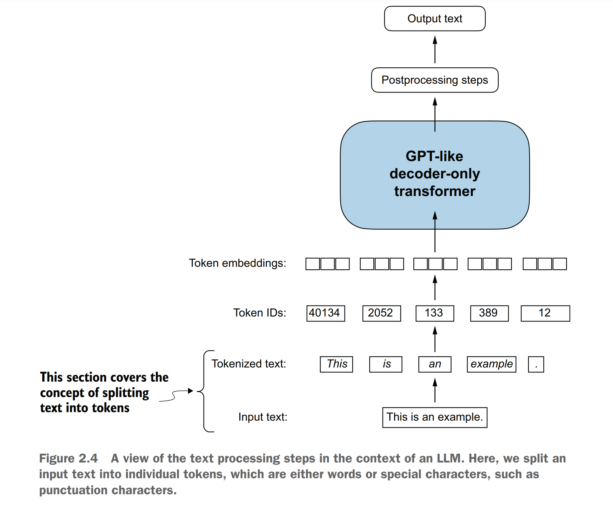
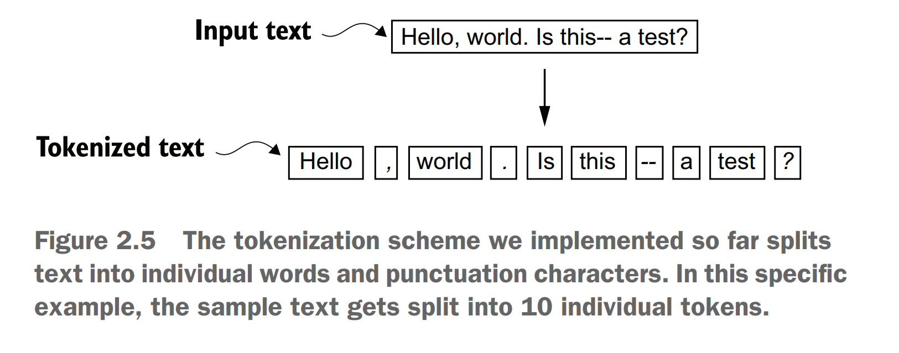

## 2.2文本标记化
让我讨论一下如何将文本拆分为单个的标记，这是为大语言模型生成嵌入的一个必须的预处理步骤。这些标记可以是单个的词，或者是包含标点符号在内的特殊字符，如图2.4所示


您提到要将Edith Wharton的短篇小说《The Verdict》进行分词处理，以用于大型语言模型（LLM）的训练。这篇小说已经处于公有领域，因此可以被用于LLM训练任务。这个文本可以在Wiki下载，https://en.wikisource.org/wiki/The_Verdict，你可以拷贝并且粘贴到一个文本文件，我将它粘贴到了"the-verdict.txt"文本文件。
您提到可以在本书的GitHub仓库，位于https://mng.bz/Adng找到"the-verdict.txt"文本文件。你可以使用如下的python代码下载该文件。
```python
import urllib.request
url = ("https://raw.githubusercontent.com/rasbt/"
 "LLMs-from-scratch/main/ch02/01_main-chapter-code/"
 "the-verdict.txt")
file_path = "the-verdict.txt"
urllib.request.urlretrieve(url, file_path)
```
接下来，我们可以使用Python的标准文件读取工具来加载"the-verdict.txt"文件。
&nbsp;&nbsp;&nbsp;&nbsp;***代码块 2.1 将一部短篇小说作为文本读入的python示例代码***
```python
with open("the-verdict.txt", "r", encoding="utf-8") as f:
 raw_text = f.read()
print("Total number of character:", len(raw_text))
print(raw_text[:99])
```
print命令打印出文件的总字符数以及为了说明目的而展示的前100个字符
```
Total number of character: 20479
I HAD always thought Jack Gisburn rather a cheap genius--though a good fellow
enough--so it was no 
```
我们的目标是将这个20,479个字符的短篇小说进行分词处理，将其拆分成单个的单词和特殊字符，然后可以将这些分词结果转换成用于大型语言模型（LLM）训练的嵌入表示。
&nbsp;&nbsp;&nbsp;&nbsp;***注意***：在使用大型语言模型（LLMs）时，处理数百万篇文章和数十万本书——即数Gb字节的文本——是很常见的。然而，出于教育目的，使用较小的文本样本（如一本书）就足够了，这样可以阐明文本处理步骤背后的主要思想，并使其能够在消费级硬件上以合理的时间运行。
为了将文本拆分成一个标记（token）列表，我们可以采取多种策略。在这里，我们将简要介绍如何使用Python的正则表达式库re来实现这一目标，但请注意，后续我们会转向使用更高级、预构建的分词器。因此，您无需深入学习或记忆正则表达式的具体语法。
&nbsp;&nbsp;&nbsp;&nbsp;借助一段简单的示例文本，我们可以通过re.split命令，并遵循下面的语法规则，根据空白字符（如空格、制表符等）来拆分这段文本。
```python
import re
text = "Hello, world. This, is a test."
result = re.split(r'(\s)', text)
print(result)
```
结果是一个包含单个单词，空格和特殊字符的列表。
```
['Hello,', ' ', 'world.', ' ', 'This,', ' ', 'is', ' ', 'a', ' ', 'test.']
```
这种简单的分词方案基本上可以将示例文本拆分成单个的单词，但是有些单词仍然与标点符号相连，而我们希望这些标点符号能够作为单独的列表项。此外，我们并不将所有文本都转换为小写，因为大写有助于大型语言模型（LLMs）区分专有名词和普通名词，理解句子结构，并学习生成具有正确大写格式的文本。
&nbsp;&nbsp;&nbsp;&nbsp;让我们修改正则表达式，以便根据空白字符（\s）、逗号（,）和句号（.）来进行拆分：
```python
result = re.split(r'([,.]|\s)', text)
print(result)
```
我们可以看到，单词和标点符号现在已经作为单独的列表项分开了，这正是我们想要的：
```
['Hello', ',', '', ' ', 'world', '.', '', ' ', 'This', ',', '', ' ', 'is',' ', 'a', ' ', 'test', '.', '']
```
剩余的一个小问题是，列表中仍然包含了空白字符。我们可以选择安全地移除这些多余的字符，具体方法如下：
```python
result = [item for item in result if item.strip()]
print(result)
```
去除空格字符的结果输出如下：
```
['Hello', ',', 'world', '.', 'This', ',', 'is', 'a', 'test', '.']
```
&nbsp;&nbsp;&nbsp;&nbsp;***注意***：在开发一个简单的分词器时，是否将空白字符编码为单独的字符还是直接移除它们，这取决于我们的应用程序及其需求。移除空白字符可以减少内存和计算需求。然而，如果我们训练的是对文本精确结构敏感的模型（例如，对缩进和空格敏感的Python代码），那么保留空白字符可能是有用的。在这里，为了简洁和分词输出的简洁性，我们选择移除空白字符。稍后，我们将切换到一种包含空白字符的分词方案。
我们在这里设计的分词方案在简单的示例文本上效果很好。让我们对其进行一些进一步的修改，以便它也能够处理其他类型的标点符号，比如问号、引号，以及我们在埃迪丝·华顿短篇小说前100个字符中看到的双破折号，还有一些其他的特殊字符。
```python
text = "Hello, world. Is this-- a test?"
result = re.split(r'([,.:;?_!"()\']|--|\s)', text)
result = [item.strip() for item in result if item.strip()]
print(result)
```
输出结果如下：
```
['Hello', ',', 'world', '.', 'Is', 'this', '--', 'a', 'test', '?']
```
根据图2.5中总结的结果，我们可以看到，我们的分词方案现在已经能够成功地处理文本中的各种特殊字符了。

现在我们已经有了一个基本的分词器，让我们将其应用于埃迪丝·华顿的整个短篇小说：
```python
preprocessed = re.split(r'([,.:;?_!"()\']|--|\s)', raw_text)
preprocessed = [item.strip() for item in preprocessed if item.strip()]
print(len(preprocessed))
```
这条打印语句输出了4690，这是该文本中token的数量（不包括空白字符）。为了快速进行视觉检查，我们打印出前30个token：
```
print(preprocessed[:30])
```
输出结果显示，我们的分词器似乎很好地处理了文本，因为所有的单词和特殊字符都被整齐地分开了。
```
['I', 'HAD', 'always', 'thought', 'Jack', 'Gisburn', 'rather', 'a','cheap', 'genius', '--', 'though', 'a', 'good', 'fellow', 'enough','--', 'so', 'it', 'was', 'no', 'great', 'surprise', 'to', 'me', 'to','hear', 'that', ',', 'in']
```