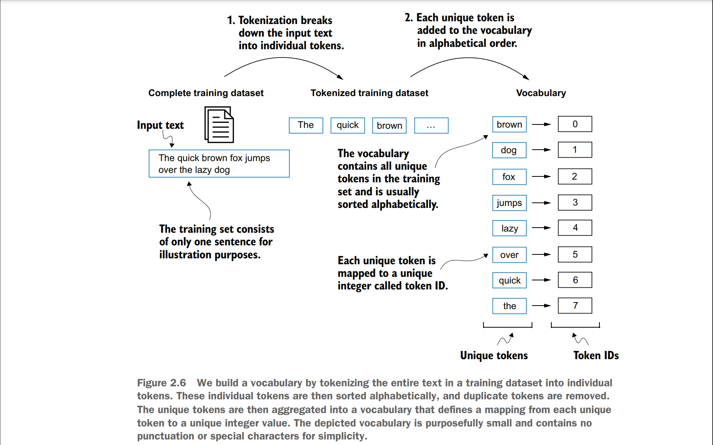
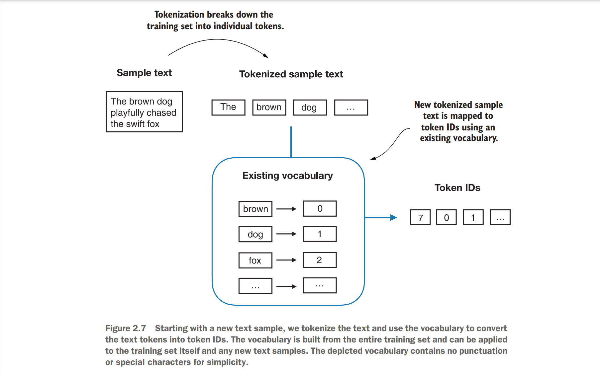
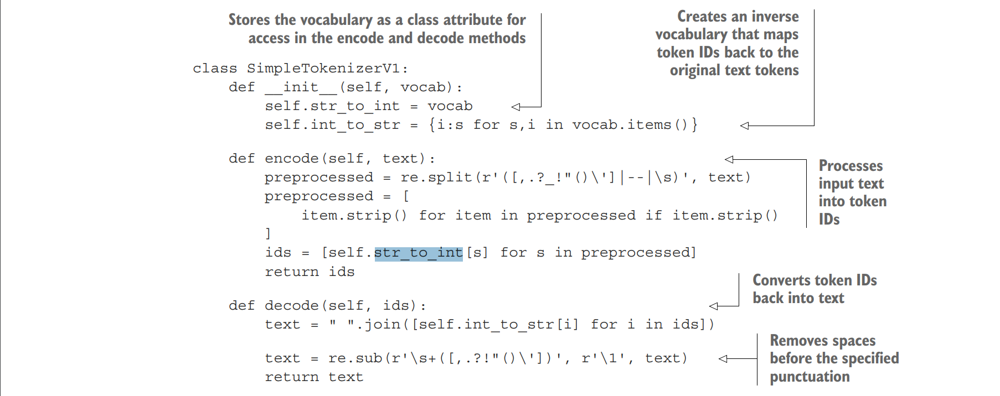
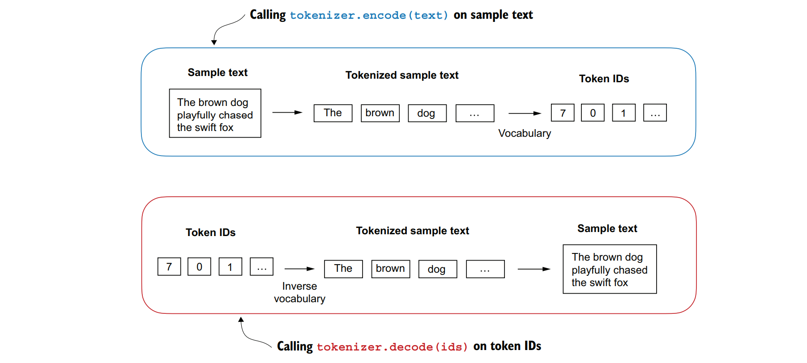

## 2.3将标记转换为ID
接下来，让我们将这些来自Python字符串的标记转换为整数表示，以生成标记ID。这一转换是将标记ID转换为嵌入向量之前的中间步骤。
&nbsp;&nbsp;&nbsp;&nbsp;为了将之前生成的标记映射到标记ID，我们首先需要构建一个词汇表。这个词汇表定义了如何将每个唯一的单词和特殊字符映射到一个唯一的整数，如图2.6所示。

既然我们已经将Edith Wharton的短篇小说进行了标记化处理，并将其分配给了一个名为preprocessed的Python变量，接下来我们将创建一个包含所有唯一标记的列表，并按字母顺序对其进行排序，以确定词汇表的大小:
```python
all_words = sorted(set(preprocessed))
vocab_size = len(all_words)
print(vocab_size)
```
在通过代码确定词汇表大小为1,130之后，我们将创建这个词汇表，并为了说明目的，打印出其前51个条目。
&nbsp;&nbsp;&nbsp;&nbsp;***代码块 2.2 创建单词表***
```python
vocab = {token:integer for integer,token in enumerate(all_words)}
for i, item in enumerate(vocab.items()):
 print(item)
 if i >= 50:
 break
```
代码输出如下:
```
('!', 0)
('"', 1)
("'", 2)
...
('Her', 49)
('Hermia', 50)
```
正如我们所见，该字典包含了与唯一整数标签相关联的单个标记。我们的下一个目标是将此词汇表应用于将新文本转换为标记ID（如图2.7所示）。

当我们想要将大型语言模型（LLM）的输出从数字转换回文本时，我们需要一种方法将标记ID转换回对应的文本标记。为此，我们可以创建一个词汇表的逆版本，它将标记ID映射回对应的文本标记。
&nbsp;&nbsp;&nbsp;&nbsp;下面是一个完整的Python分词器类的实现，它包含了一个encode方法用于将文本拆分成标记并通过词汇表进行字符串到整数的映射以生成标记ID，以及一个decode方法用于执行反向的整数到字符串的映射以将标记ID转换回文本。以下是该分词器实现的代码：
&nbsp;&nbsp;&nbsp;&nbsp;***代码块 2.3 实现一个简单的分词器***

使用SimpleTokenizerV1这个Python类，我们现在可以通过一个已存在的词汇表来实例化新的分词器对象，然后利用这个对象对文本进行编码和解码，正如图2.8所展示的那样。
&nbsp;&nbsp;&nbsp;&nbsp;接下来，我们将从SimpleTokenizerV1类中实例化一个新的分词器对象，并对Edith Wharton短篇小说中的一段文字进行分词实践，以检验其效果。
```python
tokenizer = SimpleTokenizerV1(vocab)
text = """"It's the last he painted, you know,"
 Mrs. Gisburn said with pardonable pride."""
ids = tokenizer.encode(text)
print(ids)
```
前面的代码会打印出以下标记ID（token IDs）：
```
[1, 56, 2, 850, 988, 602, 533, 746, 5, 1126, 596, 5, 1, 67, 7, 38, 851, 1108,
754, 793, 7]
```
接下来，让我们看看是否可以使用decode方法将这些标记ID转换回文本。
```python
print(tokenizer.decode(ids))
```

图2.8&nbsp;&nbsp;&nbsp;&nbsp;所示的分词器实现通常包含两个通用方法：encode方法和decode方法。encode方法负责接收输入的样本文本，然后将其拆分成单独的标记（tokens），并通过词汇表将这些标记转换为相应的标记ID。这一过程是文本数据预处理中的重要步骤，特别是在需要将文本输入到机器学习模型时。
上述代码输出如下：
```
'" It\' s the last he painted, you know," Mrs. Gisburn said with
pardonable pride.'
```
基于这个输出结果，我们可以确认decode方法成功地将标记ID转换回了原始文本。
&nbsp;&nbsp;&nbsp;&nbsp;到目前为止，一切顺利。我们已经实现了一个能够根据训练集片段对文本进行分词和解分词的分词器。现在，让我们将其应用于一个未包含在训练集中的新文本样本:
```python
text = "Hello, do you like tea?"
print(tokenizer.encode(text))
```
执行改代码会导致如下错误：
```
KeyError: 'Hello'
```
&nbsp;&nbsp;&nbsp;&nbsp;问题在于，“Hello”这个词并未在“The Verdict”这篇短篇小说中出现，因此它并未被纳入词汇表中。这再次强调了在使用大型语言模型（LLMs）时，为了扩展词汇表，需要采用规模庞大且内容多样的训练数据集。
&nbsp;&nbsp;&nbsp;&nbsp;接下来，我们将进一步测试分词器在处理包含未知词汇的文本时的表现，并探讨在训练大型语言模型（LLM）时，可以使用哪些额外的特殊标记来提供更多的上下文信息。

## 2.4增加特殊的上下文标记