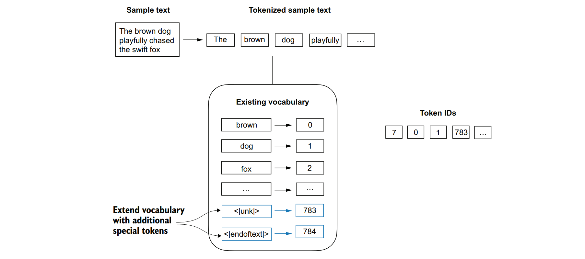
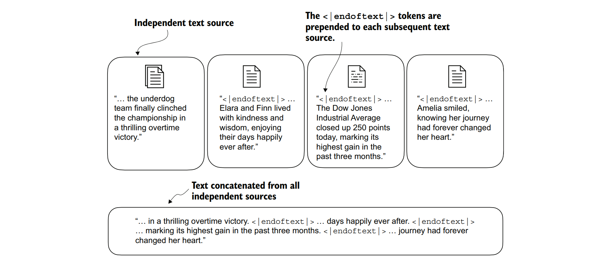

## 2.4增加特殊的上下文标记
我们需要对分词器进行修改，以便处理未知词汇。同时，我们还需要解决特殊上下文标记的使用和添加问题，这些标记能够增强模型对文本中上下文或其他相关信息的理解。这些特殊标记可以包括未知词汇标记和文档边界标记等。具体来说，我们将修改词汇表和名为SimpleTokenizerV2的分词器，以支持两个新标记：<|unk|> 和 <|endoftext|>，如图2.9所示。


<p >图2.9 我们向词汇表中添加特殊标记以处理特定上下文。例如，我们添加了一个<|unk|>标记，用于表示那些不属于训练数据、因此也不属于现有词汇表的新词汇或未知词汇。此外，我们还添加了一个<|endoftext|>标记，它可以用来分隔两个不相关的文本源。</p>

我们可以修改分词器，以便在遇到不属于词汇表的词汇时，使用<|unk|>标记来表示该未知词汇。此外，我们还可以在不相关的文本之间添加一个标记。例如，在训练类似GPT的大型语言模型（LLM）时，如果处理的是多个独立的文档或书籍，通常会在每个文档或书籍之前插入一个标记，以区分它之前的文本源，如图2.10所示。这样做有助于LLM理解，尽管这些文本源在训练时被连接在一起，但它们实际上是相互独立的。


图2.10 当处理多个独立的文本源时，我们在这些文本之间添加<|endoftext|>标记。这些<|endoftext|>标记作为标识符，指示特定段落的开始或结束，从而使大型语言模型（LLM）能够更有效地处理和理解文本。

现在，让我们通过将所有独特的单词列表中添加这两个特殊标记 <unk> 和 <|endoftext|> 来修改词汇表。

```python
all_tokens = sorted(list(set(preprocessed)))
all_tokens.extend(["<|endoftext|>", "<|unk|>"])
vocab = {token:integer for integer,token in enumerate(all_tokens)}
print(len(vocab.items()))
```

基于这个打印语句的输出，新的词汇表大小是1,132（之前的词汇表大小是1,130）。为了进行额外的快速检查，让我们打印更新后的词汇表中的最后五个条目。

```python
for i, item in enumerate(list(vocab.items())[-5:]):
 print(item)
```

代码输出如下：

```
('younger', 1127)
('your', 1128)
('yourself', 1129)
('<|endoftext|>', 1130)
('<|unk|>', 1131)
```

根据代码输出，我们可以确认这两个新的特殊标记确实已经成功地被纳入了词汇表中。接下来，我们将根据代码列表2.3对分词器进行相应的调整，如下面的代码列表所示。

***代码块2.4 一个处理未知词汇的简单分词器***

```python
class SimpleTokenizerV2:
 def __init__(self, vocab):
 self.str_to_int = vocab
 self.int_to_str = { i:s for s,i in vocab.items()}

 def encode(self, text):
 preprocessed = re.split(r'([,.:;?_!"()\']|--|\s)', text)
 preprocessed = [
 item.strip() for item in preprocessed if item.strip()
 ]
 preprocessed = [item if item in self.str_to_int
 else "<|unk|>" for item in preprocessed]
 ids = [self.str_to_int[s] for s in preprocessed]
 return ids

 def decode(self, ids):
 text = " ".join([self.int_to_str[i] for i in ids])
 text = re.sub(r'\s+([,.:;?!"()\'])', r'\1', text)
 return text
 ```

 与我们之前在代码列表2.3中实现的SimpleTokenizerV1相比，新的SimpleTokenizerV2将未知单词替换为<unk>标记。现在，让我们在实践中尝试使用这个新的分词器。为此，我们将使用一个简单的文本样本，该样本由两个独立且无关的句子拼接而成：

```python
text1 = "Hello, do you like tea?"
text2 = "In the sunlit terraces of the palace."
text = " <|endoftext|> ".join((text1, text2))
print(text)
```

代码输出如下：
```
Hello, do you like tea? <|endoftext|> In the sunlit terraces of
the palace.
```

现在，让我们使用SimpleTokenizerV2和假设的列表2.2中的词汇表来对示例文本进行分词。
```python
tokenizer = SimpleTokenizerV2(vocab)
print(tokenizer.encode(text))
```

代码输出如下ID：
```
[1131, 5, 355, 1126, 628, 975, 10, 1130, 55, 988, 956, 984, 722, 988, 1131, 7]
```

我们可以观察到，这个token ID列表中包含了用于<|endoftext|>分隔符标记的ID 1130，以及两个用于未知单词的ID 1131。
&nbsp;&nbsp;&nbsp;&nbsp;现在，让我们对文本进行反分词操作，以进行快速的一致性检查。

```python
print(tokenizer.decode(tokenizer.encode(text)))
```

代码输出如下：
```
<|unk|>, do you like tea? <|endoftext|> In the sunlit terraces of
the <|unk|>.
```

通过对比反分词后的文本与原始输入文本，我们可以确认，训练数据集——伊迪丝·华顿的短篇小说《裁决》（"The Verdict"）中，并未包含“Hello”和“palace”这两个单词。

&nbsp;&nbsp;&nbsp;&nbsp;根据所使用的大型语言模型（LLM），一些研究人员还会考虑引入以下额外的特殊标记：

- [BOS]（序列开始）——此标记用于标识文本的起始位置。它向LLM指示一段内容的开始。
- [EOS]（序列结束）——此标记位于文本的末尾，特别适用于连接多个不相关的文本时，类似于<|endoftext|>。例如，在合并两篇不同的维基百科文章或书籍时，[EOS]标记可以指示一篇文章的结束和下一篇文章的开始。
- [PAD]（填充）——在训练具有大于1的批大小的大型语言模型时，批中可能包含长度不同的文本。为了确保所有文本具有相同的长度，较短的文本会使用[PAD]标记进行扩展或“填充”，直到达到批中最长文本的长度。

为GPT模型所用的分词器其实并不需要上述提及的多数特殊标记；为了简化处理，它仅采用了<|endoftext|>这一标记。<|endoftext|>的作用与[EOS]（序列结束）标记相似，均用于标识文本的结尾。同时，<|endoftext|>也被用于填充（padding）操作。但正如我们将在后续章节中探讨的那样，在进行批量输入训练时，我们通常会使用一个掩码（mask），这意味着模型在处理时不会关注那些被填充的标记。因此，具体选用哪个标记作为填充就变得无关紧要了。

&nbsp;&nbsp;&nbsp;&nbsp;此外，为GPT模型所用的分词器也不会为词汇表外的单词使用<|unk|>标记。相反，GPT模型采用的是字节对编码（Byte Pair Encoding, BPE）分词器，该分词器会将单词拆分成子词单元（subword units）。我们将在接下来详细讨论这一点。
