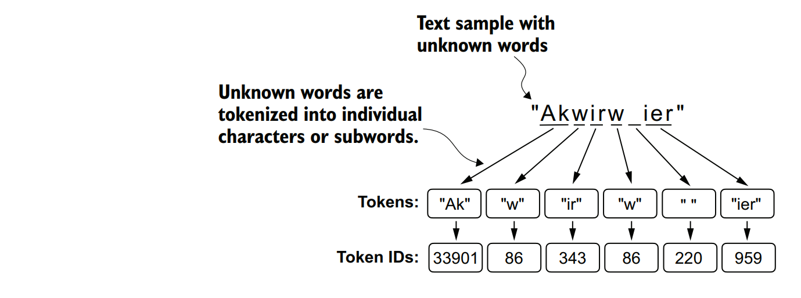

### 字节对编码
让我们来看看一种更复杂的基于字节对编码（Byte Pair Encoding，简称BPE）的分词方案。BPE分词器被用于训练诸如GPT-2、GPT-3以及ChatGPT原始模型等大型语言模型（LLMs）。

&nbsp;&nbsp;&nbsp;&nbsp;由于实现BPE可能相对复杂，我们将使用一个名为tiktoken的现有Python开源库，该库基于Rust源代码高效地实现了BPE算法。与其他Python库类似，我们可以通过Python的pip安装程序从终端安装tiktoken库。

```shell
pip install tiktoken
```

以下是我们将要使用的代码，它基于tiktoken 0.7.0版本。您可以使用以下代码来检查您当前已安装的版本：

```python
from importlib.metadata import version
import tiktoken
print("tiktoken version:", version("tiktoken"))
```

一旦安装完成，我们可以按照以下方式从tiktoken中实例化BPE分词器：

```python
tokenizer = tiktoken.get_encoding("gpt2")
```

这个分词器的使用方法与我们之前通过encode方法实现的SimpleTokenizerV2类似。

```python
text = (
 "Hello, do you like tea? <|endoftext|> In the sunlit terraces"
 "of someunknownPlace."
)
integers = tokenizer.encode(text, allowed_special={"<|endoftext|>"})
print(integers)
```

代码将打印出以下token IDs：
```
[15496, 11, 466, 345, 588, 8887, 30, 220, 50256, 554, 262, 4252, 18250,
 8812, 2114, 286, 617, 34680, 27271, 13]
```

随后，我们可以使用decode方法将token IDs转换回文本，这与我们之前实现的SimpleTokenizerV2分词器的功能相似。

```python
strings = tokenizer.decode(integers)
print(strings)
```

代码输出如下:
```
Hello, do you like tea? <|endoftext|> In the sunlit terraces of
 someunknownPlace.
```

&nbsp;&nbsp;&nbsp;&nbsp;基于token IDs和解码后的文本，我们可以得出两个值得关注的观察结果。首先，<|endoftext|>这个特殊token被分配了一个相对较大的token ID，即50256。实际上，用于训练诸如GPT-2、GPT-3以及ChatGPT原始模型等模型的BPE分词器，其总词汇量大小为50,257。在这个词汇表中，<|endoftext|>被分配了最大的token ID，即它是词汇表中的最后一个元素，其ID为50256。
&nbsp;&nbsp;&nbsp;&nbsp;第二点值得注意的是，BPE（Byte Pair Encoding，字节对编码）分词器能够正确地对诸如someunknownPlace这样的未知单词进行编码和解码。BPE分词器具备处理任何未知单词的能力，而且它并不需要使用<|unk|>（未知单词）这样的特殊标记来实现这一点。那么，BPE分词器是如何在不使用<|unk|>标记的情况下实现这一点的呢？
&nbsp;&nbsp;&nbsp;&nbsp;BPE（Byte Pair Encoding，字节对编码）算法背后的原理是将不在其预定义词汇表中的单词分解成更小的子词单元，甚至是单个字符，从而使其能够处理词汇表外的单词。因此，得益于BPE算法，当分词器在分词过程中遇到不熟悉的单词时，它可以将其表示为一系列子词标记或字符的组合，如图2.11所示。


图2.11 BPE分词器将未知词汇分解为字词和单个字符。如此，BPE分词器可以解析任意词汇，并且无需使用诸如<|unk|>这样的特殊标记来替换这些未知单词。

将未知单词分解成单个字符的能力确保了分词器以及随后使用它训练的LLM（大型语言模型）能够处理任何文本，即使文本中包含训练数据中未出现的单词。

***练习2.1 未知词汇字节对编码***
要使用tiktoken库中的BPE分词器来处理未知单词“Akwirw ier”，并打印出各个标记的ID，然后通过这些整数ID调用解码函数来重现图2.11中所示的映射，最后通过标记ID的解码方法来检查是否能重构原始输入“Akwirw ier”

关于BPE（Byte Pair Encoding，字节对编码）的详细讨论和实现超出了本书的范围，但简而言之，BPE是通过迭代地将频繁出现的字符合并成子词，再将频繁出现的子词合并成单词来构建其词汇表的。BPE的过程通常从将所有单个字符添加到词汇表中开始，例如“a”、“b”等。在下一阶段，BPE会合并那些经常一起出现的字符组合，形成子词。例如，“d”和“e”可能会被合并成子词“de”，这在许多英语单词中都很常见，如“define”、“depend”、“made”和“hidden”等。这些合并操作是基于频率阈值来确定的。