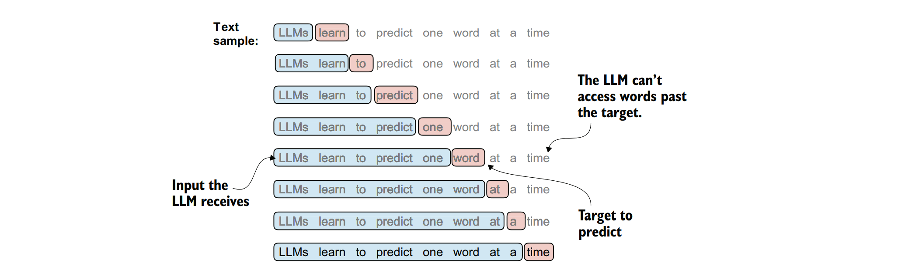
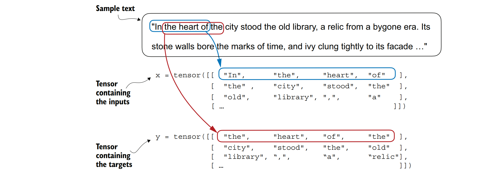
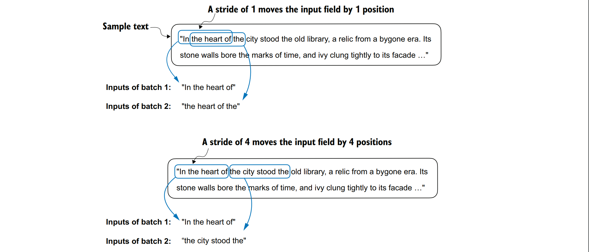

### 滑动窗口数据采样
&nbsp;&nbsp;&nbsp;&nbsp;在创建大型语言模型（LLM）的嵌入时，下一步是生成训练LLM所需的输入-目标对。这些输入-目标对具体是什么样子的呢？如我们已知，大型语言模型通常通过预测文本中的下一个词来进行预训练，如图2.12所示。


&nbsp;&nbsp;&nbsp;&nbsp;***图2.12描述了一个场景，其中给定一个文本样本，我们从中提取出输入块作为大型语言模型（LLM）的输入子样本。在训练过程中，LLM&nbsp;&nbsp;&nbsp;&nbsp;的预测任务是预测每个输入块之后紧接着的下一个词。在训练时，我们会掩码掉所有超过目标位置的词。需要注意的是，虽然图中展示的文本&nbsp;&nbsp;&nbsp;&nbsp;在LLM处理之前需要经过令牌化（即将文本转换为模型可以理解的数值表示或令牌序列），但为了清晰起见，图中省略了令牌化步骤。***

&nbsp;&nbsp;&nbsp;&nbsp;为了实施一个数据加载器，该加载器将使用滑动窗口方法从训练数据集中获取图2.12中所示的输入-目标对，我们首先需要对整个短篇小说《The Verdict》进行令牌化（tokenization），这里我们使用BPE（Byte-Pair Encoding，字节对编码）令牌化器

```python
with open("the-verdict.txt", "r", encoding="utf-8") as f:
 raw_text = f.read()
enc_text = tokenizer.encode(raw_text)
print(len(enc_text))
```

&nbsp;&nbsp;&nbsp;&nbsp;既然执行代码后，应用BPE令牌化器得到了训练集中的总令牌数为5145，并且为了演示目的，我们决定从数据集中移除前50个令牌，以在后续步骤中获得一个稍微更有意思的文本段落。

```python
enc_sample = enc_text[50:]
```

&nbsp;&nbsp;&nbsp;&nbsp;为下一个词预测任务创建输入-目标对的最简单且最直观的方法之一，是创建两个变量x和y。其中，x包含输入令牌（tokens），而y包含目标令牌，这些目标令牌是输入令牌向右移动（或称为“偏移”）一个位置后的结果。

```python
context_size = 4
x = enc_sample[:context_size]
y = enc_sample[1:context_size+1]
print(f"x: {x}")
print(f"y: {y}")
```

&nbsp;&nbsp;&nbsp;&nbsp;上述代码运行将输出如下结果：

```
x: [290, 4920, 2241, 287]
y: [4920, 2241, 287, 257]
```

&nbsp;&nbsp;&nbsp;&nbsp;通过处理输入以及目标（即输入向右移动一个位置后的结果），我们可以创建下一个词预测任务（如图2.12所示）。

```python
for i in range(1, context_size+1):
 context = enc_sample[:i]
 desired = enc_sample[i]
 print(context, "---->", desired)
```

&nbsp;&nbsp;&nbsp;&nbsp;代码输出如下：
```
[290] ----> 4920
[290, 4920] ----> 2241
[290, 4920, 2241] ----> 287
[290, 4920, 2241, 287] ----> 257
```

&nbsp;&nbsp;&nbsp;&nbsp;箭头（---->）左侧的内容指的是大型语言模型（LLM）会接收到的输入，而箭头右侧的数字则代表LLM应该预测的目标令牌ID。” 让我们重复之前的代码，但这次将令牌ID转换回文本形式：

```python
for i in range(1, context_size+1):
 context = enc_sample[:i]
 desired = enc_sample[i]
 print(tokenizer.decode(context), "---->", tokenizer.decode([desired]))
```

&nbsp;&nbsp;&nbsp;&nbsp;以下输出展示了输入和输出在文本格式下的样子:
```
 and ----> established
 and established ----> himself
 and established himself ----> in
 and established himself in ----> a
```

&nbsp;&nbsp;&nbsp;&nbsp;我们现在已经创建了可以用于大型语言模型（LLM）训练的输入-目标对。

&nbsp;&nbsp;&nbsp;&nbsp;在我们能够将令牌转换成嵌入向量之前，还有最后一项任务：实现一个高效的数据加载器。这个数据加载器将遍历输入数据集，并返回作为PyTorch张量（可以视为多维数组）的输入和目标。我们特别感兴趣的是返回两个张量：一个包含大型语言模型（LLM）所看到的文本的输入张量，以及一个包含LLM需要预测的目标的张量，如图2.13所示。尽管为了说明目的，图中以字符串形式展示了令牌，但代码实现将直接操作令牌ID，因为BPE分词器的encode方法会同时执行分词和转换成令牌ID这两个步骤



***图2.13 描述了一种高效实现数据加载器的方法，其中我们将输入收集到一个张量 x 中，每一行代表一个输入上下文。另一个张量 y 包含相应的预测目标（即下一个词），这是通过将输入向右移动一个位置来创建的。***

***注意： 为了实现高效的数据加载器，我们将使用PyTorch内置的Dataset和DataLoader类。关于安装PyTorch的额外信息和指导，请参见附录A中的第A.2.1.3节。***

***代码块2.5 输入和目标批次数据加载器***
```python
import torch
from torch.utils.data import Dataset, DataLoader
class GPTDatasetV1(Dataset):
 def __init__(self, txt, tokenizer, max_length, stride):
    self.input_ids = []
    self.target_ids = []
    token_ids = tokenizer.encode(txt)
    for i in range(0, len(token_ids) - max_length, stride):
        input_chunk = token_ids[i:i + max_length]
        target_chunk = token_ids[i + 1: i + max_length + 1]
        self.input_ids.append(torch.tensor(input_chunk))
        self.target_ids.append(torch.tensor(target_chunk))
 
 def __len__(self):
    return len(self.input_ids)
 def __getitem__(self, idx):
    return self.input_ids[idx], self.target_ids[idx]
```

&nbsp;&nbsp;&nbsp;&nbsp;GPTDatasetV1 类是基于 PyTorch 的 Dataset 类构建的，它定义了如何从数据集中获取单个行（样本），其中每一行由一个分配给 input_chunk 张量的令牌ID序列（基于 max_length 参数）组成。target_chunk 张量则包含相应的目标值。我建议您继续阅读，以了解当我们将这个数据集与 PyTorch 的 DataLoader 结合使用时，返回的数据是什么样的——这将为您提供更多的直观理解和清晰度。

&nbsp;&nbsp;&nbsp;&nbsp;***注意：如果您对PyTorch Dataset类的结构还不熟悉，比如列表2.5中所示的内容，请参考附录A中的第A.6节。该节将解释PyTorch Dataset和DataLoader类的一般结构和用法。***

&nbsp;&nbsp;&nbsp;&nbsp;以下代码示例展示了如何使用GPTDatasetV1类通过PyTorch的DataLoader来按批次加载输入数据。

***代码2.6：生成包含输入对的数据批次的数据加载器***
```python
def create_dataloader_v1(
    txt,
    batch_size=4,
    max_length=256,
    stride=128,
    shuffle=True,
    drop_last=True,
    num_workers=0,
):
    tokenizer = tiktoken.get_encoding("gpt2")
    dataset = GPTDatasetV1(txt, tokenizer, max_length, stride)
    dataloader = DataLoader(
        dataset,
        batch_size=batch_size,
        shuffle=shuffle,
        drop_last=drop_last,
        num_workers=num_workers,
    )
    return dataloader
```

&nbsp;&nbsp;&nbsp;&nbsp;为了测试数据加载器并直观地理解GPTDatasetV1类（来自列表2.5的假设类）和create_dataloader_v1函数（来自列表2.6的假设函数）是如何协同工作的，我们将构建一个简化的示例。在这个示例中，我们将使用批次大小为1的数据加载器，并且假设大型语言模型（LLM）的上下文大小为4

```python
with open("the-verdict.txt", "r", encoding="utf-8") as f:
    raw_text = f.read()
dataloader = create_dataloader_v1(raw_text, batch_size=1, max_length=4, stride=1, shuffle=False)
data_iter = iter(dataloader)
first_batch = next(data_iter)
print(first_batch)
```

&nbsp;&nbsp;&nbsp;&nbsp;代码执行输出如下：
```
[tensor([[ 40, 367, 2885, 1464]]), tensor([[ 367, 2885, 1464, 1807]])]
```

&nbsp;&nbsp;&nbsp;&nbsp;first_batch变量包含两个张量：第一个张量存储输入令牌ID，第二个张量存储目标令牌ID。由于max_length（最大长度）被设置为4，因此这两个张量中的每一个都包含四个令牌ID。请注意，输入大小为4是相当小的，这里仅为了简化而选择。在实际中，训练大型语言模型（LLMs）时，输入大小通常为至少256。为了理解stride=1的含义，让我们从数据集中获取另一个批次：

```python
second_batch = next(data_iter)
print(second_batch)
```
第二个批次的内容如下：
```
[tensor([[ 367, 2885, 1464, 1807]]), tensor([[2885, 1464, 1807, 3619]])]
```
如果我们比较第一个和第二个批次，可以发现第二个批次的令牌ID相对于第一个批次移动了一个位置（例如，第一个批次输入中的第二个ID是367，它是第二个批次输入中的第一个ID）。stride设置决定了输入在不同批次之间移动的位置数，这模拟了一种滑动窗口的方法，如图2.14所示。

&nbsp;&nbsp;&nbsp;&nbsp;***练习2.2：使用不同步长和上下文大小的数据加载器***
&nbsp;&nbsp;&nbsp;&nbsp;***为了更直观地理解数据加载器的工作原理，请尝试使用不同的设置来运行它，例如设置max_length=2且stride=2，以及max_length=8且stride=2。***

&nbsp;&nbsp;&nbsp;&nbsp;在深度学习中，像我们从数据加载器中迄今为止所采样的那样，使用批量大小为1的情况主要用于说明目的。如果你有深度学习的经验，你可能会知道，较小的批量大小在训练期间需要的内存较少，但会导致模型更新更加嘈杂。就像在传统的深度学习中一样，批量大小是一个权衡因素，也是在训练大型语言模型（LLMs）时需要实验的超参数。


&nbsp;&nbsp;&nbsp;&nbsp;***图2.14 从输入数据集中创建多个批次时，我们在文本上滑动一个输入窗口。如果步长设置为1，则在创建下一个批次时，我们将输入窗口移动一个位置。如果我们将步长设置为等于输入窗口大小，则可以防止批次之间重叠。***

&nbsp;&nbsp;&nbsp;&nbsp;当我们想要使用数据加载器以大于1的批量大小进行采样时，我们需要对数据加载器的配置进行一些调整.

```python
dataloader = create_dataloader_v1(
 raw_text, batch_size=8, max_length=4, stride=4,
 shuffle=False
)
data_iter = iter(dataloader)
inputs, targets = next(data_iter)
print("Inputs:\n", inputs)
print("\nTargets:\n", targets)
```

&nbsp;&nbsp;&nbsp;&nbsp;代码输出：
```
Inputs:
 tensor([[ 40, 367, 2885, 1464],
 [ 1807, 3619, 402, 271],
 [10899, 2138, 257, 7026],
 [15632, 438, 2016, 257],
 [ 922, 5891, 1576, 438],
 [ 568, 340, 373, 645],
 [ 1049, 5975, 284, 502],
 [ 284, 3285, 326, 11]])
Targets:
 tensor([[ 367, 2885, 1464, 1807],
 [ 3619, 402, 271, 10899],
 [ 2138, 257, 7026, 15632],
 [ 438, 2016, 257, 922],
 [ 5891, 1576, 438, 568],
 [ 340, 373, 645, 1049],
 [ 5975, 284, 502, 284],
 [ 3285, 326, 11, 287]])
 ```

 &nbsp;&nbsp;&nbsp;&nbsp;这里需要注意的是，我们将步长（stride）增加到4，是为了充分利用数据集（即不跳过任何一个单词）。这样做的好处是可以避免批次之间出现过多的重叠，因为过多的重叠可能会导致模型在训练过程中更容易过拟合。