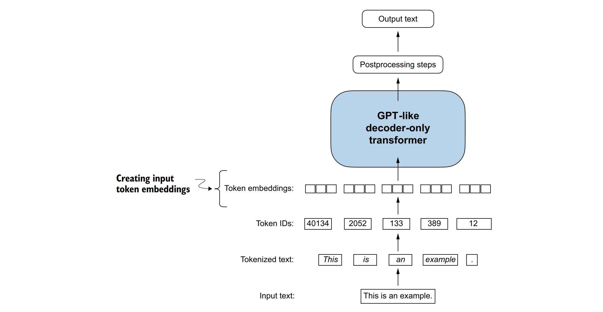
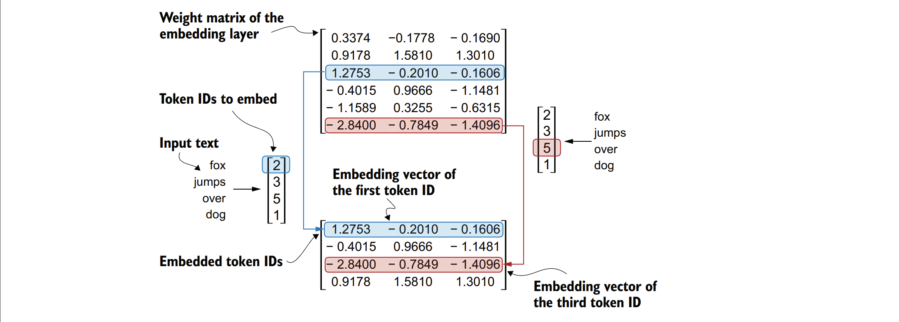
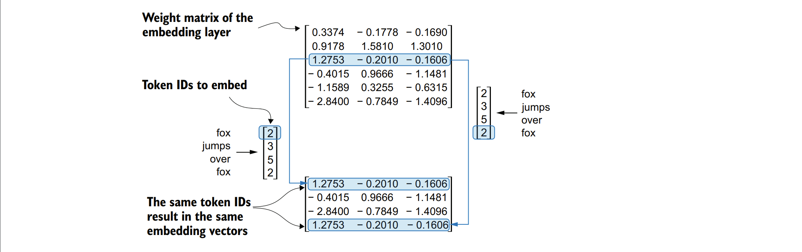
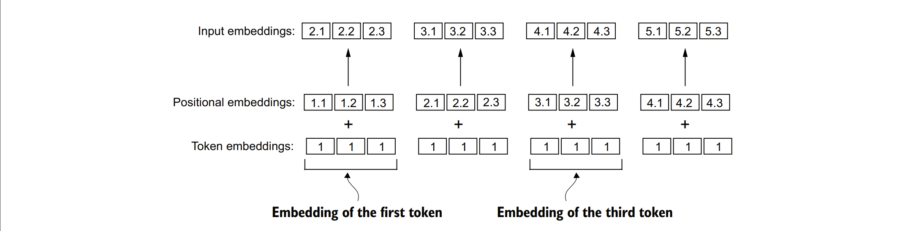
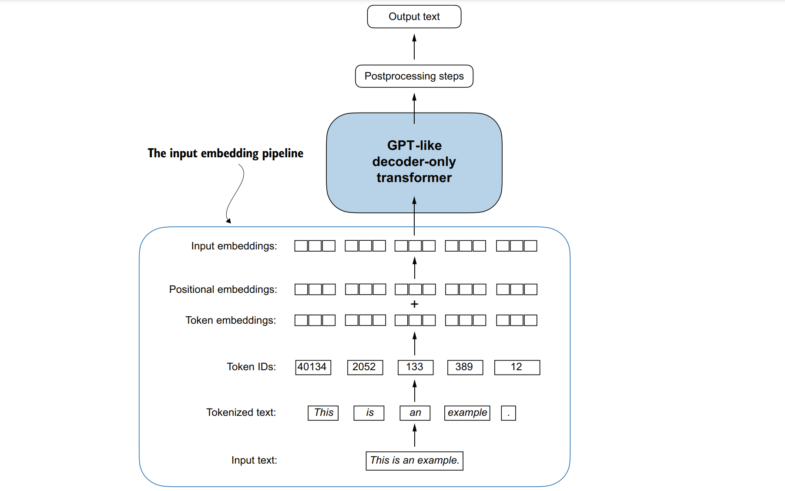

### 2.7创建标记嵌入
&nbsp;&nbsp;&nbsp;&nbsp;为LLM（大型语言模型）训练准备输入文本的最后一步是将令牌ID转换为嵌入向量，如图2.15所示。作为初步步骤，我们必须使用随机值初始化这些嵌入权重。这种初始化是LLM学习过程的起点。在第五章中，我们将作为LLM训练的一部分来优化这些嵌入权重。

&nbsp;&nbsp;&nbsp;&nbsp;由于GPT等LLM是使用反向传播算法训练的深度神经网络，因此需要使用连续的向量表示，即嵌入。


&nbsp;&nbsp;&nbsp;&nbsp;***图2.15展示了文本准备的三个步骤：文本分词、将文本令牌转换为令牌ID，以及将令牌ID转换为嵌入向量。在这里，我们利用之前生成的令牌ID来创建令牌嵌入向量。***

&nbsp;&nbsp;&nbsp;&nbsp;***注意：如果您对如何使用反向传播算法训练神经网络不熟悉，请阅读附录A中的B.4部分。***

&nbsp;&nbsp;&nbsp;&nbsp;让我们通过一个实际操作示例来看看如何将令牌ID转换为嵌入向量。假设我们有以下四个输入令牌，其ID分别为2、3、5和1：

```python
input_ids = torch.tensor([2, 3, 5, 1])
```

&nbsp;&nbsp;&nbsp;&nbsp;为了简化说明，假设我们有一个仅包含6个单词的小型词汇表（而不是BPE分词器词汇表中的50,257个单词），并且我们希望创建大小为3的嵌入（在GPT-3中，嵌入大小为12,288维）：

```python
vocab_size = 6
output_dim = 3
```
&nbsp;&nbsp;&nbsp;&nbsp;使用vocab_size和output_dim，我们可以在PyTorch中实例化一个嵌入层，并为了可重复性设置随机种子为123：

```python
torch.manual_seed(123)
embedding_layer = torch.nn.Embedding(vocab_size, output_dim)
print(embedding_layer.weight)
```
&nbsp;&nbsp;&nbsp;&nbsp;print语句会打印出嵌入层的底层权重矩阵：

```
Parameter containing:
tensor([[ 0.3374, -0.1778, -0.1690],
        [ 0.9178, 1.5810, 1.3010],
        [ 1.2753, -0.2010, -0.1606],
        [-0.4015, 0.9666, -1.1481],
        [-1.1589, 0.3255, -0.6315],
        [-2.8400, -0.7849, -1.4096]], requires_grad=True)
```
&nbsp;&nbsp;&nbsp;&nbsp;嵌入层的权重矩阵包含小的随机值。这些值在LLM训练过程中作为LLM优化本身的一部分进行优化。此外，我们可以看到权重矩阵有6行和3列。词汇表中的每个可能的令牌都有一行，每个嵌入维度都有一列。

&nbsp;&nbsp;&nbsp;&nbsp;现在，让我们将其应用于一个令牌ID以获得嵌入向量：

```python
print(embedding_layer(torch.tensor([3])))
```

&nbsp;&nbsp;&nbsp;&nbsp;此代码将输出与令牌ID 3相对应的嵌入向量:

```
tensor([[-0.4015, 0.9666, -1.1481]], grad_fn=<EmbeddingBackward0>)
```

&nbsp;&nbsp;&nbsp;&nbsp;如果我们比较令牌ID 3的嵌入向量与之前的嵌入矩阵，我们会发现它与第四行（由于Python的索引从0开始，因此它对应于索引3的行）完全相同。换句话说，嵌入层本质上是一个查找操作，它通过令牌ID从嵌入层的权重矩阵中检索行。

&nbsp;&nbsp;&nbsp;&nbsp;***注意：对于那些熟悉one-hot编码的人来说，这里描述的嵌入层方法本质上只是实现one-hot编码后在全连接层中进行矩阵乘法的一种更高效的方式。这在GitHub上的补充代码中得到了说明，网址为：https://mng.bz/ZEB5。由于嵌入层只是one-hot编码和矩阵乘法方法的一种更高效实现，因此它可以被视为一个可以通过反向传播优化的神经网络层。***

&nbsp;&nbsp;&nbsp;&nbsp;我们已经了解了如何将单个令牌ID转换为三维嵌入向量。现在，让我们将所有四个输入ID（torch.tensor([2, 3, 5, 1])）都应用这个转换：

```python
print(embedding_layer(input_ids))
```
&nbsp;&nbsp;&nbsp;&nbsp;打印输出显示，这会产生一个4×3的矩阵：

```
tensor([[ 1.2753, -0.2010, -0.1606],
        [-0.4015,  0.9666, -1.1481],
        [-2.8400, -0.7849, -1.4096],
        [ 0.9178,  1.5810,  1.3010]], grad_fn=<EmbeddingBackward0>)
```
在这个输出矩阵中，每一行都是通过从嵌入权重矩阵中查找得到的，如图2.16所示（注意：图2.16在此文本环境中无法直接展示）。
&nbsp;&nbsp;&nbsp;&nbsp;现在我们已经从令牌ID创建了嵌入向量，接下来我们将对这些嵌入向量进行一个小修改，以编码文本中令牌的位置信息。


### 2.8 文本位置信息编码
&nbsp;&nbsp;&nbsp;&nbsp;原则上，令牌嵌入（Token Embeddings）是大型语言模型（LLM）的合适输入。然而，大型语言模型的一个微小缺陷是它们的自注意力机制（见第3章）没有序列中令牌的位置或顺序的概念。之前介绍的嵌入层的工作方式是，无论令牌ID在输入序列中的位置如何，相同的令牌ID总是被映射到相同的向量表示，如图2.17所示。



&nbsp;&nbsp;&nbsp;&nbsp;***图2.16解释：嵌入层执行查找操作，从嵌入层的权重矩阵中检索与令牌ID对应的嵌入向量。例如，令牌ID为5的嵌入向量是嵌入层权重矩阵的第六行（之所以是第六行而不是第五行，是因为Python的索引是从0开始的）。我们假设这些令牌ID是由第2.3节中的小词汇表生成的。***


&nbsp;&nbsp;&nbsp;&nbsp;***图2.17 解读：此图展示了嵌入层的一个关键特性，即它将相同的令牌ID转换为相同的向量表示，而不考虑该令牌ID在输入序列中的位置。具体来说，如果输入向量中有两个位置分别包含令牌ID 5，无论这两个位置是第一个还是第四个，嵌入层都会为这两个令牌ID生成完全相同的嵌入向量。***

&nbsp;&nbsp;&nbsp;&nbsp;原则上，确定性的、与位置无关的标记ID嵌入对于可再现性是有益的。然而，由于大型语言模型（LLMs）的自注意力机制本身也是位置无关的，向LLM中注入额外的位置信息是有帮助的。

&nbsp;&nbsp;&nbsp;&nbsp;为了实现这一点，我们可以使用两大类位置感知嵌入：相对位置嵌入和绝对位置嵌入。绝对位置嵌入直接与序列中的特定位置相关联。对于输入序列中的每个位置，都会向标记的嵌入中添加一个独特的嵌入，以传达其确切位置。例如，第一个标记将有一个特定的位置嵌入，第二个标记有另一个不同的嵌入，以此类推，如图2.18所示。


&nbsp;&nbsp;&nbsp;&nbsp;***图2.18 描述：位置嵌入被添加到标记嵌入向量中，以创建大型语言模型（LLM）的输入嵌入。位置向量与原始标记嵌入具有相同的维度。为了简化，标记嵌入的值用1表示.***

&nbsp;&nbsp;&nbsp;&nbsp;相对位置嵌入的重点不在于标记的绝对位置，而在于标记之间的相对位置或距离。这意味着模型学习的是“相距多远”的关系，而不是“位于哪个确切位置”。这里的优势在于，模型可以更好地泛化到不同长度的序列，即使它在训练期间没有见过这样的长度。

&nbsp;&nbsp;&nbsp;&nbsp;这两种类型的位置嵌入都旨在增强大型语言模型（LLMs）理解标记的顺序和关系的能力，从而确保更准确和更好的感知上下文的预测。选择哪种嵌入通常取决于具体的应用和正在处理的数据的性质。

&nbsp;&nbsp;&nbsp;&nbsp;OpenAI的GPT模型使用在训练过程中优化的绝对位置嵌入，而不是像原始Transformer模型中的位置编码那样固定或预定义。这个优化过程是模型训练本身的一部分。现在，让我们创建初始的位置嵌入来构建LLM的输入。

&nbsp;&nbsp;&nbsp;&nbsp;之前，为了简单起见，我们主要关注了非常小的嵌入尺寸。现在，让我们考虑更现实且有用的嵌入尺寸，并将输入标记编码为256维的向量表示。这个维度虽然小于原始GPT-3模型所使用的维度（GPT-3的嵌入尺寸是12,288维），但对于实验来说仍然是合理的。此外，我们假设这些标记ID是由我们之前实现的BPE分词器创建的，该分词器的词汇表大小为50,257：

```python
vocab_size = 50257
output_dim = 256
token_embedding_layer = torch.nn.Embedding(vocab_size, output_dim)
```
使用之前的token_embedding_layer，如果我们从数据加载器中采样数据，我们可以将每个批次中的每个标记嵌入到256维的向量中。如果我们有一个批次大小为8，每个样本有4个标记，那么结果将是一个8 × 4 × 256的张量。

&nbsp;&nbsp;&nbsp;&nbsp;现在，让我们先实例化数据加载器（参见第2.6节）：

```python
max_length = 4
dataloader = create_dataloader_v1(
    raw_text, batch_size=8, max_length=max_length,
    stride=max_length, shuffle=False
)
data_iter = iter(dataloader)
inputs, targets = next(data_iter)
print("Token IDs:\n", inputs)
print("\nInputs shape:\n", inputs.shape)
```
&nbsp;&nbsp;&nbsp;&nbsp;这段代码的输出为：
```
Token IDs:
 tensor([[ 40, 367, 2885, 1464],
 [ 1807, 3619, 402, 271],
 [10899, 2138, 257, 7026],
 [15632, 438, 2016, 257],
 [ 922, 5891, 1576, 438],
 [ 568, 340, 373, 645],
 [ 1049, 5975, 284, 502],
 [ 284, 3285, 326, 11]])
Inputs shape:
 torch.Size([8, 4])
```
&nbsp;&nbsp;&nbsp;&nbsp;我们可以看到，标记ID张量是8 × 4维的，这意味着数据批次包含八个文本样本，每个样本有四个标记。

&nbsp;&nbsp;&nbsp;&nbsp;现在，让我们使用嵌入层将这些标记ID嵌入到256维的向量中：

```python
token_embeddings = token_embedding_layer(inputs)
print(token_embeddings.shape)
```

&nbsp;&nbsp;&nbsp;&nbsp;打印函数调用返回的结果是:
```
 torch.Size([8, 4, 256])，
```

&nbsp;&nbsp;&nbsp;&nbsp;这表明每个标记ID现在都被嵌入为256维的向量，形成了一个8 × 4 × 256维的张量输出。

&nbsp;&nbsp;&nbsp;&nbsp;对于GPT模型的绝对位置嵌入方法，我们只需要创建另一个嵌入层，其嵌入维度与token_embedding_layer相同。这是通过以下代码实现的：

```python
context_length = max_length
pos_embedding_layer = torch.nn.Embedding(context_length, output_dim)
pos_embeddings = pos_embedding_layer(torch.arange(context_length))
print(pos_embeddings.shape)
```

&nbsp;&nbsp;&nbsp;&nbsp;位置嵌入的输入通常是一个占位符向量torch.arange(context_length)，它包含从0到最大输入长度减1的连续数字序列。context_length是一个变量，代表大型语言模型（LLM）支持的输入大小。在这里，我们选择它与输入文本的最大长度相似。在实际应用中，如果输入文本长于支持的上下文长度，则需要截断文本。

&nbsp;&nbsp;&nbsp;&nbsp;打印语句的输出结果是：
```
 torch.Size([4, 256])
```

&nbsp;&nbsp;&nbsp;&nbsp;这表明位置嵌入张量由四个256维的向量组成。现在，我们可以将这些位置嵌入直接添加到标记嵌入中。在PyTorch中，这会将4 × 256维的pos_embeddings张量添加到每个批次中每个4 × 256维的标记嵌入张量上：

```python
input_embeddings = token_embeddings + pos_embeddings
print(input_embeddings.shape)
```
&nbsp;&nbsp;&nbsp;&nbsp;打印输出结果是:
```
torch.Size([8, 4, 256])
```
&nbsp;&nbsp;&nbsp;&nbsp;表明我们创建的input_embeddings保持了与原始标记嵌入相同的形状。如图2.19所示，这些input_embeddings是嵌入后的输入示例，现在可以由主要的大型语言模型（LLM）模块处理，我们将在下一章中开始实现这些模块。


&nbsp;&nbsp;&nbsp;&nbsp;***图2.19:展示了输入处理流程的一部分，其中输入文本首先被分解成单独的标记（tokens）。这些标记随后使用词汇表转换为标记ID。标记ID被转换为嵌入向量，并且与相同大小的位置嵌入相加，最终得到用作主要大型语言模型（LLM）层输入的输入嵌入。***

***总结：***
- 大型语言模型（LLMs）需要将文本数据转换成数值向量，这些向量被称为嵌入（embeddings），因为LLMs无法直接处理原始文本。嵌入技术将离散数据（如单词或图像）转换为连续向量空间中的表示，使其能够与神经网络操作兼容。

-  首先，原始文本被分割成标记（tokens），这些标记可以是单词或字符。然后，这些标记被转换成整数表示，即标记ID（token IDs）。

- 为了增强模型的理解能力并处理各种上下文，如未知单词或标记不相关文本之间的边界，可以添加特殊标记，如<|unk|>（表示未知单词）和<|endoftext|>（表示文本结束）。

- 对于像GPT-2和GPT-3这样的大型语言模型，所使用的字节对编码（BPE）分词器可以通过将未知单词分解成子词单元或单个字符来高效地处理它们。

- 在分词后的数据上，我们使用滑动窗口方法来生成LLM训练所需的输入-目标对。

- 在PyTorch中，嵌入层执行查找操作，根据标记ID检索相应的向量。由此产生的嵌入向量提供了标记的连续表示，这对于训练像LLMs这样的深度学习模型至关重要。

- 虽然标记嵌入为每个标记提供了一致的向量表示，但它们缺乏标记在序列中的位置信息。为了解决这个问题，存在两种主要的位置嵌入类型：绝对位置嵌入和相对位置嵌入。OpenAI的GPT模型使用绝对位置嵌入，这些嵌入被添加到标记嵌入向量上，并在模型训练过程中进行优化。