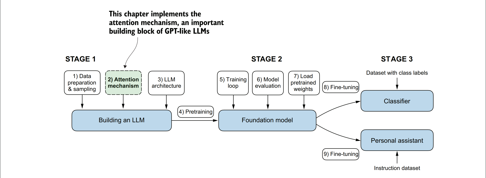
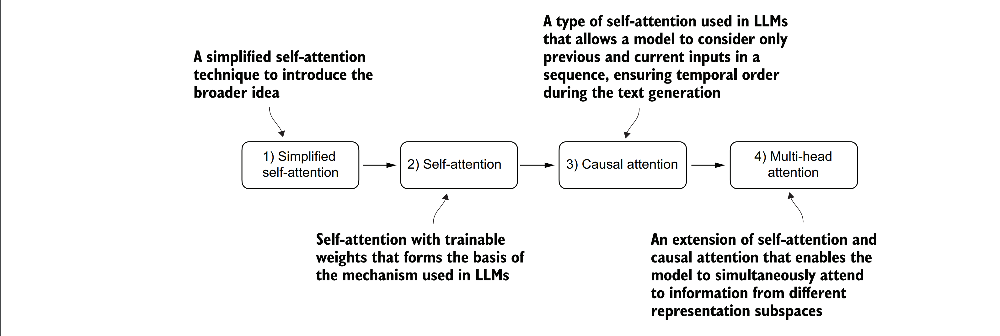
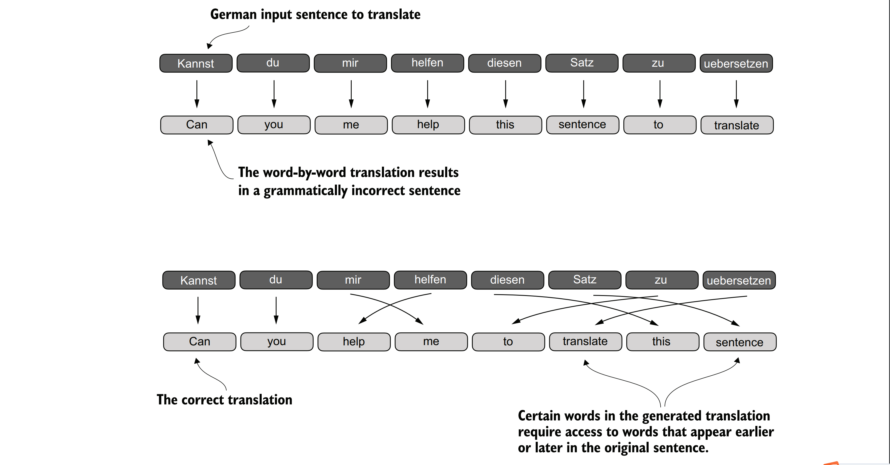
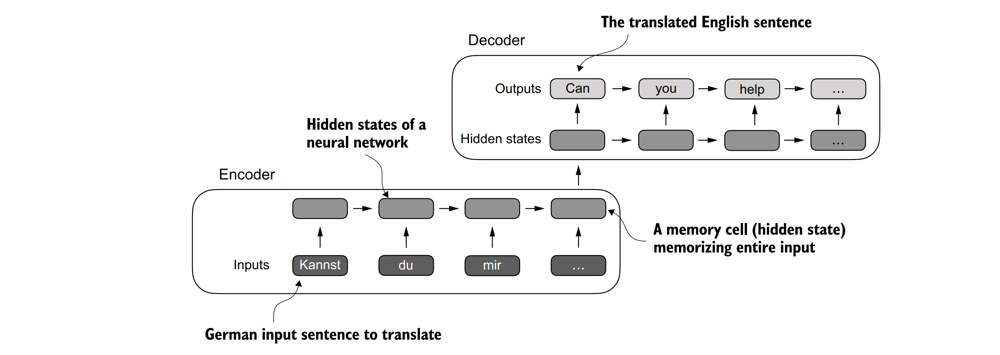

### 本章简介
- 在神经网络中使用注意力机制的原因
- 基础自注意力框架，逐步发展到增强的自注意力机制
- 允许大型语言模型（LLMs）一次生成一个标记（token）的因果注意力模块
- 使用dropout随机屏蔽注意力权重以减少过拟合
- 将多个因果注意力模块堆叠成多头注意力模块

&nbsp;&nbsp;&nbsp;&nbsp;到目前为止，您已经知道如何通过将文本拆分成单个单词和子单词标记来为训练大型语言模型（LLMs）准备输入文本，这些标记可以编码成大型语言模型的向量表示，即嵌入（embeddings）。现在，我们将关注大型语言模型架构本身的一个不可或缺的部分，即注意力机制，如图3.1所示。我们将主要单独研究注意力机制，并从机制层面对其进行深入探讨。

&nbsp;&nbsp;&nbsp;&nbsp;***图3.1 展示了编写大型语言模型（LLM）的三个主要阶段。本章重点关注第一阶段中的第2步：实现注意力机制，这是大型语言模型架构不可或缺的一部分。***

&nbsp;&nbsp;&nbsp;&nbsp;接下来，我们将编写围绕自注意力机制的大型语言模型（LLM）的剩余部分，以便观察其实际运行效果，并创建一个用于生成文本的模型。

&nbsp;&nbsp;&nbsp;&nbsp;我们将实现四种不同的注意力机制变体，如图3.2所示。这些不同的注意力变体是相互构建的，我们的目标是得到一个紧凑且高效的多头注意力实现，然后将其插入到我们将在下一章编写的大型语言模型（LLM）架构中。

&nbsp;&nbsp;&nbsp;&nbsp;***图3.2 展示了本章中我们将编写的不同注意力机制。首先是一个简化的自注意力机制的版本，尚未添加可训练权重。接着，因果注意力机制在自注意力的基础上添加了一个掩码，使得大型语言模型（LLM）能够一次生成一个单词。最后，多头注意力机制将注意力机制组织成多个头，使模型能够并行地捕捉输入数据的各个方面。***

### 3.1长序列建模的问题

&nbsp;&nbsp;&nbsp;&nbsp;在我们深入探讨大型语言模型（LLMs）核心的自注意力机制之前，让我们先考虑一下不包含注意力机制的预LLM架构所存在的问题。假设我们想开发一个语言翻译模型，将文本从一种语言翻译成另一种语言。如图3.3所示，由于源语言和目标语言的语法结构差异，我们不能简单地逐词翻译文本。

&nbsp;&nbsp;&nbsp;&nbsp;***图3.3 从一种语言翻译到另一种语言（如德语到英语）时，不能仅逐词翻译。 相反，翻译过程需要上下文理解和语法对齐。***

&nbsp;&nbsp;&nbsp;&nbsp;为了解决这个问题，通常使用包含两个子模块（编码器和解码器）的深度神经网络。编码器的工作是首先读取并处理整个文本，然后解码器生成翻译后的文本。

&nbsp;&nbsp;&nbsp;&nbsp;在Transformer出现之前，循环神经网络（RNN）是语言翻译中最流行的编码器-解码器架构。RNN是一种神经网络，其中前一步的输出被作为当前步的输入，这使得它们非常适合处理像文本这样的序列数据。如果你对RNN不太熟悉，不用担心——你不需要了解RNN的详细工作原理就能理解接下来的讨论；我们这里的重点更多在于编码器-解码器设置的一般概念。

&nbsp;&nbsp;&nbsp;&nbsp;在编码器-解码器RNN中，输入文本被送入编码器，编码器按顺序处理它。编码器在每一步更新其隐藏状态（隐藏层的内部值），试图在最终的隐藏状态中捕获输入句子的全部意义，如图3.4所示。然后，解码器使用这个最终的隐藏状态开始逐词生成翻译后的句子。解码器也在每一步更新其隐藏状态，这个隐藏状态应该携带进行下一个词预测所需的上下文信息。

&nbsp;&nbsp;&nbsp;&nbsp;***图3.4 在Transformer模型出现之前，编码器-解码器RNN是机器翻译中的热门选择。 编码器接收来自源语言的一系列词元（tokens）作为输入，其中编码器的隐藏状态（一个中间神经网络层）对整个输入序列进行压缩表示。然后，解码器利用其当前的隐藏状态开始逐词进行翻译。***

&nbsp;&nbsp;&nbsp;&nbsp;虽然我们不需要了解这些编码器-解码器RNN的内部工作原理，但关键思想是编码器部分将整个输入文本处理成一个隐藏状态（记忆单元）。然后，解码器接收这个隐藏状态来产生输出。你可以将这个隐藏状态想象成一个嵌入向量，这是我们在第2章中讨论过的概念。

&nbsp;&nbsp;&nbsp;&nbsp;编码器-解码器RNN的一个主要限制是，在解码阶段，RNN不能直接访问编码器中的早期隐藏状态。因此，它仅依赖于当前的隐藏状态，该状态包含了所有相关信息。这可能会导致上下文信息的丢失，特别是在复杂的句子中，其中依赖关系可能跨越很长的距离。

&nbsp;&nbsp;&nbsp;&nbsp;幸运的是，在构建大型语言模型（LLM）时，理解循环神经网络（RNN）并不是必需的。只需记住，编码器-解码器RNN存在一个缺陷，这个缺陷促使了注意力机制的设计。