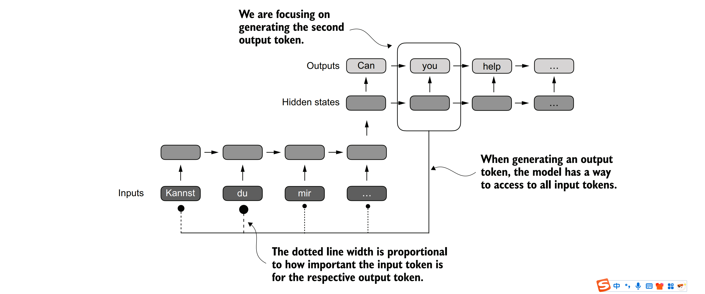
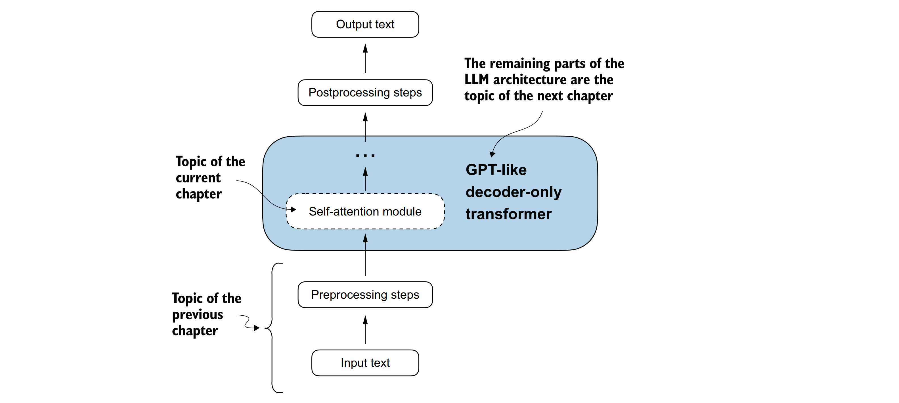

### 3.2使用注意力机制捕获数据依赖性
&nbsp;&nbsp;&nbsp;&nbsp;尽管循环神经网络（RNNs）在翻译短句时表现良好，但在处理更长的文本时效果不佳，因为它们无法直接访问输入中的前文词汇。这种方法的一个主要缺点是，在将编码后的输入传递给解码器之前，RNN必须将整个编码后的输入保存在一个单一的隐藏状态中（如图3.4所示）。因此，研究人员在2014年为RNN开发了Bahdanau注意力机制（以该领域第一篇论文的第一作者命名；更多信息请参见附录B），该机制对编码器-解码器RNN进行了修改，使得解码器在解码的每一步能够有选择地访问输入序列的不同部分，如图3.5所示。

&nbsp;&nbsp;&nbsp;&nbsp;***图3.5解析：利用注意力机制，网络中文本生成的解码器部分能够有选择性地访问所有输入标记。这意味着，在生成某个特定的输出标记时，并不是所有的输入标记都具有同等的重要性。输入标记的重要性由注意力权重来决定，而这些权重我们稍后会进行计算。需要注意的是，这幅图主要展示了注意力机制的基本概念，而并非是对Bahdanau注意力机制（这是一种RNN方法，超出了本书的讨论范围）的具体实现***

&nbsp;&nbsp;&nbsp;&nbsp;有趣的是，仅仅三年后，研究人员就发现，对于构建用于自然语言处理的深度神经网络而言，循环神经网络（RNN）架构并非必需，他们提出了原始的Transformer架构（第1章中已讨论），其中包含一个受Bahdanau注意力机制启发而设计的自注意力机制。
&nbsp;&nbsp;&nbsp;&nbsp;自注意力机制是一种允许在计算序列表示时，输入序列中的每个位置都能考虑同一序列中所有其他位置的相关性（或“关注”这些位置）的机制。自注意力机制是当代基于Transformer架构的大型语言模型（LLMs）的关键组件，如GPT系列模型。
&nbsp;&nbsp;&nbsp;&nbsp;本章将重点介绍GPT类模型中使用的自注意力机制的编码和理解，如图3.6所示。在下一章中，我们将编写大型语言模型剩余部分的代码。

&nbsp;&nbsp;&nbsp;&nbsp;***图3.6 自注意力机制是Transformer架构中的一个核心组件，它通过允许序列中的每个位置与同一序列内的所有其他位置进行交互，并衡量这些位置的重要性，从而计算出更为高效的输入表示。在本章中，我们将从头开始详细编写这个自注意力机制的代码实现，为接下来在下一章中编写GPT类大型语言模型（LLM）的其余部分打下基础。***