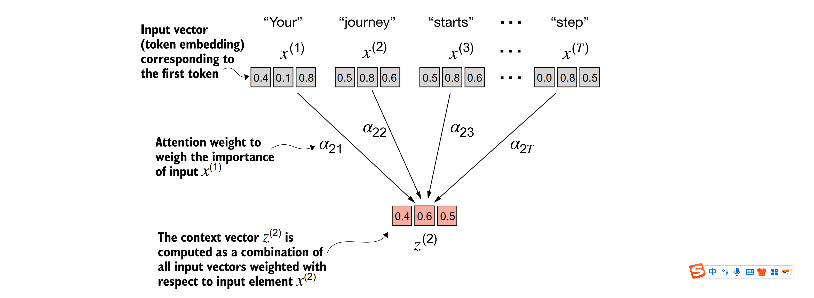
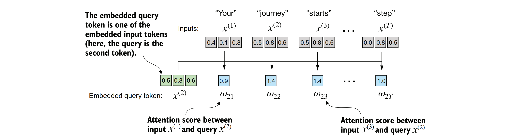
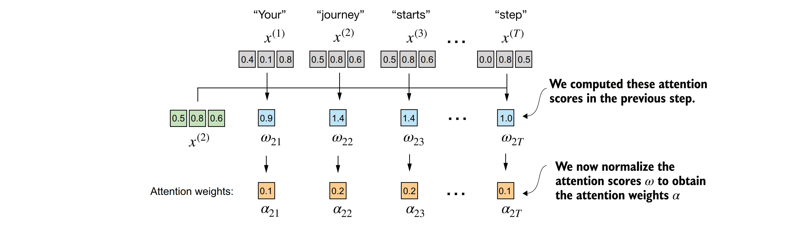
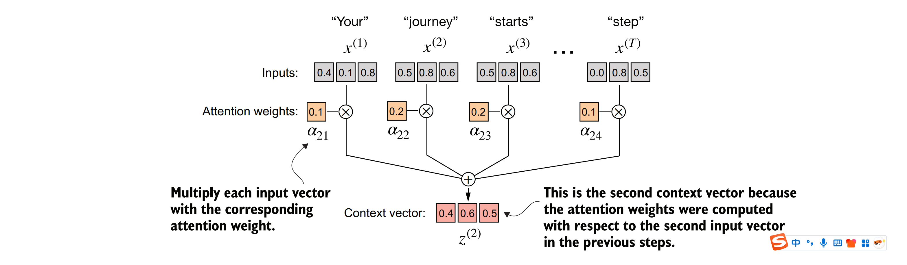
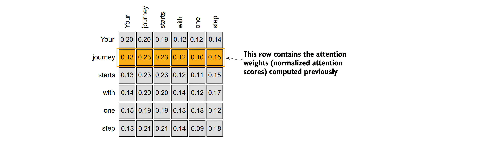
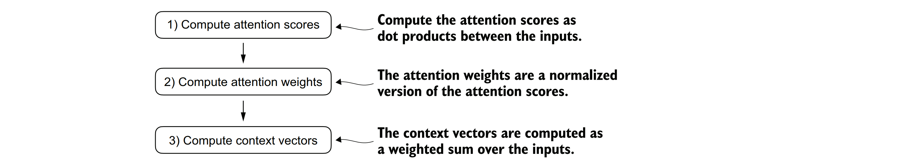

### 3.3使用自注意力机制关注输入的不同部分
&nbsp;&nbsp;&nbsp;&nbsp;现在，我们将深入探讨自注意力机制的内部工作原理，并从基础开始学习如何编写其代码。自注意力机制是基于Transformer架构的每个大型语言模型（LLM）的基石。这个话题可能需要你高度集中注意力（这里并无双关之意），但一旦你掌握了它的基本原理，你就已经攻克了本书以及一般大型语言模型实现中最困难的部分之一。

&nbsp;&nbsp;&nbsp;&nbsp;在自注意力（self-attention）中，“self”指的是该机制能够计算单个输入序列内不同位置之间的注意力权重的能力。它评估和学习输入本身各部分之间的关系和依赖性，比如句子中的单词或图像中的像素。这与传统的注意力机制形成对比，传统注意力机制关注的是两个不同序列元素之间的关系，比如在序列到序列（sequence-to-sequence）模型中，注意力可能存在于输入序列和输出序列之间，如图3.5所示的例子。

&nbsp;&nbsp;&nbsp;&nbsp;由于自注意力机制可能看起来比较复杂，特别是如果你第一次接触它的话，我们将从它的一个简化版本开始探讨。随后，我们将实现用于大型语言模型（LLMs）中带有可训练权重的自注意力机制。

### 3.3.1一个不可训练权重的简单自注意力机制

&nbsp;&nbsp;&nbsp;&nbsp;让我们开始实现一个简化的自注意力变体，该变体不包含任何可训练权重，正如图3.7所概述的那样。我们的目标是在添加可训练权重之前，先阐述自注意力机制中的一些关键概念。


&nbsp;&nbsp;&nbsp;&nbsp;***图3.7 自注意力的目标是为每个输入元素计算一个上下文向量，该向量结合了来自所有其他输入元素的信息。在这个例子中，我们计算上下文向量z(2)。在计算z(2)时，每个输入元素的重要性或贡献度由注意力权重α21到α2T决定。在计算z(2)时，注意力权重是根据输入元素x(2)和所有其他输入计算得出的。***

&nbsp;&nbsp;&nbsp;&nbsp;图3.7展示了一个输入序列，记为x，由T个元素组成，表示为x(1)到x(T)。这个序列通常代表已经转换为词嵌入的文本，比如一个句子。

&nbsp;&nbsp;&nbsp;&nbsp;例如，考虑一个输入文本如“Your journey starts with one step.”，在这种情况下，序列的每个元素，如x(1)，对应于一个d维嵌入向量，表示一个特定的词元，如“Your”。图3.7将这些输入向量展示为三维嵌入。

&nbsp;&nbsp;&nbsp;&nbsp;在自注意力机制中，我们的目标是为输入序列中的每个元素x(i)计算上下文向量z(i)。上下文向量可以被解释为一个增强的嵌入向量。

&nbsp;&nbsp;&nbsp;&nbsp;为了说明这个概念，让我们专注于第二个输入元素x(2)的嵌入向量（对应于词元“journey”）和对应的上下文向量z(2)，它们在图3.7的底部显示。这个增强的上下文向量z(2)是一个嵌入，它包含了关于x(2)和所有其他输入元素x(1)到x(T)的信息。

&nbsp;&nbsp;&nbsp;&nbsp;上下文向量在自注意力机制中起着至关重要的作用。它们的目的是通过整合序列中所有其他元素的信息来创建输入序列（如句子）中每个元素的丰富表示（见图3.7）。这对于大型语言模型（LLMs）来说至关重要，因为它们需要理解句子中单词之间的关系和相关性。稍后，我们将添加可训练权重，帮助大型语言模型学习构建这些上下文向量，以便它们对于大型语言模型生成下一个词元是相关的。但首先，让我们实现一个简化的自注意力机制，一步一步地计算这些权重和最终的上下文向量。

&nbsp;&nbsp;&nbsp;&nbsp;考虑以下已经嵌入为三维向量的输入句子（见第2章）。我选择了一个小的嵌入维度，以确保它能在页面上显示而不换行

```python
import torch
inputs = torch.tensor(
 [[0.43, 0.15, 0.89], # Your (x^1)
 [0.55, 0.87, 0.66], # journey (x^2)
 [0.57, 0.85, 0.64], # starts (x^3)
 [0.22, 0.58, 0.33], # with (x^4)
 [0.77, 0.25, 0.10], # one (x^5)
 [0.05, 0.80, 0.55]] # step (x^6)
)
```

&nbsp;&nbsp;&nbsp;&nbsp;实现自注意力的第一步是计算中间值ω，这些值被称为注意力分数，如图3.8所示。由于空间限制，该图以截断形式显示了前一个输入张量的值；例如，0.87被截断为0.8。在这个截断版本中，单词“journey”和“starts”的嵌入可能会随机偶然地显得相似。


&nbsp;&nbsp;&nbsp;&nbsp;***图3.8的总体目标是展示如何使用第二个输入元素x(2)作为查询来计算上下文向量z(2)。该图展示了第一个中间步骤，即计算查询x(2)与所有其他输入元素之间的注意力分数ω，这是通过点积运算来实现的。（注意，为了减少视觉上的杂乱，数字被截断为小数点后一位。）***

&nbsp;&nbsp;&nbsp;&nbsp;图3.8展示了如何计算查询标记（token）与每个输入标记之间的中间注意力分数。我们通过计算查询x(2)与其他每个输入标记的点积来确定这些分数。

```python
query = inputs[1]
attn_scores_2 = torch.empty(inputs.shape[0])
for i, x_i in enumerate(inputs):
 attn_scores_2[i] = torch.dot(x_i, query)
print(attn_scores_2)
```

&nbsp;&nbsp;&nbsp;&nbsp;计算出来的注意力分数如下：
```
tensor([0.9544, 1.4950, 1.4754, 0.8434, 0.7070, 1.0865])
```


&nbsp;&nbsp;&nbsp;&nbsp;***理解点积***
&nbsp;&nbsp;&nbsp;&nbsp;点积本质上是两个向量进行元素级乘法后求和的一种简洁方式，以下是一个示例来说明这一点：
```python
res = 0.
for idx, element in enumerate(inputs[0]):
 res += inputs[0][idx] * query[idx]
print(res)
print(torch.dot(inputs[0], query))
```
&nbsp;&nbsp;&nbsp;&nbsp;输出结果证实了通过元素级乘法求和得到的结果与点积的结果是一致的

```
tensor(0.9544)
tensor(0.9544)
```

&nbsp;&nbsp;&nbsp;&nbsp;除了将点积运算视为将两个向量组合以产生标量值的数学工具之外，点积还是一种相似性的度量，因为它量化了两个向量之间的对齐程度：点积越高，表示向量之间的对齐程度或相似性越大。在自注意力机制的背景下，点积决定了序列中每个元素对其他元素的关注程度或“注意力”：点积越高，两个元素之间的相似性和注意力分数就越高。

&nbsp;&nbsp;&nbsp;&nbsp;在接下来的一步中，如图3.9所示，我们将之前计算得到的每个注意力分数进行归一化处理。归一化的主要目的是获得总和为1的注意力权重。这种归一化是一种惯例，对于大型语言模型（LLM）的解释性和训练稳定性维护都非常有用。以下是实现这一归一化步骤的直观方法：

```python
attn_weights_2_tmp = attn_scores_2 / attn_scores_2.sum()
print("Attention weights:", attn_weights_2_tmp)
print("Sum:", attn_weights_2_tmp.sum())
```


&nbsp;&nbsp;&nbsp;&nbsp;***图3.9 展示了在针对输入查询 $x^{(2)}$ 计算出注意力分数 $\omega_{21}$ 到 $\omega_{2T}$ 之后，下一步是通过归一化这些注意力分数来获得注意力权重 $\alpha_{21}$ 到 $\alpha_{2T}$。***
​
 

&nbsp;&nbsp;&nbsp;&nbsp;正如输出结果所示，现在注意力权重的总和为1：
```
Attention weights: tensor([0.1455, 0.2278, 0.2249, 0.1285, 0.1077, 0.1656])
Sum: tensor(1.0000)
```

&nbsp;&nbsp;&nbsp;&nbsp;在实践中，使用 softmax 函数进行归一化更为常见且更为可取。这种方法在处理极值方面表现更好，并且在训练过程中提供了更有利的梯度特性。以下是 softmax 函数的基本实现，用于归一化注意力分数：

```python
def softmax_naive(x):
    return torch.exp(x) / torch.exp(x).sum(dim=0)

attn_weights_2_naive = softmax_naive(attn_scores_2)
print("Attention weights:", attn_weights_2_naive)
print("Sum:", attn_weights_2_naive.sum())
```

&nbsp;&nbsp;&nbsp;&nbsp;输出结果显示，softmax 函数同样满足了目标，对注意力权重进行了归一化，使它们的总和为 1：
```
Attention weights: tensor([0.1385, 0.2379, 0.2333, 0.1240, 0.1082, 0.1581])
Sum: tensor(1.)
```

此外，softmax 函数确保注意力权重始终为正。这使得输出可以解释为概率或相对重要性，其中权重较高表示重要性更大。
&nbsp;&nbsp;&nbsp;&nbsp;需要注意的是，这个朴素的 softmax 实现（softmax_naive）在处理大值或小值输入时可能会遇到数值不稳定问题，如溢出和下溢。因此，在实践中，建议使用 PyTorch 的 softmax 实现，它经过了广泛的性能优化：

```python
attn_weights_2 = torch.softmax(attn_scores_2, dim=0)
print("Attention weights:", attn_weights_2)
print("Sum:", attn_weights_2.sum())
```

&nbsp;&nbsp;&nbsp;&nbsp;在这种情况下，它与我们之前的 softmax_naive 函数产生了相同的结果：
```
Attention weights: tensor([0.1385, 0.2379, 0.2333, 0.1240, 0.1082, 0.1581])
Sum: tensor(1.)
```

&nbsp;&nbsp;&nbsp;&nbsp;既然我们已经计算出了归一化的注意力权重，现在就可以进行最后一步了，如图3.10所示：通过将嵌入的输入标记 $x_i$ 与相应的注意力权重相乘，然后对结果向量进行求和，来计算上下文向量 $z^{(2)}$。因此，上下文向量 $z^{(2)}$ 是所有输入向量的加权和，每个输入向量都乘以其对应的注意力权重得到：

```python
query = inputs[1]
context_vec_2 = torch.zeros(query.shape)
for i,x_i in enumerate(inputs):
 context_vec_2 += attn_weights_2[i]*x_i
print(context_vec_2)
```
计算输出如下：
```
tensor([0.4419, 0.6515, 0.5683])
```



&nbsp;&nbsp;&nbsp;&nbsp;**图3.10 在为查询 $x^{(2)}$ 计算并归一化注意力分数以获得注意力权重后，最后一步是计算上下文向量 $z^{(2)}$。这个上下文向量是所有输入向量 $x^{(1)}$ 到 $x^{(T)}$ 的组合，每个输入向量都根据其对应的注意力权重进行加权。**

&nbsp;&nbsp;&nbsp;&nbsp;接下来，我们将把这个计算上下文向量的过程推广，以便同时计算所有的上下文向量。

### 3.3.2计算所有输入标记的注意力权重
&nbsp;&nbsp;&nbsp;&nbsp;到目前为止，我们已经为输入2计算了注意力权重和上下文向量，如图3.11中高亮显示的行所示。现在，让我们将这个计算扩展到为所有输入计算注意力权重和上下文向量。


&nbsp;&nbsp;&nbsp;&nbsp;***图3.11展示了当第二个输入元素被用作查询（query）时，其对应的注意力权重（attention weights）。现在，我们要将这个计算过程扩展到所有输入元素，以获取它们分别作为查询时的注意力权重。（请注意，为了简化视觉呈现，该图中的数字被截断为小数点后两位。实际上，在完整的计算中，每一行的数值之和应该严格等于1.0或100%，这反映了softmax归一化的结果。）***

&nbsp;&nbsp;&nbsp;&nbsp;我们遵循与之前相同的三个步骤（见图3.12），但会对代码进行一些修改，以便计算所有上下文向量，而不仅仅是第二个上下文向量z(2)。
```python
attn_scores = torch.empty(6, 6)
for i, x_i in enumerate(inputs):
 for j, x_j in enumerate(inputs):
 attn_scores[i, j] = torch.dot(x_i, x_j)
print(attn_scores)
```


&nbsp;&nbsp;&nbsp;&nbsp;***图3.12展示了在第一步中，我们增加了一个额外的for循环来计算所有输入对之间的点积。***

注意力分数结果如下：
```
tensor([[0.9995, 0.9544, 0.9422, 0.4753, 0.4576, 0.6310],
 [0.9544, 1.4950, 1.4754, 0.8434, 0.7070, 1.0865],
 [0.9422, 1.4754, 1.4570, 0.8296, 0.7154, 1.0605],
 [0.4753, 0.8434, 0.8296, 0.4937, 0.3474, 0.6565],
 [0.4576, 0.7070, 0.7154, 0.3474, 0.6654, 0.2935],
 [0.6310, 1.0865, 1.0605, 0.6565, 0.2935, 0.9450]])
```
&nbsp;&nbsp;&nbsp;&nbsp;在之前的讨论中，我们了解到张量中的每个元素都代表了输入对之间的注意力分数，这与图3.11中的展示是一致的。值得注意的是，图3.11中的数值已经经过了归一化处理，因此它们与前面提到的未归一化的注意力分数存在差异。归一化的处理我们将在后续步骤中进行。

&nbsp;&nbsp;&nbsp;&nbsp;在计算前面提到的注意力分数张量时，我们采用了Python中的for循环。然而，for循环通常效率较低，我们可以通过矩阵乘法来达到同样的计算效果，而且速度更快。

```python
attn_scores = inputs @ inputs.T
print(attn_scores)
```

&nbsp;&nbsp;&nbsp;&nbsp;我们可以通过可视化手段来验证，所得结果与之前是一致的。
```
tensor([[0.9995, 0.9544, 0.9422, 0.4753, 0.4576, 0.6310],
 [0.9544, 1.4950, 1.4754, 0.8434, 0.7070, 1.0865],
 [0.9422, 1.4754, 1.4570, 0.8296, 0.7154, 1.0605],
 [0.4753, 0.8434, 0.8296, 0.4937, 0.3474, 0.6565],
 [0.4576, 0.7070, 0.7154, 0.3474, 0.6654, 0.2935],
 [0.6310, 1.0865, 1.0605, 0.6565, 0.2935, 0.9450]])
```

&nbsp;&nbsp;&nbsp;&nbsp;在图3.12的第二步中，我们对每一行进行了归一化处理，以确保每一行中的数值之和为1：

```python
attn_weights = torch.softmax(attn_scores, dim=-1)
print(attn_weights)
```
&nbsp;&nbsp;&nbsp;&nbsp;这段代码返回了以下注意力权重张量，该张量的值与图3.10中所示的值相匹配：

```
tensor([[0.2098, 0.2006, 0.1981, 0.1242, 0.1220, 0.1452],
        [0.1385, 0.2379, 0.2333, 0.1240, 0.1082, 0.1581],
        [0.1390, 0.2369, 0.2326, 0.1242, 0.1108, 0.1565],
        [0.1435, 0.2074, 0.2046, 0.1462, 0.1263, 0.1720],
        [0.1526, 0.1958, 0.1975, 0.1367, 0.1879, 0.1295],
        [0.1385, 0.2184, 0.2128, 0.1420, 0.0988, 0.1896]])
```

&nbsp;&nbsp;&nbsp;&nbsp;在PyTorch的上下文中，torch.softmax等函数中的dim参数指定了输入张量上要计算softmax函数的维度。通过设置dim=-1，我们指示softmax函数沿着attn_scores张量的最后一个维度应用归一化。如果attn_scores是一个二维张量（例如，形状为[行数, 列数]），那么它将在列上进行归一化，以确保每一行（沿列维度求和）的值之和为1。

&nbsp;&nbsp;&nbsp;&nbsp;我们可以验证每一行的值之和确实为1：

```python
row_2_sum = sum([0.1385, 0.2379, 0.2333, 0.1240, 0.1082, 0.1581])
print("Row 2 sum:", row_2_sum)
print("All row sums:", attn_weights.sum(dim=-1))
```
&nbsp;&nbsp;&nbsp;&nbsp;输出结果将是：

```
Row 2 sum: 1.0
All row sums: tensor([1.0000, 1.0000, 1.0000, 1.0000, 1.0000, 1.0000])
```
&nbsp;&nbsp;&nbsp;&nbsp;这证实了每一行的值之和都等于1。

&nbsp;&nbsp;&nbsp;&nbsp;在图3.12的第三步也是最后一步中，我们使用这些注意力权重通过矩阵乘法来计算所有的上下文向量：

```python
all_context_vecs = attn_weights @ inputs
print(all_context_vecs)
```
&nbsp;&nbsp;&nbsp;&nbsp;在输出的张量中，每一行都包含一个三维的上下文向量
```
tensor([[0.4421, 0.5931, 0.5790],
 [0.4419, 0.6515, 0.5683],
 [0.4431, 0.6496, 0.5671],
 [0.4304, 0.6298, 0.5510],
 [0.4671, 0.5910, 0.5266],
 [0.4177, 0.6503, 0.5645]])
```

&nbsp;&nbsp;&nbsp;&nbsp;我们可以通过比较第二行与我们在3.3.1节中计算得到的上下文向量z(2)来再次确认代码的正确性：

```python
print("Previous 2nd context vector:", context_vec_2)
```
&nbsp;&nbsp;&nbsp;&nbsp;基于输出结果，我们可以看到之前计算的context_vec_2与前面张量的第二行完全匹配：

```
Previous 2nd context vector: tensor([0.4419, 0.6515, 0.5683])
```
&nbsp;&nbsp;&nbsp;&nbsp;这标志着我们对简单自注意力机制的代码讲解告一段落。接下来，我们将添加可训练的权重，从而使大型语言模型（LLM）能够从数据中学习，并在特定任务上提高其性能。