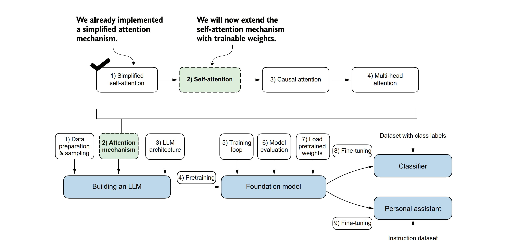
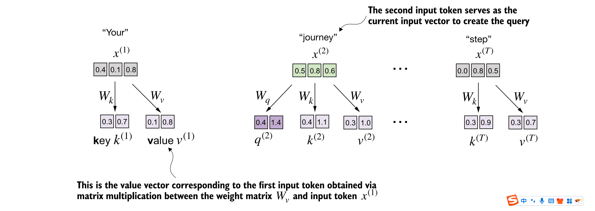
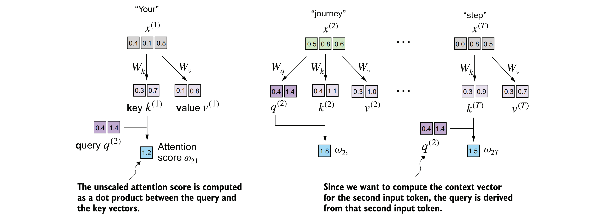
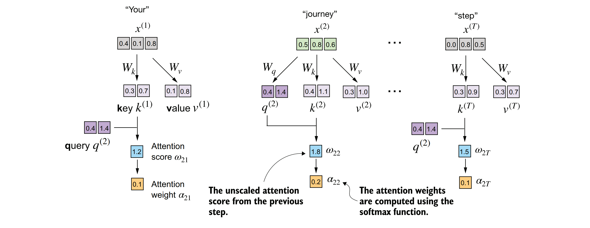
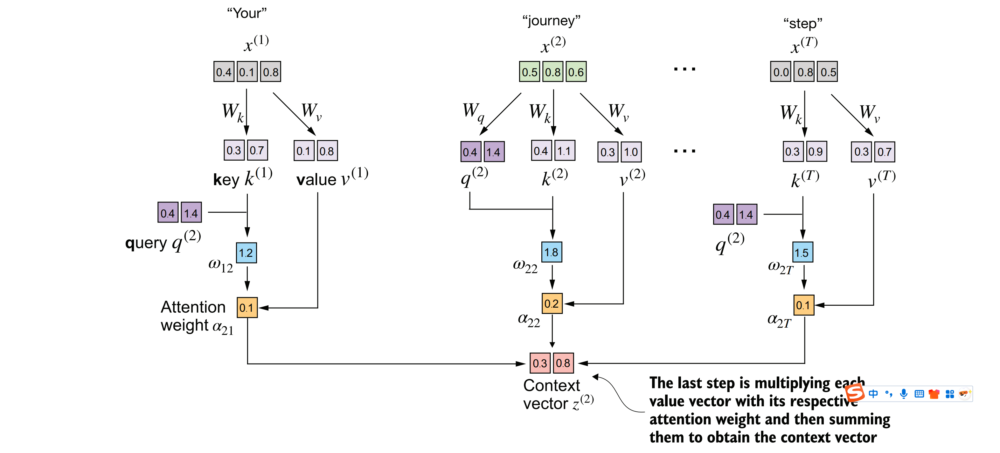

### 3.4实现带有可训练权重的自注意力机制
&nbsp;&nbsp;&nbsp;&nbsp;我们的下一步将是实现原始Transformer架构、GPT模型以及大多数其他流行大型语言模型（LLMs）中所使用的自注意力机制。这种自注意力机制也被称为缩放点积注意力（scaled dot-product attention）。图3.13展示了在实现大型语言模型的更广泛背景下，这种自注意力机制是如何被整合进去的。


&nbsp;&nbsp;&nbsp;&nbsp;***图3.13 展示了从简化版注意力机制到带有可训练权重的注意力机制的演进过程。在此之前，我们已经编写了一个简化的注意力机制代码，以便理解注意力机制背后的基本原理。现在，我们将在这个注意力机制中引入可训练权重。随后，我们还将通过添加因果掩码（causal mask）和多头（multi-head）来扩展这个自注意力机制。***

&nbsp;&nbsp;&nbsp;&nbsp;如图3.13所示，带有可训练权重的自注意力机制建立在之前的概念之上：我们希望计算特定于某个输入元素的输入向量上的加权和作为上下文向量。您将会看到，与我们之前编写的基本自注意力机制相比，这里只有细微的差别。

&nbsp;&nbsp;&nbsp;&nbsp;最显著的区别在于引入了在模型训练过程中更新的权重矩阵。这些可训练的权重矩阵至关重要，因为它们使得模型（特别是模型内部的注意力模块）能够学习生成“良好”的上下文向量。（我们将在第5章中训练大型语言模型。）

&nbsp;&nbsp;&nbsp;&nbsp;我们将分两小节来探讨这个自注意力机制。首先，我们将像之前一样逐步编写代码。其次，我们将把代码组织成一个紧凑的Python类，以便将其导入到大型语言模型架构中。

### 3.4.1逐步计算注意力权重

&nbsp;&nbsp;&nbsp;&nbsp;我们将通过引入三个可训练的权重矩阵 **$W_q$**、**$W_k$** 和 **$W_v$**，来逐步实现自注意力机制。这三个矩阵分别用于将嵌入的输入标记（tokens）**$x^{(i)}$** 投影到查询（query）、键（key）和值（value）向量上，如图3.14所示。


&nbsp;&nbsp;&nbsp;&nbsp;**图3.14 在带有可训练权重矩阵的自注意力机制的第一步中，我们为输入元素 $x$ 计算查询（$q$）、键（$k$）和值（$v$）向量。与之前的部分类似，我们将第二个输入 $x^{(2)}$ 指定为查询输入。查询向量 $q^{(2)}$ 是通过输入 $x^{(2)}$ 与权重矩阵 $W_q$ 进行矩阵乘法得到的。同样地，我们通过涉及权重矩阵 $W_k$ 和 $W_v$ 的矩阵乘法来获得键向量和值向量。**

&nbsp;&nbsp;&nbsp;&nbsp;之前，在计算简化注意力权重以获取上下文向量 $z^{(2)}$ 时，我们将第二个输入元素 $x^{(2)}$ 定义为查询。随后，我们将这一方法推广，用于计算六字输入句子“Your journey starts with one step.”中所有上下文向量 $z^{(1)}, \ldots, z^{(T)}$。

&nbsp;&nbsp;&nbsp;&nbsp;同样地，为了说明目的，我们在这里首先只计算一个上下文向量 $z^{(2)}$。随后，我们将修改此代码以计算所有上下文向量。让我们首先定义一些变量：

```python
x_2 = inputs[1]
d_in = inputs.shape[1]
d_out = 2 
```

&nbsp;&nbsp;&nbsp;&nbsp;请注意，在类似 GPT 的模型中，输入和输出维度通常相同，但为了更好地理解计算过程，我们在这里将使用不同的输入（$d\_in=3$）和输出（$d\_out=2$）维度。
&nbsp;&nbsp;&nbsp;&nbsp;接下来，我们将初始化图 3.14 中所示的三个权重矩阵 **$W_q$**、**$W_k$** 和 **$W_v$**.

```python
torch.manual_seed(123)
W_query = torch.nn.Parameter(torch.rand(d_in, d_out), requires_grad=False)
W_key = torch.nn.Parameter(torch.rand(d_in, d_out), requires_grad=False)
W_value = torch.nn.Parameter(torch.rand(d_in, d_out), requires_grad=False)
```

&nbsp;&nbsp;&nbsp;&nbsp;我们设置 `requires_grad=False` 以减少输出中的杂乱信息，但如果我们要使用这些权重矩阵进行模型训练，则会设置 `requires_grad=True` 以便在模型训练期间更新这些矩阵。接下来，我们计算查询、键和值向量：
```python
query_2 = x_2 @ W_query
key_2 = x_2 @ W_key
value_2 = x_2 @ W_value
print(query_2)
```

&nbsp;&nbsp;&nbsp;&nbsp;由于我们将对应权重矩阵的列数（通过 `d_out` 设置）设为 2，因此查询的输出是一个二维向量：
```
tensor([0.4306, 1.4551])
```
&nbsp;&nbsp;&nbsp;&nbsp;**权重参数与注意力权重**
&nbsp;&nbsp;&nbsp;&nbsp;**在权重矩阵 **W** 中，“权重”一词是“权重参数”的简称，这些值是神经网络在训练过程中被优化的。这与注意力权重不应混淆。如我们所见，注意力权重决定了上下文向量对输入不同部分的依赖程度（即网络对输入不同部分的关注程度）。总结来说，权重参数是定义网络连接的基础学习系数，而注意力权重是动态且特定于上下文的值。**

&nbsp;&nbsp;&nbsp;&nbsp;尽管我们的临时目标仅仅是计算一个上下文向量 z(2)，但我们仍然需要所有输入元素的键向量和值向量因为它们参与计算相对于查询 q(2) 的注意力权重（见图3.14）。


&nbsp;&nbsp;&nbsp;&nbsp;我们可以通过矩阵乘法获得所有的键和值
```python
keys = inputs @ W_key
values = inputs @ W_value
print("keys.shape:", keys.shape)
print("values.shape:", values.shape)
```
&nbsp;&nbsp;&nbsp;&nbsp;从输出中我们可以看出，我们成功地将六个输入标记从三维空间投影到了二维嵌入空间。
```
keys.shape: torch.Size([6, 2])
values.shape: torch.Size([6, 2])
```

&nbsp;&nbsp;&nbsp;&nbsp;第二步是计算注意力分数，如图3.15所示。



&nbsp;&nbsp;&nbsp;&nbsp;**图3.15 注意力分数的计算是一个点积计算，类似于我们在第3.3节中简化的自注意力机制中所使用的。这里的新特点是，我们不是直接计算输入元素之间的点积，而是使用通过各自权重矩阵转换输入后得到的查询和键来计算。**

#### 计算注意力分数 ω22

首先，我们根据以下步骤来计算注意力分数 ω22：

```python
keys_2 = keys[1]  
attn_score_22 = query_2.dot(keys_2)  
print(attn_score_22)  
```

 
&nbsp;&nbsp;&nbsp;&nbsp;未归一化的注意力分数结果为：
```
tensor(1.8524)
```
&nbsp;&nbsp;&nbsp;&nbsp;同样地，我们可以使用矩阵乘法将上述计算推广到所有注意力分数：
 
```python
attn_scores_2 = query_2 @ keys.T
print(attn_scores_2)
```
&nbsp;&nbsp;&nbsp;&nbsp;作为快速检查，我们可以看到输出张量中的第二个元素（1.8524）与我们之前单独计算的 attn_score_22 完全相同，这验证了我们的计算是正确的。
```
tensor([1.2705, 1.8524, 1.8111, 1.0795, 0.5577, 1.5440])
```

&nbsp;&nbsp;&nbsp;&nbsp;现在，我们想要如图3.16所示，从注意力分数转换到注意力权重。这一转换过程包括缩放注意力分数并使用softmax函数。缩放操作是通过将注意力分数除以键的嵌入维度的平方根来实现的（在数学上，这等同于将嵌入维度求0.5次幂后作为除数）：

```python
d_k = keys.shape[-1] 
attn_weights_2 = torch.softmax(attn_scores_2 / d_k**0.5, dim=-1)  
print(attn_weights_2)  
```



&nbsp;&nbsp;&nbsp;&nbsp;***在计算出注意力分数ω后，下一步是使用softmax函数对这些分数进行归一化。归一化的目的是确保所有注意力权重α的和为1，这样每个权重就表示了对应输入元素在最终输出中的重要程度。通过softmax函数，我们可以将注意力分数转换为正数且和为1的注意力权重。***

&nbsp;&nbsp;&nbsp;&nbsp;权重参数结果如下：
```
tensor([0.1500, 0.2264, 0.2199, 0.1311, 0.0906, 0.1820])
```

&nbsp;&nbsp;&nbsp;&nbsp;***缩放点积注意力的原理***
***通过嵌入维度大小进行归一化的原因是，通过避免梯度过小来提高训练性能。例如，当扩展嵌入维度（对于GPT等类的大型语言模型，这通常大于1,000）时，由于对其应用了softmax函数，大的点积在反向传播过程中可能导致非常小的梯度。随着点积的增大，softmax函数的行为更像是一个阶跃函数，导致梯度接近零。这些小的梯度会极大地减缓学习过程，或导致训练停滞不前。通过嵌入维度的平方根进行缩放，是自注意力机制也被称为缩放点积注意力的原因。***

&nbsp;&nbsp;&nbsp;&nbsp;现在，最后一步是计算上下文向量，如图3.17所示。


&nbsp;&nbsp;&nbsp;&nbsp;***图3.17 在自注意力计算的最后一步中，我们通过注意力权重将所有值向量组合起来，以计算上下文向量。***

&nbsp;&nbsp;&nbsp;&nbsp;类似于我们之前计算上下文向量作为输入向量的加权和（见第3.3节），我们现在计算上下文向量作为值向量的加权和。在这里，注意力权重作为权重因子，衡量了每个值向量的相对重要性。同样地，与之前一样，我们可以使用矩阵乘法来一步得到输出：
```
context_vec_2 = attn_weights_2 @ values
print(context_vec_2)
```
&nbsp;&nbsp;&nbsp;&nbsp;上述向量的内容如下：
```
tensor([0.3061, 0.8210])
```
&nbsp;&nbsp;&nbsp;&nbsp;到目前为止，我们仅计算了一个上下文向量，即 z(2)。接下来，我们将对代码进行泛化，以计算输入序列中的所有上下文向量，从 z(1) 到 z(T)。

&nbsp;&nbsp;&nbsp;&nbsp;***为什么使用查询（Query）、键（Key）和值（Value）？***
&nbsp;&nbsp;&nbsp;&nbsp;***在注意力机制的背景下，“键（Key）”、“查询（Query）”和“值（Value）”这三个术语是从信息检索和数据库领域中借鉴的，这些领域也使用类似的概念来存储、搜索和检索信息。***
&nbsp;&nbsp;&nbsp;&nbsp;***查询（Query）类似于数据库中的搜索查询。它代表模型当前关注或试图理解的项，例如句子中的一个单词或标记。查询用于探测输入序列的其他部分，以确定应对其给予多少注意力***。
&nbsp;&nbsp;&nbsp;&nbsp;***键（Key）则类似于数据库中用于索引和搜索的键。在注意力机制中，输入序列中的每个项（例如，句子中的每个单词）都有一个关联的键。这些键用于与查询进行匹配。***
&nbsp;&nbsp;&nbsp;&nbsp;***在这个上下文中，值（Value）类似于数据库中键值对中的值。它代表输入项的实际内容或表示。一旦模型确定了哪些键（以及因此输入中的哪些部分）与查询（当前关注的项）最相关，它就会检索相应的值。***