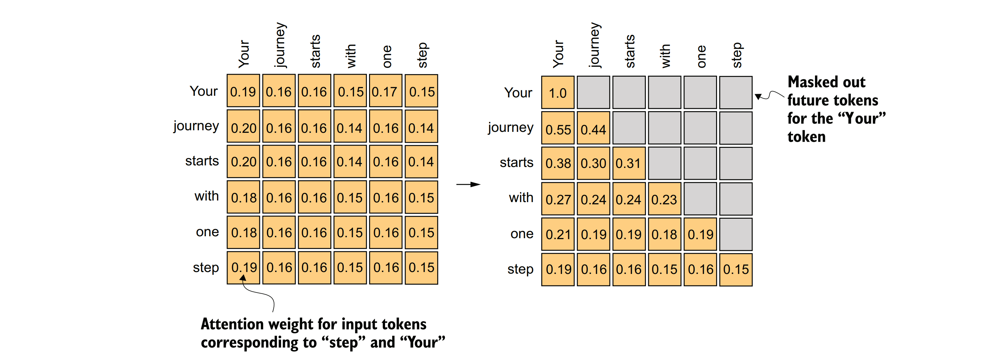
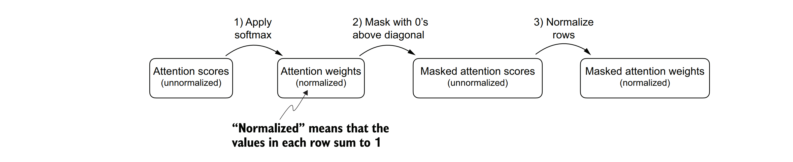
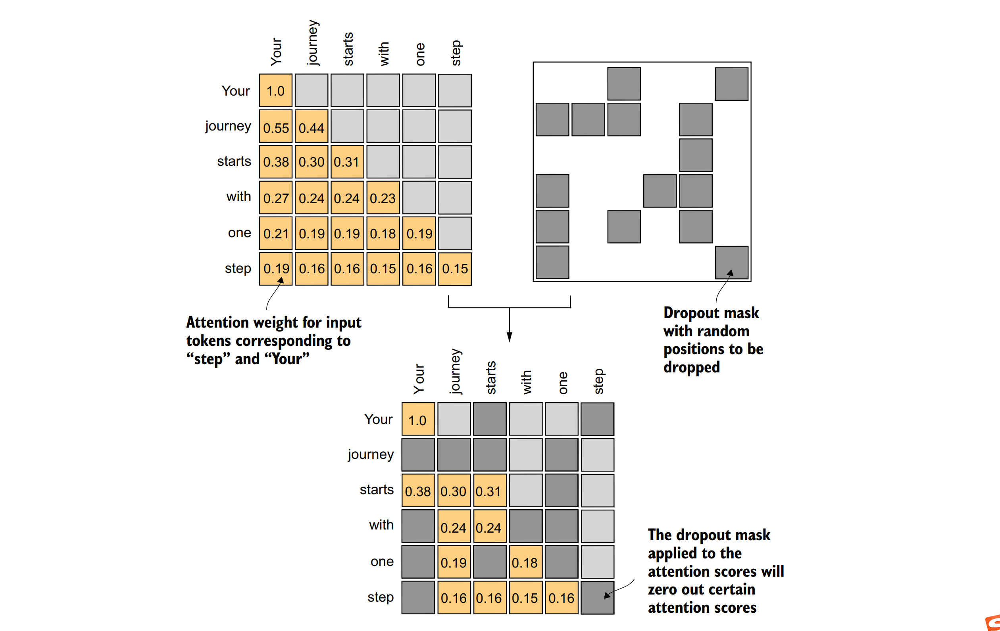
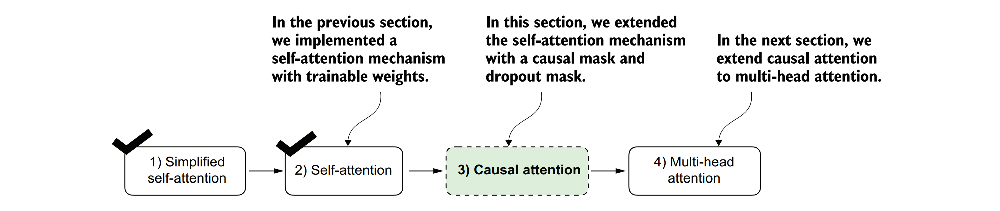

### 3.4使用因果注意力机制隐藏未来词汇
&nbsp;&nbsp;&nbsp;&nbsp;我们的下一步将是实现原始Transformer架构、GPT模型以及大多数其他流行大型语言模型（LLMs）中所使用的自注意力机制。这种自注意力机制也被称为缩放点积注意力（scaled dot-product attention）。图3.13展示了在实现大型语言模型的更广泛背景下，这种自注意力机制是如何被整合进去的。

&nbsp;&nbsp;&nbsp;&nbsp;对于许多大型语言模型（LLM）任务而言，在预测序列中下一个词汇时，你可能希望自注意力机制仅考虑当前位置之前出现的词汇。因果注意力，也被称为掩码注意力，是自注意力的一种特殊形式。在计算注意力分数时，它限制模型在处理任何给定词汇时，只能考虑序列中之前的和当前的输入。这与标准的自注意力机制形成对比，后者允许一次性访问整个输入序列。

&nbsp;&nbsp;&nbsp;&nbsp;现在，我们将修改标准的自注意力机制，以创建因果注意力机制，这对于在后续章节中开发大型语言模型至关重要。为了在类似GPT的大型语言模型中实现这一点，对于每个处理的词汇，我们会掩码掉输入文本中当前词汇之后的所有未来词汇，如图3.19所示。我们掩码掉对角线上方的注意力权重，并对未掩码的注意力权重进行归一化处理，使得每行的注意力权重之和为1。稍后，我们将在代码中实现这一掩码和归一化过程。


&nbsp;&nbsp;&nbsp;&nbsp;***图3.19 在因果注意力机制中，我们掩码掉对角线上方的注意力权重，以确保对于给定的输入，大型语言模型（LLM）在计算上下文向量时无法访问未来的词汇。例如，对于第二行中的单词“journey”，我们仅保留之前位置（“Your”）和当前位置（“journey”）的词汇的注意力权重。***

#### 3.5.1应用因果注意力

&nbsp;&nbsp;&nbsp;&nbsp;我们的下一步是在代码中实现因果注意力掩码。为了按照图3.20所概述的步骤应用因果注意力掩码以获得掩码后的注意力权重，我们将使用上一节中的注意力分数和权重来编写因果注意力机制的代码。


&nbsp;&nbsp;&nbsp;&nbsp;***图3.20 在因果注意力机制中，获得掩码后的注意力权重矩阵的一种方法是对注意力分数应用softmax函数，将对角线上方的元素置零，并对得到的矩阵进行归一化处理。***

&nbsp;&nbsp;&nbsp;&nbsp;在第一步中，我们像之前一样使用softmax函数计算注意力权重：

```python
queries = sa_v2.W_query(inputs)
keys = sa_v2.W_key(inputs)
attn_scores = queries @ keys.T
attn_weights = torch.softmax(attn_scores / keys.shape[-1]**0.5, dim=-1)
print(attn_weights)
```
&nbsp;&nbsp;&nbsp;&nbsp;这会产生如下的注意力权重：

```
tensor([[0.1921, 0.1646, 0.1652, 0.1550, 0.1721, 0.1510],
        [0.2041, 0.1659, 0.1662, 0.1496, 0.1665, 0.1477],
        [0.2036, 0.1659, 0.1662, 0.1498, 0.1664, 0.1480],
        [0.1869, 0.1667, 0.1668, 0.1571, 0.1661, 0.1564],
        [0.1830, 0.1669, 0.1670, 0.1588, 0.1658, 0.1585],
        [0.1935, 0.1663, 0.1666, 0.1542, 0.1666, 0.1529]],
       grad_fn=<SoftmaxBackward0>)
```
&nbsp;&nbsp;&nbsp;&nbsp;在第二步中，我们可以使用PyTorch的tril函数来创建一个掩码，其中对角线上方的值都为零。这个掩码将用于将注意力权重矩阵中对角线上方的元素置零，从而实现因果注意力机制。

```python
context_length = attn_scores.shape[0]
mask_simple = torch.tril(torch.ones(context_length, context_length))
print(mask_simple)
```

&nbsp;&nbsp;&nbsp;&nbsp;掩码的结果如下：
```
tensor([[1., 0., 0., 0., 0., 0.],
 [1., 1., 0., 0., 0., 0.],
 [1., 1., 1., 0., 0., 0.],
 [1., 1., 1., 1., 0., 0.],
 [1., 1., 1., 1., 1., 0.],
 [1., 1., 1., 1., 1., 1.]])
```

&nbsp;&nbsp;&nbsp;&nbsp;现在，我们可以将这个掩码与注意力权重相乘，将对角线上方的值置零：

```python
masked_simple = attn_weights * mask_simple
print(masked_simple)
```
&nbsp;&nbsp;&nbsp;&nbsp;如我们所见，对角线上方的元素已经成功地被置零：

```
tensor([[0.1921, 0.0000, 0.0000, 0.0000, 0.0000, 0.0000],
        [0.2041, 0.1659, 0.0000, 0.0000, 0.0000, 0.0000],
        [0.2036, 0.1659, 0.1662, 0.0000, 0.0000, 0.0000],
        [0.1869, 0.1667, 0.1668, 0.1571, 0.0000, 0.0000],
        [0.1830, 0.1669, 0.1670, 0.1588, 0.1658, 0.0000],
        [0.1935, 0.1663, 0.1666, 0.1542, 0.1666, 0.1529]],
       grad_fn=<MulBackward0>)
```
&nbsp;&nbsp;&nbsp;&nbsp;第三步是重新归一化注意力权重，使每行的和再次为1。我们可以通过将每行中的每个元素除以该行的和来实现这一点：

```python
row_sums = masked_simple.sum(dim=-1, keepdim=True)
masked_simple_norm = masked_simple / row_sums
print(masked_simple_norm)
```
&nbsp;&nbsp;&nbsp;&nbsp;结果是一个注意力权重矩阵，其中对角线上方的注意力权重被置零，并且每行的和为1：

```
tensor([[1.0000, 0.0000, 0.0000, 0.0000, 0.0000, 0.0000],
        [0.5517, 0.4483, 0.0000, 0.0000, 0.0000, 0.0000],
        [0.3800, 0.3097, 0.3103, 0.0000, 0.0000, 0.0000],
        [0.2758, 0.2460, 0.2462, 0.2319, 0.0000, 0.0000],
        [0.2175, 0.1983, 0.1984, 0.1888, 0.1971, 0.0000],
        [0.1935, 0.1663, 0.1666, 0.1542, 0.1666, 0.1529]],
       grad_fn=<DivBackward0>)
```

&nbsp;&nbsp;&nbsp;&nbsp;***信息泄露***
&nbsp;&nbsp;&nbsp;&nbsp;***当我们应用掩码然后重新归一化注意力权重时，初看起来，来自未来标记（我们打算掩蔽的）的信息仍然可能影响当前标记，因为它们的值是softmax计算的一部分。然而，关键之处在于，当我们掩蔽后重新归一化注意力权重时，我们实际上是在一个更小的子集上重新计算softmax（因为掩蔽位置不对softmax值做出贡献）。softmax的数学优雅之处在于，尽管最初在分母中包括了所有位置，但在掩蔽和重新归一化之后，掩蔽位置的影响被抵消了——它们不会以任何有意义的方式对softmax分数做出贡献。用更简单的术语来说，掩蔽和重新归一化之后，注意力权重的分布就好像一开始只在未掩蔽位置之间计算的一样。这确保了来自未来（或其他被掩蔽的）标记的信息不会像我们预期的那样泄露。***


&nbsp;&nbsp;&nbsp;&nbsp;尽管我们目前可以实现因果注意力机制，但我们仍然可以对其进行改进。让我们利用softmax函数的一个数学性质，以更少的步骤更高效地实现掩蔽注意力权重的计算，如图3.21所示。


&nbsp;&nbsp;&nbsp;&nbsp;***图3.21 在因果注意力机制中，获取掩蔽注意力权重矩阵的一种更高效的方法是在应用softmax函数之前，使用负无穷大值对注意力分数进行掩蔽。***


&nbsp;&nbsp;&nbsp;&nbsp;softmax函数将其输入转换为概率分布。当某一行中存在负无穷大值（-∞）时，softmax函数会将这些值视为零概率（从数学上讲，这是因为e^(-∞)趋近于0）。

&nbsp;&nbsp;&nbsp;&nbsp;我们可以通过创建一个在对角线以上的位置为1的掩码，然后将这些1替换为负无穷大（-inf）值来实现这种更高效的掩蔽“技巧”：

```python
mask = torch.triu(torch.ones(context_length, context_length), diagonal=1)
masked = attn_scores.masked_fill(mask.bool(), -torch.inf)
print(masked)
```
&nbsp;&nbsp;&nbsp;&nbsp;这段代码会生成如下的掩码：

```
tensor([[ 0.2899, -inf, -inf, -inf, -inf, -inf],
        [ 0.4656,  0.1723, -inf, -inf, -inf, -inf],
        [ 0.4594,  0.1703,  0.1731, -inf, -inf, -inf],
        [ 0.2642,  0.1024,  0.1036,  0.0186, -inf, -inf],
        [ 0.2183,  0.0874,  0.0882,  0.0177,  0.0786, -inf],
        [ 0.3408,  0.1270,  0.1290,  0.0198,  0.1290,  0.0078]],
       grad_fn=<MaskedFillBackward0>)
```

&nbsp;&nbsp;&nbsp;&nbsp;现在，我们只需要对这些掩蔽后的结果应用softmax函数，任务就完成了：

```python
attn_weights = torch.softmax(masked / keys.shape[-1]**0.5, dim=1)
print(attn_weights)
```
&nbsp;&nbsp;&nbsp;&nbsp;根据输出结果，我们可以看到每一行的值之和为1，因此无需进一步的归一化。这是因为softmax函数已经将输入分数转换为了概率分布。

```
tensor([[1.0000, 0.0000, 0.0000, 0.0000, 0.0000, 0.0000],
        [0.5517, 0.4483, 0.0000, 0.0000, 0.0000, 0.0000],
        [0.3800, 0.3097, 0.3103, 0.0000, 0.0000, 0.0000],
        [0.2758, 0.2460, 0.2462, 0.2319, 0.0000, 0.0000],
        [0.2175, 0.1983, 0.1984, 0.1888, 0.1971, 0.0000],
        [0.1935, 0.1663, 0.1666, 0.1542, 0.1666, 0.1529]],
       grad_fn=<SoftmaxBackward0>)
```
&nbsp;&nbsp;&nbsp;&nbsp;在这个结果中，每一行都代表了一个元素对其他元素的注意力权重，其中对角线以下的位置（即当前元素对其之前元素的注意力）有非零值，而对角线以上的位置（即当前元素对其之后元素的注意力）由于掩蔽操作而被置为零。

&nbsp;&nbsp;&nbsp;&nbsp;现在，我们可以使用修改后的注意力权重来计算上下文向量，如第3.4节所述，通过context_vec = attn_weights @ values来实现。然而，在继续之前，我们将介绍因果注意力机制的另一个小调整，这对于在训练大型语言模型（LLMs）时减少过拟合非常有用。

### 3.5.2使用丢弃法（dropout）屏蔽额外的注意力权重
&nbsp;&nbsp;&nbsp;&nbsp;深度学习中的Dropout技术是指在训练过程中随机忽略一部分隐藏层单元，即有效地“丢弃”它们。这种方法通过确保模型不过度依赖任何特定的隐藏层单元集合，有助于防止过拟合。重要的是要强调，Dropout仅在训练期间使用，训练结束后会禁用。

&nbsp;&nbsp;&nbsp;&nbsp;在Transformer架构中，包括像GPT这样的模型，注意力机制中的Dropout通常应用于两个特定时刻：计算注意力权重之后或将注意力权重应用于值向量之后。在这里，我们将按照图3.22所示，在计算注意力权重之后应用Dropout掩码，因为这是实践中更常见的变体。

&nbsp;&nbsp;&nbsp;&nbsp;在以下代码示例中，我们使用了50%的Dropout率，这意味着屏蔽掉一半的注意力权重。（在后续章节中训练GPT模型时，我们将使用较低的Dropout率，如0.1或0.2。）为了简化，我们首先使用PyTorch的Dropout实现对一个由1组成的6×6张量应用Dropout：

```python
torch.manual_seed(123)
dropout = torch.nn.Dropout(0.5)
example = torch.ones(6, 6)
print(dropout(example))
```


&nbsp;&nbsp;&nbsp;&nbsp;***图3.22 使用因果注意力掩码（左上角），我们应用了一个额外的Dropout掩码（右上角），以将额外的注意力权重置为零，从而在训练过程中减少过拟合。***

&nbsp;&nbsp;&nbsp;&nbsp;正如我们所见，大约有一半的值被置为零：
```
tensor([[2., 2., 0., 2., 2., 0.],
 [0., 0., 0., 2., 0., 2.],
 [2., 2., 2., 2., 0., 2.],
 [0., 2., 2., 0., 0., 2.],
 [0., 2., 0., 2., 0., 2.],
 [0., 2., 2., 2., 2., 0.]])
```

&nbsp;&nbsp;&nbsp;&nbsp;当我们以50%的比率对注意力权重矩阵应用Dropout时，矩阵中的一半元素会被随机置为零。为了补偿活跃元素的减少，矩阵中剩余元素的值会按1/0.5=2的比例进行放大。这种缩放是至关重要的，它可以保持注意力权重的整体平衡，确保在训练和推理阶段，注意力机制的平均影响保持一致。

&nbsp;&nbsp;&nbsp;&nbsp;现在，让我们对注意力权重矩阵本身应用Dropout：

```python
torch.manual_seed(123)  # 设置随机种子以确保结果可复现
print(dropout(attn_weights))  # 假设dropout是一个已经定义好的Dropout层，attn_weights是注意力权重矩阵
```
&nbsp;&nbsp;&nbsp;&nbsp;得到的注意力权重矩阵现在有了更多的零元素，并且剩余的1被重新缩放：

```
tensor([[2.0000, 0.0000, 0.0000, 0.0000, 0.0000, 0.0000],
        [0.0000, 0.0000, 0.0000, 0.0000, 0.0000, 0.0000],
        [0.7599, 0.6194, 0.6206, 0.0000, 0.0000, 0.0000],
        [0.0000, 0.4921, 0.4925, 0.0000, 0.0000, 0.0000],
        [0.0000, 0.3966, 0.0000, 0.3775, 0.0000, 0.0000],
        [0.0000, 0.3327, 0.3331, 0.3084, 0.3331, 0.0000]],
       grad_fn=<MulBackward0>)
```
&nbsp;&nbsp;&nbsp;&nbsp;请注意，由于操作系统或其他因素的影响，实际的Dropout输出可能看起来有所不同。你可以在PyTorch的问题跟踪器上了解更多关于这种不一致性的信息，网址为：https://github.com/pytorch/pytorch/issues/121595。
&nbsp;&nbsp;&nbsp;&nbsp;在理解了因果注意力和Dropout掩码之后，我们现在可以开发一个简洁的Python类。这个类旨在促进这两种技术的有效应用。

### 3.5.3 实现一个简单的因果注意力类
&nbsp;&nbsp;&nbsp;&nbsp;现在，我们将把因果注意力和Dropout修改整合到我们之前在3.4节中开发的SelfAttention Python类中。这个类将作为开发多头注意力（multi-head attention）的模板，而多头注意力是我们将要实现的最终注意力类。

&nbsp;&nbsp;&nbsp;&nbsp;但是，在开始之前，我们需要确保代码能够处理由多个输入组成的批次，以便我们的CausalAttention类能够支持我们在第2章中实现的数据加载器产生的批量输出。

&nbsp;&nbsp;&nbsp;&nbsp;为了简化，为了模拟这样的批量输入，我们复制输入文本示例：

```python
batch = torch.stack((inputs, inputs), dim=0)
print(batch.shape)
```
&nbsp;&nbsp;&nbsp;&nbsp;这会产生一个三维张量，其中包含两个输入文本，每个文本有六个标记（token），每个标记是一个三维嵌入向量：
```
torch.Size([2, 6, 3])
```
&nbsp;&nbsp;&nbsp;&nbsp;下面的CausalAttention类与我们之前实现的SelfAttention类类似，但我们添加了Dropout和因果掩码组件。


&nbsp;&nbsp;&nbsp;&nbsp;***代码块3.3 一个简单的因果注意力类***
```python
class CausalAttention(nn.Module):
 def __init__(self, d_in, d_out, context_length,
        dropout, qkv_bias=False):
        super().__init__()
        self.d_out = d_out
        self.W_query = nn.Linear(d_in, d_out, bias=qkv_bias)
        self.W_key = nn.Linear(d_in, d_out, bias=qkv_bias)
        self.W_value = nn.Linear(d_in, d_out, bias=qkv_bias)
        self.dropout = nn.Dropout(dropout)
        self.register_buffer(
        'mask',
        torch.triu(torch.ones(context_length, context_length),
        diagonal=1))
 def forward(self, x):
        b, num_tokens, d_in = x.shape
        keys = self.W_key(x)
        queries = self.W_query(x)
        values = self.W_value(x)
        attn_scores = queries @ keys.transpose(1, 2)
        attn_scores.masked_fill_(
        self.mask.bool()[:num_tokens, :num_tokens], -torch.inf)
        attn_weights = torch.softmax(
        attn_scores / keys.shape[-1]**0.5, dim=-1
        )
        attn_weights = self.dropout(attn_weights)
        context_vec = attn_weights @ values
        return context_vec
 ```

 &nbsp;&nbsp;&nbsp;&nbsp;虽然此时所有新增的代码行应该都已经很熟悉了，但我们现在在__init__方法中增加了一个self.register_buffer()调用。在PyTorch中使用register_buffer并不是所有用例都严格必需的，但在这里它提供了几个优点。例如，当我们在大型语言模型（LLM）中使用CausalAttention类时，缓冲区会自动与我们的模型一起移动到适当的设备（CPU或GPU）上，这在训练我们的LLM时将非常重要。这意味着我们不需要手动确保这些张量与模型参数在同一设备上，从而避免了设备不匹配错误。

&nbsp;&nbsp;&nbsp;&nbsp;我们可以像之前使用SelfAttention类一样使用CausalAttention类，如下所示：

```python
torch.manual_seed(123)  # 设置随机种子以确保结果可重复
context_length = batch.shape[1]  # 获取批次中每个输入文本的标记数量
ca = CausalAttention(d_in, d_out, context_length, 0.0)  # 实例化CausalAttention类，注意这里我们假设d_in和d_out已经定义，且d_out等于embed_dim
context_vecs = ca(batch)  # 通过CausalAttention类处理批次数据
print("context_vecs.shape:", context_vecs.shape)  # 打印输出张量的形状
```

&nbsp;&nbsp;&nbsp;&nbsp;生成的上下文向量是一个三维张量，其中每个标记现在由一个二维嵌入表示：
```
context_vecs.shape: torch.Size([2, 6, 2])
```
&nbsp;&nbsp;&nbsp;&nbsp;图3.23总结了我们到目前为止所完成的工作。我们重点关注了神经网络中因果注意力的概念和实现。接下来，我们将扩展这一概念，并实现一个多头注意力模块，该模块可以并行实现多个因果注意力机制。



&nbsp;&nbsp;&nbsp;&nbsp;***图3.23 我们到目前为止的工作总结.到目前为止，我们已经完成了以下工作：我们从一个简化的注意力机制开始，然后增加了可训练的权重，接着又加入了因果注意力掩码。接下来，我们将扩展因果注意力机制，并编写多头注意力（multi-head attention）的代码，这将在我们的大型语言模型（LLM）中使用。***