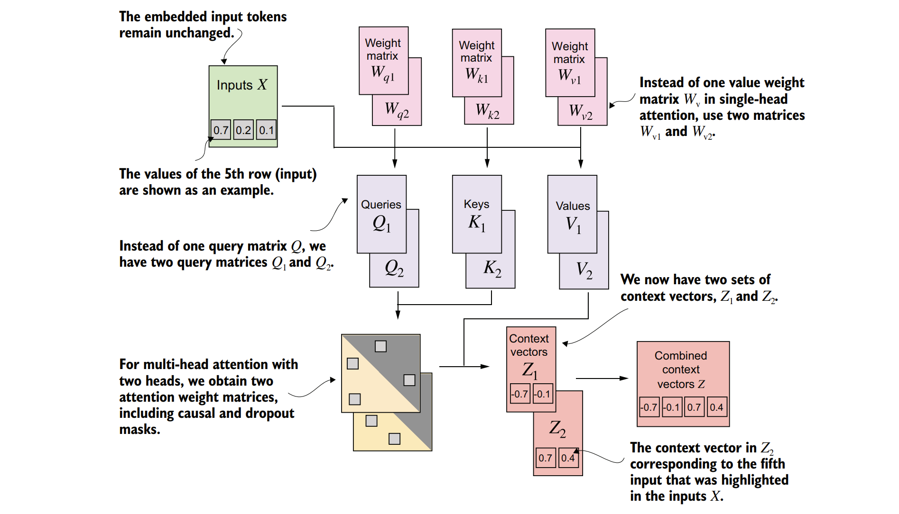
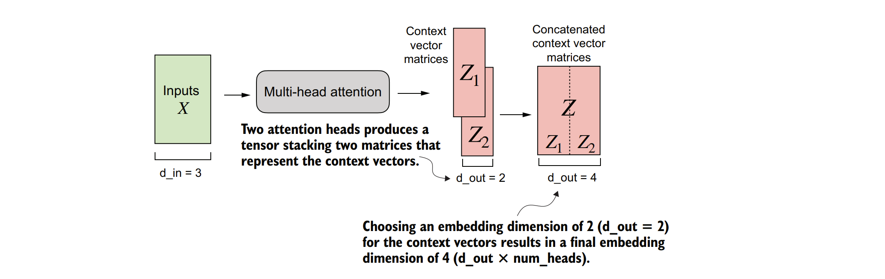
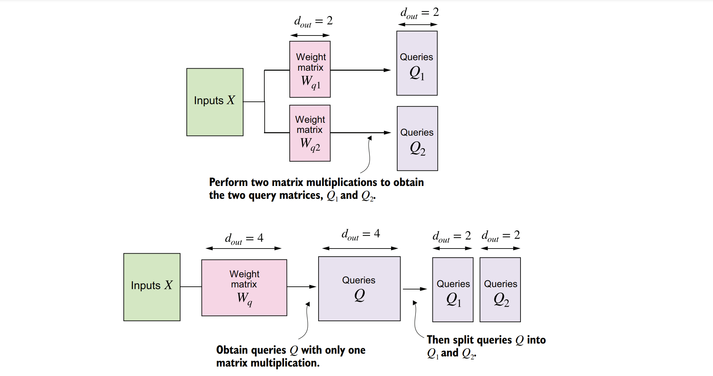

### 3.6从单头注意力扩展到多头注意力
&nbsp;&nbsp;&nbsp;&nbsp;我们的最后一步是将之前实现的因果注意力类扩展到多个头上，这也被称为多头注意力。
&nbsp;&nbsp;&nbsp;&nbsp;“多头”这一术语指的是将注意力机制分成多个“头”，每个头独立运作。在这个上下文中，一个单独的因果注意力模块可以被视为单头注意力，其中只有一组注意力权重按顺序处理输入。
&nbsp;&nbsp;&nbsp;&nbsp;我们将从因果注意力扩展到多头注意力的过程进行分解。首先，我们将通过堆叠多个CausalAttention模块来直观地构建一个多头注意力模块。然后，我们将以更复杂但计算效率更高的方式实现相同的多头注意力模块。

### 3.6.1 堆叠多个单头注意力层
&nbsp;&nbsp;&nbsp;&nbsp;从实际操作的角度来看，实现多头注意力涉及创建多个自注意力机制的实例（见图3.18），每个实例都有自己的权重，然后将它们的输出进行组合。使用多个自注意力机制的实例在计算上可能是密集型的，但对于基于Transformer的大型语言模型（LLMs）所擅长的复杂模式识别来说，这是至关重要的。
&nbsp;&nbsp;&nbsp;&nbsp;图3.24展示了多头注意力模块的结构，该模块由多个单头注意力模块组成，这些单头注意力模块与之前在图3.18中所示的结构类似，彼此堆叠在一起。


 
**图3.24展示了多头注意力模块的结构，该模块由多个单头注意力模块堆叠而成，这些单头注意力模块的结构与之前在图3.18中展示的类似。在具有两个头的多头注意力模块中，我们不再使用单个矩阵 $W_v$ 来计算值矩阵。相反，我们现在有两个值权重矩阵：$W_{v1}$ 和 $W_{v2}$。同样的原理也适用于其他权重矩阵 $W_Q$ 和 $W_K$。我们得到两组上下文向量 $Z_1$ 和 $Z_2$，可以将它们组合成一个单一的上下文向量矩阵 $Z$。** 

&nbsp;&nbsp;&nbsp;&nbsp;如前所述，多头注意力的主要思想是使用不同的、通过学习得到的线性投影多次（并行）运行注意力机制——即通过将输入数据（如注意力机制中的查询、键和值向量）乘以一个权重矩阵来得到结果。在代码中，我们可以通过实现一个简单的MultiHeadAttentionWrapper类来实现这一点，该类将我们之前实现的CausalAttention模块的多个实例堆叠在一起。


**代码块 3.4 一个实现多头注意力的包装类**
```python
class MultiHeadAttentionWrapper(nn.Module):
    def __init__(self, d_in, d_out, context_length, dropout, num_heads, qkv_bias=False):
        super().__init__()
        # 创建一个ModuleList来存储多个CausalAttention实例
        self.heads = nn.ModuleList([
            CausalAttention(d_in, d_out, context_length, dropout, qkv_bias)
            for _ in range(num_heads)
        ])

    def forward(self, x):
        # 对每个head应用前向传播，并将结果沿最后一个维度拼接
        return torch.cat([head(x) for head in self.heads], dim=-1)
```

&nbsp;&nbsp;&nbsp;&nbsp;例如，如果我们使用这个MultiHeadAttentionWrapper类，并设置两个注意力头（通过num_heads=2）以及CausalAttention的输出维度d_out=2，那么我们将得到一个四维的上下文向量（d_out*num_heads=4），如图3.25所示。



&nbsp;&nbsp;&nbsp;&nbsp;**图3.25中展示了使用MultiHeadAttentionWrapper时，我们指定了注意力头的数量（num_heads）。如果像这个例子中那样，我们将num_heads设置为2，那么我们会得到一个包含两组上下文向量矩阵的张量。在每个上下文向量矩阵中，行代表与标记相对应的上下文向量，而列则对应于通过d_out=4指定的嵌入维度。我们将这些上下文向量矩阵沿着列维度拼接起来。由于我们有两个注意力头和一个嵌入维度为2，最终的嵌入维度是2 × 2 = 4**

&nbsp;&nbsp;&nbsp;&nbsp;为了用具体例子进一步说明这一点，我们可以使用与之前的CausalAttention类类似的MultiHeadAttentionWrapper类：

```python
torch.manual_seed(123)
context_length = batch.shape[1] # This is the number of tokens
d_in, d_out = 3, 2
mha = MultiHeadAttentionWrapper(
 d_in, d_out, context_length, 0.0, num_heads=2
)
context_vecs = mha(batch)
print(context_vecs)
print("context_vecs.shape:", context_vecs.shape)
```

&nbsp;&nbsp;&nbsp;&nbsp;这会产生以下张量，代表上下文向量：
```
tensor([[[-0.4519, 0.2216, 0.4772, 0.1063],
 [-0.5874, 0.0058, 0.5891, 0.3257],
 [-0.6300, -0.0632, 0.6202, 0.3860],
 [-0.5675, -0.0843, 0.5478, 0.3589],
 [-0.5526, -0.0981, 0.5321, 0.3428],
 [-0.5299, -0.1081, 0.5077, 0.3493]],
 [[-0.4519, 0.2216, 0.4772, 0.1063],
 [-0.5874, 0.0058, 0.5891, 0.3257],
 [-0.6300, -0.0632, 0.6202, 0.3860],
 [-0.5675, -0.0843, 0.5478, 0.3589],
 [-0.5526, -0.0981, 0.5321, 0.3428],
 [-0.5299, -0.1081, 0.5077, 0.3493]]], grad_fn=<CatBackward0>)
context_vecs.shape: torch.Size([2, 6, 4])
```

&nbsp;&nbsp;&nbsp;&nbsp;生成的context_vecs张量的第一维是2，因为我们有两个输入文本（输入文本是重复的，所以它们的上下文向量是完全相同的）。第二维指的是每个输入中的6个标记（token）。第三维指的是每个标记的四维嵌入表示。


&nbsp;&nbsp;&nbsp;&nbsp;**练习3.2 返回二维嵌入向量**
**调整MultiHeadAttentionWrapper(..., num_heads=2)调用的输入参数，使得输出的上下文向量是二维的而不是四维的，同时保持num_heads=2的设置不变。提示：你无需修改类的实现，只需更改其他输入参数中的一个即可。**

&nbsp;&nbsp;&nbsp;&nbsp;到目前为止，我们已经实现了一个MultiHeadAttentionWrapper，它将多个单头注意力模块组合在一起。然而，在forward方法中，这些模块是通过[head(x) for head in self.heads]顺序处理的。我们可以通过并行处理这些头来改进这个实现。实现这一点的一种方法是通过矩阵乘法同时计算所有注意力头的输出。


### 3.6.2使用权重分割实现多头注意力

&nbsp;&nbsp;&nbsp;&nbsp;到目前为止，我们已经创建了MultiHeadAttentionWrapper类，通过堆叠多个单头注意力模块来实现多头注意力。这是通过实例化和组合多个CausalAttention对象来完成的。为了不再维护两个独立的类——MultiHeadAttentionWrapper和CausalAttention，我们可以将这些概念合并到一个单一的MultiHeadAttention类中。此外，除了将MultiHeadAttentionWrapper与CausalAttention的代码合并之外，我们还将进行一些其他修改，以更高效地实现多头注意力。

&nbsp;&nbsp;&nbsp;&nbsp;在MultiHeadAttentionWrapper中，多个头是通过创建一个CausalAttention对象列表（self.heads）来实现的，每个对象代表一个独立的注意力头。CausalAttention类独立地执行注意力机制，并将每个头的结果拼接起来。相比之下，下面的MultiHeadAttention类将多头功能集成在一个类内。它通过重塑投影后的查询（query）、键（key）和值（value）张量来将输入分割成多个头，然后在计算注意力之后将这些头的结果合并起来。

&nbsp;&nbsp;&nbsp;&nbsp;在我们进一步讨论之前，让我们先来看一下MultiHeadAttention类。


```python
import torch
import torch.nn as nn

class MultiHeadAttention(nn.Module):
    def __init__(self, d_in, d_out, context_length, dropout, num_heads, qkv_bias=False):
        super().__init__()
        # 确保d_out可以被num_heads整除
        assert (d_out % num_heads == 0), "d_out must be divisible by num_heads"
        
        self.d_out = d_out
        self.num_heads = num_heads
        self.head_dim = d_out // num_heads  # 每个头的维度
        
        # 初始化查询、键和值的线性变换层
        self.W_query = nn.Linear(d_in, d_out, bias=qkv_bias)
        self.W_key = nn.Linear(d_in, d_out, bias=qkv_bias)
        self.W_value = nn.Linear(d_in, d_out, bias=qkv_bias)
        
        # 输出投影层，用于合并所有头的输出
        self.out_proj = nn.Linear(d_out, d_out)
        
        # Dropout层
        self.dropout = nn.Dropout(dropout)
        
        # 创建一个上三角矩阵作为掩码，用于自注意力机制中的自回归约束
        self.register_buffer(
            "mask",
            torch.triu(torch.ones(context_length, context_length), diagonal=1)
        )

    def forward(self, x):
        b, num_tokens, d_in = x.shape  # 输入张量的形状：批量大小、令牌数量、输入维度
        
        # 通过线性变换得到查询、键和值
        keys = self.W_key(x)
        queries = self.W_query(x)
        values = self.W_value(x)
        
        # 将查询、键和值重塑为多头形状
        keys = keys.view(b, num_tokens, self.num_heads, self.head_dim)
        values = values.view(b, num_tokens, self.num_heads, self.head_dim)
        queries = queries.view(b, num_tokens, self.num_heads, self.head_dim)
        
        # 转置，以便每个头可以独立处理
        keys = keys.transpose(1, 2)
        queries = queries.transpose(1, 2)
        values = values.transpose(1, 2)
        
        # 计算注意力分数，并进行缩放
        attn_scores = queries @ keys.transpose(2, 3) / keys.shape[-1]**0.5
        
        # 应用掩码，将上三角部分设置为负无穷，以在softmax中忽略
        mask_bool = self.mask.bool()[:num_tokens, :num_tokens]
        attn_scores.masked_fill_(mask_bool, -torch.inf)
        
        # 计算注意力权重，并应用dropout
        attn_weights = torch.softmax(attn_scores, dim=-1)
        attn_weights = self.dropout(attn_weights)
        
        # 计算上下文向量，并转置回原始形状
        context_vec = (attn_weights @ values).transpose(1, 2)
        
        # 重塑上下文向量，以匹配输出维度
        context_vec = context_vec.contiguous().view(b, num_tokens, self.d_out)
        
        # 应用输出投影层
        context_vec = self.out_proj(context_vec)
        
        return context_vec
```

&nbsp;&nbsp;&nbsp;&nbsp;尽管MultiHeadAttention类内部的张量重塑（.view）和转置（.transpose）操作在数学上看起来非常复杂，但实际上，MultiHeadAttention类实现的概念与之前提到的MultiHeadAttentionWrapper是相同的。

&nbsp;&nbsp;&nbsp;&nbsp;从大局来看，在之前的MultiHeadAttentionWrapper中，我们是将多个单头注意力层堆叠起来，然后将它们组合成一个多头注意力层。而MultiHeadAttention类则采用了一种集成的方法。它从一个多头层开始，然后在内部将这个层拆分成单个的注意力头，如图3.26所示。

&nbsp;&nbsp;&nbsp;&nbsp;查询（query）、键（key）和值（value）张量的拆分是通过使用PyTorch的.view和.transpose方法进行的张量重塑和转置操作来实现的。输入首先通过线性层（针对查询、键和值）进行变换，然后重塑以表示多个头。

&nbsp;&nbsp;&nbsp;&nbsp;关键操作是将d_out维度拆分成num_heads和head_dim，其中head_dim = d_out / num_heads。这种拆分是通过.view方法实现的：一个维度为(b, num_tokens, d_out)的张量被重塑为维度(b, num_tokens, num_heads, head_dim)。



**&nbsp;&nbsp;&nbsp;&nbsp;图3.26 在具有两个注意力头的MultiHeadAttentionWrapper类中，我们初始化了两个权重矩阵Wq1和Wq2，并计算了两个查询矩阵Q1和Q2（上部）。而在MultiHeadAttention类中，我们初始化了一个更大的权重矩阵Wq，仅对输入执行一次矩阵乘法以获得查询矩阵Q，然后将查询矩阵Q拆分成Q1和Q2（下部）。对于键和值，我们也做了同样的处理，但为了减少视觉上的杂乱，图中并未展示。**

&nbsp;&nbsp;&nbsp;&nbsp;随后，对这些张量进行转置，将num_heads维度置于num_tokens维度之前，从而得到形状为(b, num_heads, num_tokens, head_dim)的张量。这种转置对于正确对齐不同头之间的查询、键和值，以及高效执行批量矩阵乘法至关重要。

&nbsp;&nbsp;&nbsp;&nbsp;为了说明这种批量矩阵乘法，假设我们有以下张量：

```
a = torch.tensor([[[[0.2745, 0.6584, 0.2775, 0.8573],
 [0.8993, 0.0390, 0.9268, 0.7388],
 [0.7179, 0.7058, 0.9156, 0.4340]],
 [[0.0772, 0.3565, 0.1479, 0.5331],
 [0.4066, 0.2318, 0.4545, 0.9737],
 [0.4606, 0.5159, 0.4220, 0.5786]]]])
```

&nbsp;&nbsp;&nbsp;&nbsp;现在，我们在张量本身和该张量的一个视图之间执行批量矩阵乘法，其中该视图的最后两个维度（num_tokens和head_dim）已被转置：

```python
print(a @ a.transpose(2, 3))
```

结果如下：
```
tensor([[[[1.3208, 1.1631, 1.2879],
 [1.1631, 2.2150, 1.8424],
 [1.2879, 1.8424, 2.0402]],
 [[0.4391, 0.7003, 0.5903],
 [0.7003, 1.3737, 1.0620],
 [0.5903, 1.0620, 0.9912]]]])
```

&nbsp;&nbsp;&nbsp;&nbsp;在这种情况下，PyTorch中的矩阵乘法实现会处理这个四维输入张量，使得矩阵乘法在两个最后的维度（num_tokens和head_dim）之间进行，然后对每个头重复这一操作。

&nbsp;&nbsp;&nbsp;&nbsp;例如，前面的方法可以被简化为一种更紧凑的方式来分别计算每个头的矩阵乘法：

```python
first_head = a[0, 0, :, :]
first_res = first_head @ first_head.T
print("First head:\n", first_res)
second_head = a[0, 1, :, :]
second_res = second_head @ second_head.T
print("\nSecond head:\n", second_res)
```

&nbsp;&nbsp;&nbsp;&nbsp;这些结果与使用批量矩阵乘法print(a @ a.transpose(2, 3))时获得的结果完全相同。

```
First head:
 tensor([[1.3208, 1.1631, 1.2879],
 [1.1631, 2.2150, 1.8424],
 [1.2879, 1.8424, 2.0402]])
Second head:
 tensor([[0.4391, 0.7003, 0.5903],
 [0.7003, 1.3737, 1.0620],
 [0.5903, 1.0620, 0.9912]])
```

&nbsp;&nbsp;&nbsp;&nbsp;在继续讨论多头注意力（MultiHeadAttention）时，计算出注意力权重和上下文向量后，所有头的上下文向量会被转置回形状（b, num_tokens, num_heads, head_dim）。然后，这些向量会被重塑（展平）成形状（b, num_tokens, d_out），从而有效地结合了所有头的输出。

&nbsp;&nbsp;&nbsp;&nbsp;此外，在合并所有头之后，我们在多头注意力中增加了一个输出投影层（self.out_proj），这在因果注意力（CausalAttention）类中是不存在的。这个输出投影层并不是严格必需的（更多细节见附录B），但它在许多大型语言模型（LLM）架构中经常被使用，因此我为了完整性在这里添加了它。

&nbsp;&nbsp;&nbsp;&nbsp;尽管由于额外的张量重塑和转置，多头注意力类（MultiHeadAttention）看起来比多头注意力包装器（MultiHeadAttentionWrapper）更复杂，但它更高效。原因是，例如，我们只需要一个矩阵乘法来计算键（keys = self.W_key(x)），查询（queries）和值（values）的计算也是如此。在多头注意力包装器中，我们需要对每个注意力头重复这个矩阵乘法，这是计算中最昂贵的步骤之一。

&nbsp;&nbsp;&nbsp;&nbsp;多头注意力类（MultiHeadAttention）的使用方式与我们之前实现的自注意力（SelfAttention）和因果注意力（CausalAttention）类类似：

```python
torch.manual_seed(123)
batch_size, context_length, d_in = batch.shape
d_out = 2
mha = MultiHeadAttention(d_in, d_out, context_length, 0.0, num_heads=2)
context_vecs = mha(batch)
print(context_vecs)
print("context_vecs.shape:", context_vecs.shape)
```

&nbsp;&nbsp;&nbsp;&nbsp;结果表明，输出维度直接由d_out参数控制：
```
tensor([[[0.3190, 0.4858],
 [0.2943, 0.3897],
 [0.2856, 0.3593],
 [0.2693, 0.3873],
 [0.2639, 0.3928],
 [0.2575, 0.4028]],
 [[0.3190, 0.4858],
 [0.2943, 0.3897],
 [0.2856, 0.3593],
 [0.2693, 0.3873],
 [0.2639, 0.3928],
 [0.2575, 0.4028]]], grad_fn=<ViewBackward0>)
context_vecs.shape: torch.Size([2, 6, 2])
```

&nbsp;&nbsp;&nbsp;&nbsp;现在，我们已经实现了将在实现和训练大型语言模型（LLM）时使用的MultiHeadAttention类。请注意，虽然代码功能完备，但为了使输出易于阅读，我使用了相对较小的嵌入尺寸和注意力头数量。

&nbsp;&nbsp;&nbsp;&nbsp;相比之下，最小的GPT-2模型（1.17亿参数）有12个注意力头和768的上下文向量嵌入尺寸。而最大的GPT-2模型（15亿参数）则有25个注意力头和1600的上下文向量嵌入尺寸。在GPT模型中，标记输入和上下文嵌入的嵌入尺寸是相同的（d_in = d_out）。

&nbsp;&nbsp;&nbsp;&nbsp;**练习3.3 初始化GPT-2尺寸的注意力模块**
&nbsp;&nbsp;&nbsp;&nbsp;**使用MultiHeadAttention类，初始化一个多头注意力模块，使其具有与最小GPT-2模型相同数量的注意力头（12个注意力头）。同时，确保您使用的输入和输出嵌入尺寸与GPT-2相似（768维）。请注意，最小的GPT-2模型支持1,024个标记的上下文长度。**


**总结**
- 注意力机制将输入元素转换为增强的上下文向量表示，这些表示包含了所有输入的信息。
- 自注意力机制通过输入的加权和来计算上下文向量表示。
- 在简化的注意力机制中，注意力权重通过点积计算得出。
- 点积是一种简洁的方式，通过逐元素相乘然后求和来计算两个向量的乘积。
- 矩阵乘法虽然不是严格必需的，但它通过替换嵌套的for循环，帮助我们更高效地实施计算，并使代码更简洁。
- 在大型语言模型（LLM）中使用的自注意力机制，也称为缩放点积注意力，我们包含可训练的权重矩阵来计算输入的中间变换：查询、值和键。
- 当处理从左到右读取和生成文本的大型语言模型时，我们添加一个因果注意力掩码，以防止模型访问未来的标记。
- 除了使用因果注意力掩码将注意力权重置零外，我们还可以添加丢弃掩码来减少大型语言模型中的过拟合。
- 基于Transformer的大型语言模型中的注意力模块涉及多个因果注意力的实例，这被称为多头注意力。
- 我们可以通过堆叠多个因果注意力模块的实例来创建多头注意力模块。
- 创建多头注意力模块的更高效方法涉及批量矩阵乘法。