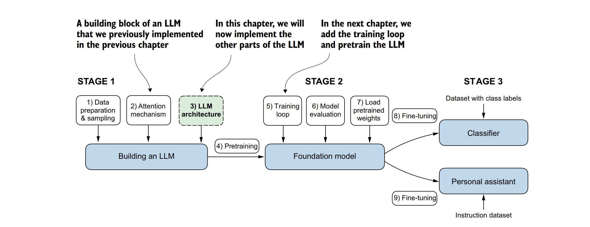
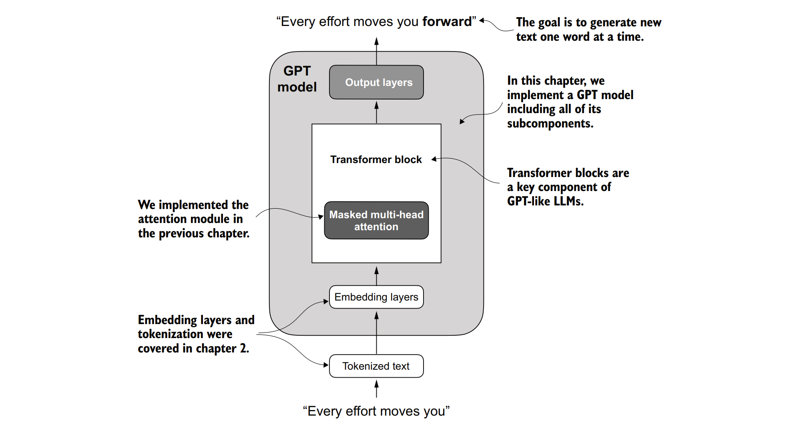
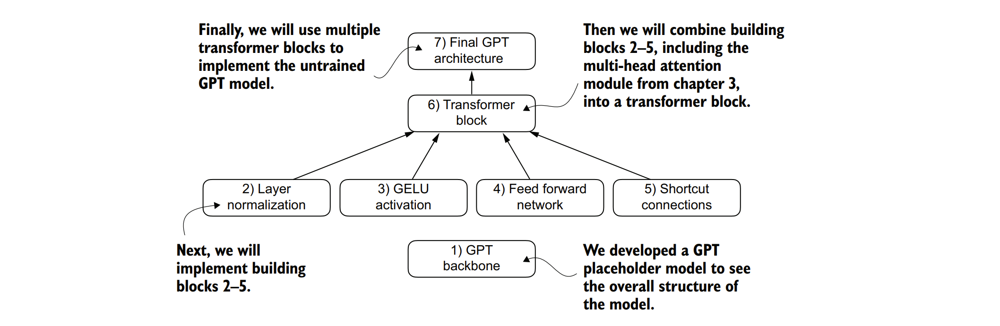
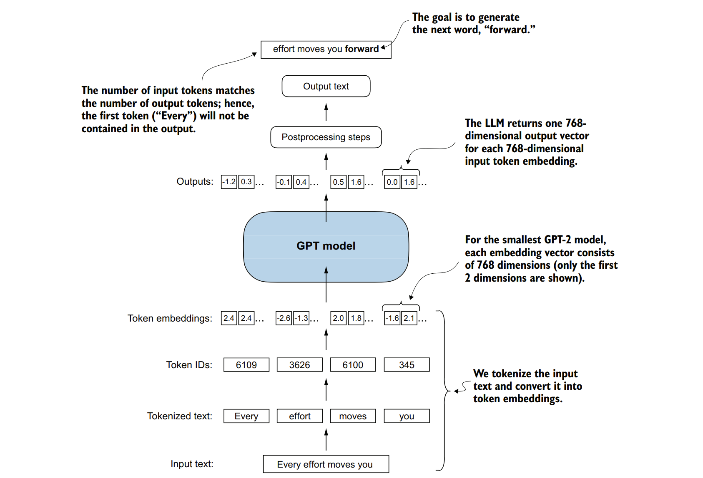

### 第4章 从头实现一个用于生成文本的GPT模型

本章内容涵盖：
- 编写一个类似GPT的大型语言模型（LLM），该模型可以经过训练以生成类似人类的文本。
- 对层激活进行归一化，以稳定神经网络的训练。
- 在深度神经网络中添加快捷连接（也称为残差连接）。
- 实现Transformer模块，以创建不同大小的GPT模型。
- 计算GPT模型的参数数量和存储需求。

&nbsp;&nbsp;&nbsp;&nbsp;您已经学习和编写了多头注意力机制，这是大型语言模型（LLMs）的核心组件之一。现在，我们将编写LLM的其他构建块，并将它们组装成一个类似GPT的模型，我们将在下一章中对其进行训练，以生成类似人类的文本。

&nbsp;&nbsp;&nbsp;&nbsp;图4.1中引用的大型语言模型（LLM）架构由几个构建块组成。在更详细地介绍各个组件之前，我们将先从模型架构的顶层视图开始。


&nbsp;&nbsp;&nbsp;&nbsp;**图4.1 编码大型语言模型（LLM）的三个主要阶段。本章专注于第一阶段中的第三步：实现LLM架构。**

### 4.1 编写大型语言模型（LLM）架构的代码

&nbsp;&nbsp;&nbsp;&nbsp;大型语言模型（LLMs），如GPT（代表生成式预训练Transformer），是设计用于一次生成一个新文本单词（或标记）的大型深度神经网络架构。然而，尽管它们的规模很大，但其模型架构却比您想象的要简单得多，因为我们会发现，它的许多组件都是重复的。图4.2提供了一个类似GPT的大型语言模型的顶层视图，并突出了其主要组件。

&nbsp;&nbsp;&nbsp;&nbsp;我们已经介绍了大型语言模型架构的几个方面，如输入分词和嵌入以及掩码多头注意力模块。现在，我们将实现GPT模型的核心结构，包括其Transformer模块，稍后将对其进行训练以生成类似人类的文本。

&nbsp;&nbsp;&nbsp;&nbsp;之前，为了简化，我们使用了较小的嵌入维度，确保概念和示例能够轻松地容纳在一页内。现在，我们将规模扩大到一个小型GPT-2模型的大小，特别是具有1.24亿参数的最小版本，如Radford等人在“Language Models Are Unsupervised Multitask Learners”（《语言模型是无监督多任务学习者》）一文（https://mng.bz/yoBq）中所述。请注意，尽管原始报告提到了1.17亿参数，但后来这一数字已被更正。在第六章中，我们将重点介绍如何将预训练权重加载到我们的实现中，并使其适用于具有3.45亿、7.62亿和15.42亿参数的更大GPT-2模型。

&nbsp;&nbsp;&nbsp;&nbsp;在深度学习和类似GPT的大型语言模型的背景下，“参数”一词指的是模型的可训练权重。这些权重本质上是模型在训练过程中进行调整和优化的内部变量，以最小化特定的损失函数。这种优化使模型能够从训练数据中学习。


&nbsp;&nbsp;&nbsp;&nbsp;**图4.2 GPT模型。除了嵌入层之外，它由一个或多个包含我们之前实现的掩码多头注意力模块的Transformer模块组成。**

&nbsp;&nbsp;&nbsp;&nbsp;例如，在一个由2048×2048维的权重矩阵（或张量）表示的神经网络层中，该矩阵的每个元素都是一个参数。由于有2048行和2048列，因此该层的参数总数是2048乘以2048，等于4,194,304个参数。


&nbsp;&nbsp;&nbsp;&nbsp;**GPT-2与GPT-3**

&nbsp;&nbsp;&nbsp;&nbsp;**请注意，我们之所以重点关注GPT-2，是因为OpenAI已经公开了预训练模型的权重，我们将在第六章中将其加载到我们的实现中。GPT-3在模型架构上与GPT-2基本相同，不同之处在于GPT-3的参数规模从GPT-2的15亿扩展到了1750亿，并且它使用了更多的数据进行训练。截至本文撰写之时，GPT-3的权重尚未公开。GPT-2也是学习如何实现大型语言模型（LLMs）的更好选择，因为它可以在单台笔记本电脑上运行，而GPT-3的训练和推理则需要GPU集群。根据Lambda Labs（https://lambdalabs.com/）的数据，在单个V100数据中心GPU上训练GPT-3需要355年，而在消费者级的RTX 8000 GPU上则需要665年。**


&nbsp;&nbsp;&nbsp;&nbsp;我们通过以下Python字典指定了小型GPT-2模型的配置，该配置将在后续的代码示例中使用：

```python
GPT_CONFIG_124M = {
 "vocab_size": 50257,  # 词汇表大小
 "context_length": 1024,  # 上下文长度
 "emb_dim": 768,  # 嵌入维度
 "n_heads": 12,  # 注意力头的数量
 "n_layers": 12,  # 层数
 "drop_rate": 0.1,  # Dropout率
 "qkv_bias": False  # Query-Key-Value偏置
}
```
&nbsp;&nbsp;&nbsp;&nbsp;在GPT_CONFIG_124M字典中，我们使用了简洁的变量名以提高清晰度并避免代码行过长：

- vocab_size指的是词汇表的大小，为50,257个词，由BPE分词器使用（见第2章）。
- context_length表示模型通过位置嵌入可以处理的最大输入标记数量（见第2章）。
- emb_dim代表嵌入大小，将每个标记转换为768维向量。
- n_heads指示多头注意力机制中注意力头的数量（见第3章）。
- n_layers指定模型中的Transformer块数量，我们将在接下来的讨论中介绍。
- drop_rate表示Dropout机制的强度（0.1意味着隐藏单元的10%随机丢弃）以防止过拟合（见第3章）。
- qkv_bias确定在多头注意力的查询、键和值计算的线性层中是否包含偏置向量。我们最初将禁用它，遵循现代大型语言模型的规范，但在第6章将OpenAI的预训练GPT-2权重加载到我们的模型中时会再次考虑它（见第6章）。

&nbsp;&nbsp;&nbsp;&nbsp;使用此配置，我们将实现一个GPT占位符架构（DummyGPTModel），如图4.3所示。这将为我们提供一个整体视图，展示所有内容如何组合在一起，以及我们需要编写哪些其他组件来组装完整的GPT模型架构。

&nbsp;&nbsp;&nbsp;&nbsp;图4.3中的编号框说明了我们编写最终GPT架构所需处理的各个概念的顺序。我们将从步骤1开始，即一个我们称之为DummyGPTModel的GPT占位符主干。


&nbsp;&nbsp;&nbsp;&nbsp;**图4.3展示了我们编写GPT架构的顺序。我们从GPT主干开始，即一个占位符架构，然后深入到各个核心组件，并最终将它们组装成一个Transformer块，以构建最终的GPT架构。**


**&nbsp;&nbsp;&nbsp;&nbsp;代码块4.1 一个占位符GPT模型架构类**
```python
import torch
import torch.nn as nn

class DummyGPTModel(nn.Module):
    def __init__(self, cfg):
        super().__init__()
        self.tok_emb = nn.Embedding(cfg["vocab_size"], cfg["emb_dim"])
        self.pos_emb = nn.Embedding(cfg["context_length"], cfg["emb_dim"])
        self.drop_emb = nn.Dropout(cfg["drop_rate"])
        self.trf_blocks = nn.Sequential(
            *[DummyTransformerBlock(cfg) for _ in range(cfg["n_layers"])]
        )
        self.final_norm = DummyLayerNorm(cfg["emb_dim"])
        self.out_head = nn.Linear(cfg["emb_dim"], cfg["vocab_size"], bias=False)

    def forward(self, in_idx):
        batch_size, seq_len = in_idx.shape
        tok_embeds = self.tok_emb(in_idx)
        pos_embeds = self.pos_emb(torch.arange(seq_len, device=in_idx.device))
        x = tok_embeds + pos_embeds
        x = self.drop_emb(x)
        x = self.trf_blocks(x)
        x = self.final_norm(x)
        logits = self.out_head(x)
        return logits

class DummyTransformerBlock(nn.Module):
    def __init__(self, cfg):
        super().__init__()
    def forward(self, x):
        return x

class DummyLayerNorm(nn.Module):
    def __init__(self, normalized_shape, eps=1e-5):
        super().__init__()
    def forward(self, x):
        return x
```

&nbsp;&nbsp;&nbsp;&nbsp;在这段代码中，DummyGPTModel类使用PyTorch的神经网络模块（nn.Module）定义了一个GPT（Generative Pre-trained Transformer）类模型的简化版本。DummyGPTModel类中的模型架构包括标记（token）嵌入和位置嵌入、丢弃层（dropout）、一系列Transformer块（DummyTransformerBlock）、最终的层归一化（DummyLayerNorm）以及一个线性输出层（out_head）。模型的配置是通过一个Python字典传递的，例如我们之前创建的GPT_CONFIG_124M字典。

f&nbsp;&nbsp;&nbsp;&nbsp;orward方法描述了数据在模型中的流动过程：它首先为输入索引计算标记嵌入和位置嵌入，然后应用丢弃层，接着通过Transformer块处理数据，再应用归一化，最后使用线性输出层生成逻辑值（logits）。

&nbsp;&nbsp;&nbsp;&nbsp;列表4.1中的代码已经具备功能。但请注意，目前我们为Transformer块和层归一化使用了占位符（DummyLayerNorm和DummyTransformerBlock），这些我们将在后续开发中完善。

&nbsp;&nbsp;&nbsp;&nbsp;接下来，我们将准备输入数据并初始化一个新的GPT模型，以展示其使用方法。基于我们在第二章中编写的分词器（tokenizer），现在让我们来概括地了解一下数据是如何流入和流出GPT模型的，如图4.4所示。

&nbsp;&nbsp;&nbsp;&nbsp;为了实现这些步骤，我们使用第二章中的tiktoken分词器对包含两个文本输入的批次进行分词，以供GPT模型使用。

```python
import tiktoken
tokenizer = tiktoken.get_encoding("gpt2")
batch = []
txt1 = "Every effort moves you"
txt2 = "Every day holds a"
batch.append(torch.tensor(tokenizer.encode(txt1)))
batch.append(torch.tensor(tokenizer.encode(txt2)))
batch = torch.stack(batch, dim=0)
print(batch)
```



&nbsp;&nbsp;&nbsp;&nbsp;**图4.4展示了一个宏观的概览，它揭示了输入数据是如何被分词、嵌入并输入到GPT模型中的。请注意，在我们之前编写的DummyGPTClass（这里可能是DummyGPTModel的笔误）中，标记（token）嵌入是在GPT模型内部处理的。在大型语言模型（LLMs）中，嵌入后的输入标记的维度通常与输出维度相匹配。这里的输出嵌入代表的是上下文向量（参见第三章）。**


&nbsp;&nbsp;&nbsp;&nbsp;两个文本的分词结果ID如下：
```
tensor([[6109, 3626, 6100, 345],
        [6109, 1110, 6622, 257]])
```
&nbsp;&nbsp;&nbsp;&nbsp;接下来，我们初始化一个新的具有1.24亿参数的DummyGPTModel实例，并将分词后的批次数据输入给它：

```python
torch.manual_seed(123)
model = DummyGPTModel(GPT_CONFIG_124M)
logits = model(batch)
print("输出形状:", logits.shape)
print(logits)
```
&nbsp;&nbsp;&nbsp;&nbsp;模型的输出（通常称为逻辑值logits）如下：

&nbsp;&nbsp;&nbsp;&nbsp;输出形状: 
```
torch.Size([2, 4, 50257])
tensor([[[-1.2034, 0.3201, -0.7130, ..., -1.5548, -0.2390, -0.4667],
         [-0.1192, 0.4539, -0.4432, ..., 0.2392, 1.3469, 1.2430],
         [ 0.5307, 1.6720, -0.4695, ..., 1.1966, 0.0111, 0.5835],
         [ 0.0139, 1.6755, -0.3388, ..., 1.1586, -0.0435, -1.0400]],
 
        [[-1.0908, 0.1798, -0.9484, ..., -1.6047, 0.2439, -0.4530],
         [-0.7860, 0.5581, -0.0610, ..., 0.4835, -0.0077, 1.6621],
         [ 0.3567, 1.2698, -0.6398, ..., -0.0162, -0.1296, 0.3717],
         [-0.2407, -0.7349, -0.5102, ..., 2.0057, -0.3694, 0.1814]]],
       grad_fn=<UnsafeViewBackward0>)
```
&nbsp;&nbsp;&nbsp;&nbsp;输出张量有两行，分别对应两个文本样本。每个文本样本包含四个标记；每个标记是一个50,257维的向量，这与分词器的词汇量大小相匹配。

&nbsp;&nbsp;&nbsp;&nbsp;嵌入向量有50,257维，因为这些维度中的每一个都指向词汇表中的一个唯一标记。当我们实现后处理代码时，我们会将这些50,257维的向量转换回标记ID，然后可以将它们解码成单词。

&nbsp;&nbsp;&nbsp;&nbsp;现在，我们已经从整体上了解了GPT架构及其输入和输出，接下来我们将编写各个占位符的代码，首先从将替换之前代码中DummyLayerNorm的真实层归一化类开始