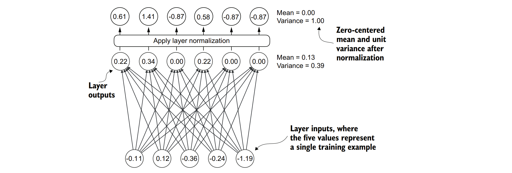
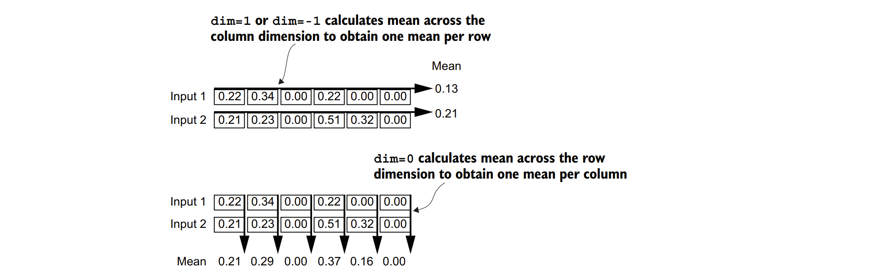
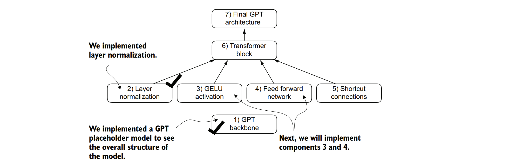

### 4.1 使用层归一化对激活进行归一化

&nbsp;&nbsp;&nbsp;&nbsp;训练具有多层结构的深度神经网络有时会因为梯度消失或梯度爆炸等问题而变得具有挑战性。这些问题会导致训练过程不稳定，使得网络难以有效地调整其权重，即神经网络难以找到一组能够最小化损失函数的参数（权重）。换句话说，网络难以学习到数据中潜在的模式，从而达到能够做出准确预测或决策的程度。

&nbsp;&nbsp;&nbsp;&nbsp;**注意：如果你对神经网络训练和梯度概念还不太了解，可以在附录A的第A.4节中找到这些概念的简要介绍。不过，要理解本书的内容，并不需要深入掌握梯度的数学知识。**

&nbsp;&nbsp;&nbsp;&nbsp;现在，我们来实现层归一化，以提高神经网络训练的稳定性和效率。层归一化的核心思想是调整神经网络层的激活值（输出），使其均值为0，方差为1（也称为单位方差）。这种调整能够加速收敛到有效的权重，并确保训练过程的一致性和可靠性。在GPT-2和现代Transformer架构中，层归一化通常应用于多头注意力模块之前和之后，以及（如我们在DummyLayerNorm占位符中所见）最终输出层之前。图4.5提供了层归一化功能的可视化概述。



&nbsp;&nbsp;&nbsp;&nbsp;**图4.5展示了层归一化的示意图，其中该层的六个输出（也称为激活值）被归一化，使得它们的均值为0，方差为1。**

&nbsp;&nbsp;&nbsp;&nbsp;我们可以通过以下代码重现图4.5中所示的例子，其中我们实现了一个具有五个输入和六个输出的神经网络层，并将其应用于两个输入示例：

```python
import torch
import torch.nn as nn
 
torch.manual_seed(123)  # 设置随机种子以确保结果可复现
batch_example = torch.randn(2, 5)  # 生成一个2x5的随机张量作为输入示例
layer = nn.Sequential(nn.Linear(5, 6), nn.ReLU())  # 定义一个顺序模型，包含一个线性层和一个ReLU激活层
out = layer(batch_example)  # 将输入示例通过模型进行前向传播
print(out)
```
&nbsp;&nbsp;&nbsp;&nbsp;这段代码会打印出以下张量，其中第一行列出了第一个输入对应的层输出，第二行列出了第二个输入对应的层输出：

```
tensor([[0.2260, 0.3470, 0.0000, 0.2216, 0.0000, 0.0000],
        [0.2133, 0.2394, 0.0000, 0.5198, 0.3297, 0.0000]],
       grad_fn=<ReluBackward0>)
```

&nbsp;&nbsp;&nbsp;&nbsp;我们编写的神经网络层由一个线性层后跟一个非线性激活函数ReLU（全称为修正线性单元）组成，ReLU是神经网络中常用的标准激活函数。如果你不熟悉ReLU，它简单地将负输入阈值化为0，确保层只输出正值，这解释了为什么得到的层输出不包含任何负值。稍后，在GPT中我们将使用另一个更复杂的激活函数。

&nbsp;&nbsp;&nbsp;&nbsp;在我们对这些输出应用层归一化之前，让我们先检查一下它们的均值和方差：

```python
mean = out.mean(dim=-1, keepdim=True)
var = out.var(dim=-1, keepdim=True)
print("Mean:\n", mean)
print("Variance:\n", var)
```

&nbsp;&nbsp;&nbsp;&nbsp;输出结果为：

```
Mean:
 tensor([[0.1324],
 [0.2170]], grad_fn=<MeanBackward1>)
Variance:
 tensor([[0.0231],
 [0.0398]], grad_fn=<VarBackward0>)
```

&nbsp;&nbsp;&nbsp;&nbsp;这里的均值张量的第一行包含了第一个输入行的均值，第二行包含了第二个输入行的均值。

&nbsp;&nbsp;&nbsp;&nbsp;在计算均值或方差等操作时，使用keepdim=True参数可以确保输出张量保留与输入张量相同的维度数，即使操作会减少指定维度（通过dim参数）上的张量大小。例如，如果不使用keepdim=True，返回的均值张量将是一个二维向量[0.1324, 0.2170]，而不是一个2×1维的矩阵[[0.1324], [0.2170]]。

&nbsp;&nbsp;&nbsp;&nbsp;dim参数指定了在张量中计算统计量（这里是均值或方差）时应沿哪个维度进行。如图4.6所示，对于一个二维张量（如矩阵），在均值或方差计算等操作中使用dim=-1与使用dim=1是相同的。这是因为-1指的是张量的最后一个维度，它对应于二维张量中的列。稍后，当我们将层归一化添加到GPT模型中时，该模型会产生形状为[batch_size, num_tokens, embedding_size]的三维张量，我们仍然可以使用dim=-1来对最后一个维度进行归一化，从而避免从dim=1更改为dim=2。


&nbsp;&nbsp;&nbsp;&nbsp;**图4.6展示了在计算张量均值时dim参数的作用。例如，如果我们有一个二维张量（矩阵），其维度为[行, 列]，那么使用dim=0将沿着行（垂直方向，如图底部所示）执行操作，从而得到一个对每列数据进行聚合的输出。使用dim=1或dim=-1将沿着列（水平方向，如图顶部所示）执行操作，从而得到一个对每行数据进行聚合的输出。**


&nbsp;&nbsp;&nbsp;&nbsp;接下来，让我们将层归一化应用于之前获得的层输出。该操作包括从输出中减去均值，然后除以方差的平方根（也称为标准差）：

```python
out_norm = (out - mean) / torch.sqrt(var)
mean = out_norm.mean(dim=-1, keepdim=True)
var = out_norm.var(dim=-1, keepdim=True)
print("归一化后的层输出:\n", out_norm)
print("均值:\n", mean)
print("方差:\n", var)
```

&nbsp;&nbsp;&nbsp;&nbsp;根据结果，我们可以看到归一化后的层输出（现在也包含负值）具有0均值和1方差：

&nbsp;&nbsp;&nbsp;&nbsp;归一化后的层输出:
```
 tensor([[ 0.6159, 1.4126, -0.8719, 0.5872, -0.8719, -0.8719],
 [-0.0189, 0.1121, -1.0876, 1.5173, 0.5647, -1.0876]],
 grad_fn=<DivBackward0>)
```

&nbsp;&nbsp;&nbsp;&nbsp;均值:
```
 tensor([[-5.9605e-08],
 [ 1.9868e-08]], grad_fn=<MeanBackward1>)
```

&nbsp;&nbsp;&nbsp;&nbsp;方差:
```
 tensor([[1.],
 [1.]], grad_fn=<VarBackward0>)
```

&nbsp;&nbsp;&nbsp;&nbsp;请注意，输出张量中的值-5.9605e-08是科学记数法，表示-5.9605 × 10^-8，在十进制形式下为-0.000000059605。这个值非常接近0，但由于计算机表示数字时有限的精度，可能会累积小的数值误差，因此它并不完全等于0。

&nbsp;&nbsp;&nbsp;&nbsp;为了提高可读性，在打印张量值时，我们还可以通过将sci_mode设置为False来关闭科学记数法：

```python
torch.set_printoptions(sci_mode=False)
print("均值:\n", mean)
print("方差:\n", var)
```

&nbsp;&nbsp;&nbsp;&nbsp;输出如下：

```
Mean:
 tensor([[ 0.0000],
 [ 0.0000]], grad_fn=<MeanBackward1>)
Variance:
 tensor([[1.],
 [1.]], grad_fn=<VarBackward0>)
```


&nbsp;&nbsp;&nbsp;&nbsp;到目前为止，我们已经逐步编写并应用了层归一化。现在，让我们将其封装在一个PyTorch模块中，以便稍后在GPT模型中使用。

&nbsp;&nbsp;&nbsp;&nbsp;以下是LayerNorm类的实现：

```python
class LayerNorm(nn.Module):
    def __init__(self, emb_dim):
        super().__init__()
        self.eps = 1e-5  # 防止除以零的小常数（epsilon）
        self.scale = nn.Parameter(torch.ones(emb_dim))  # 可训练的缩放参数
        self.shift = nn.Parameter(torch.zeros(emb_dim))  # 可训练的平移参数
 
    def forward(self, x):
        # 在输入张量x的最后一个维度（嵌入维度）上计算均值和方差
        mean = x.mean(dim=-1, keepdim=True)
        var = x.var(dim=-1, keepdim=True, unbiased=False)  # 不使用Bessel校正的方差计算
        # 进行归一化
        norm_x = (x - mean) / torch.sqrt(var + self.eps)
        # 应用可训练的缩放和平移参数
        return self.scale * norm_x + self.shift
```

&nbsp;&nbsp;&nbsp;&nbsp;这个特定的层归一化实现在输入张量x的最后一个维度上操作，该维度代表嵌入维度（emb_dim）。变量eps是一个小常数（epsilon），它被加到方差上以防止归一化过程中除以零。scale和shift是两个与输入相同维度的可训练参数，如果确定这样做能改善模型在训练任务上的性能，大型语言模型（LLM）在训练过程中会自动调整它们。这允许模型学习最适合其处理数据的缩放和平移。

&nbsp;&nbsp;&nbsp;&nbsp;**有偏方差**
&nbsp;&nbsp;&nbsp;&nbsp;在我们的方差计算方法中，通过设置unbiased=False来使用一个实现细节。对于那些好奇这意味着什么的人来说，在方差计算中，我们按照方差公式中的输入数量n来除。这种方法没有应用Bessel校正，Bessel校正通常在分母中使用n – 1而不是n来调整样本方差估计中的偏差。这个决定导致了一个所谓的方差的有偏估计。对于大型语言模型（LLMs）来说，当嵌入维度n非常大时，使用n和n – 1之间的差异实际上是微不足道的。我选择这种方法是为了确保与GPT-2模型的归一化层兼容，并且因为它反映了用于实现原始GPT-2模型的TensorFlow的默认行为。使用类似的设置可以确保我们的方法与第6章中将加载的预训练权重兼容。


&nbsp;&nbsp;&nbsp;&nbsp;现在，让我们在实践中尝试使用LayerNorm模块，并将其应用于批量输入：

```python
ln = LayerNorm(emb_dim=5)  # 实例化LayerNorm模块，指定嵌入维度为5
out_ln = ln(batch_example)  # 将批量输入应用于LayerNorm模块
mean = out_ln.mean(dim=-1, keepdim=True)  # 计算归一化输出在最后一个维度上的均值
var = out_ln.var(dim=-1, unbiased=False, keepdim=True)  # 计算归一化输出在最后一个维度上的方差
print("Mean:\n", mean)  # 打印均值
print("Variance:\n", var)  # 打印方差
```

&nbsp;&nbsp;&nbsp;&nbsp;结果显示，LayerNorm代码按预期工作，并对两个输入的值进行了归一化，使它们的均值为0，方差为1：
```
Mean:
 tensor([[ -0.0000],
         [ 0.0000]], grad_fn=<MeanBackward1>)
Variance:
 tensor([[1.0000],
         [1.0000]], grad_fn=<VarBackward0>)
```
&nbsp;&nbsp;&nbsp;&nbsp;现在，我们已经介绍了实现GPT架构所需的两个构建块之一（另一个是之前提到的，但在此上下文中未明确提及），如图4.7所示。接下来，我们将研究GELU激活函数，这是大型语言模型（LLMs）中使用的激活函数之一，而不是我们之前使用的传统ReLU函数。



&nbsp;&nbsp;&nbsp;&nbsp;**图4.7 构建GPT架构所需的构建块，到目前为止。我们已经完成了GPT架构的主干部分和层归一化。接下来，我们将重点关注GELU激活函数和前馈神经网络。**


&nbsp;&nbsp;&nbsp;&nbsp;**层归一化（Layer Normalization）与批量归一化（Batch Normalization）**

&nbsp;&nbsp;&nbsp;&nbsp;如果你熟悉批量归一化，这是神经网络中一种常见且传统的归一化方法，你可能会好奇它与层归一化相比如何。与批量归一化不同，批量归一化是在批量维度上进行归一化，而层归一化则是在特征维度上进行归一化。大型语言模型（LLMs）通常需要大量的计算资源，而可用的硬件或特定的应用场景可能会决定训练或推理期间的批量大小。由于层归一化对每个输入进行独立于批量大小的归一化，因此在这些场景中它提供了更多的灵活性和稳定性。这对于分布式训练或在资源受限的环境中部署模型时尤其有益。