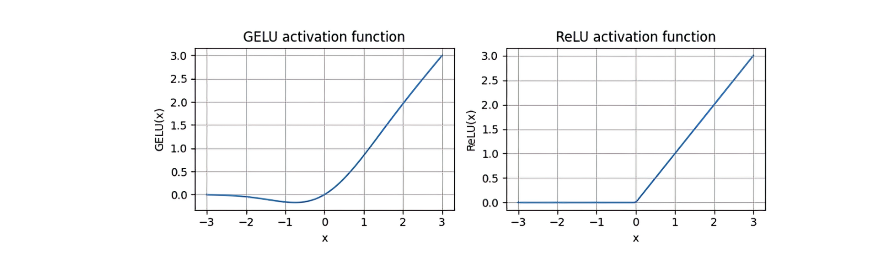
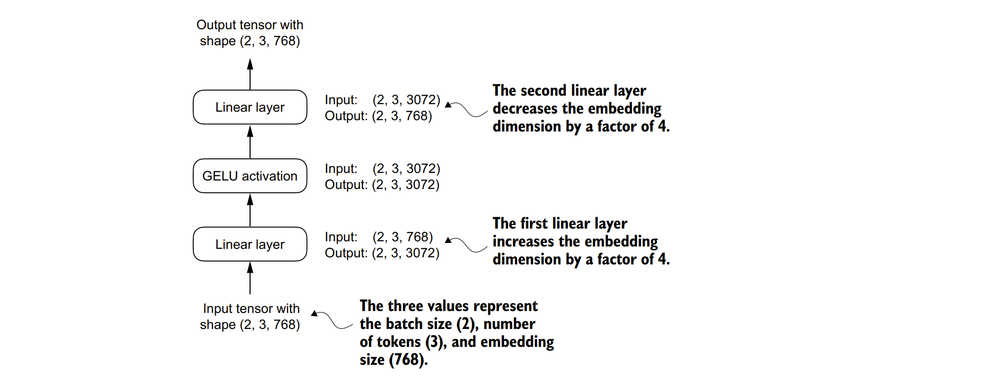
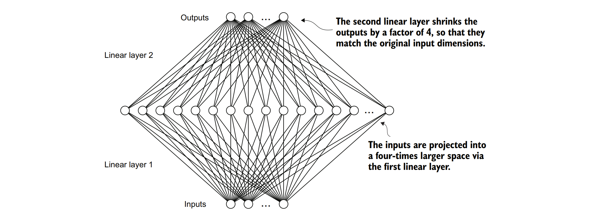
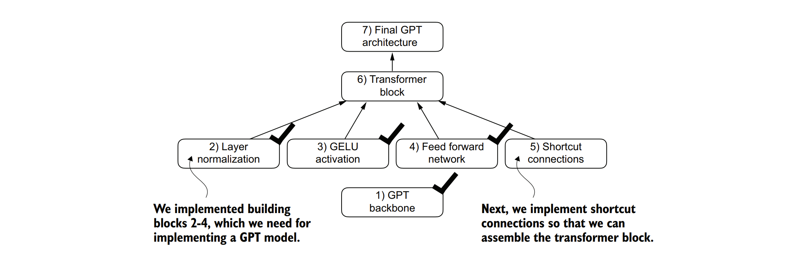

### 4.1 实现一个带有GELU激活函数的前馈神经网络


&nbsp;&nbsp;&nbsp;&nbsp;训练具有多层结构的深度神经网络有时会因为梯度消失或梯度爆炸等问题而变得具有挑战性。这些问题会导致训练过程不稳定，使得网络难以有效地调整其权重，即神经网络难以找到一组能够最小化损失函数的参数（权重）。换句话说，网络难以学习到数据中潜在的模式，从而达到能够做出准确预测或决策的程度。


&nbsp;&nbsp;&nbsp;&nbsp;接下来，我们将实现一个小的神经网络子模块，该子模块将作为大型语言模型（LLMs）中Transformer块的一部分。我们首先实现GELU激活函数，该函数在此神经网络子模块中起着至关重要的作用。

&nbsp;&nbsp;&nbsp;&nbsp;**注意：有关在PyTorch中实现神经网络的更多信息，请参阅附录A中的A.5节。**

&nbsp;&nbsp;&nbsp;&nbsp;从历史上看，ReLU激活函数因其简单性和在各种神经网络架构中的有效性而在深度学习中得到广泛应用。然而，在大型语言模型（LLMs）中，除了传统的ReLU之外，还采用了其他几种激活函数。其中两个值得注意的例子是GELU（高斯误差线性单元）和SwiGLU（Swish门控线性单元）。

&nbsp;&nbsp;&nbsp;&nbsp;GELU和SwiGLU是更复杂且平滑的激活函数，分别结合了高斯分布和sigmoid门控线性单元。与更简单的ReLU不同，它们为深度学习模型提供了更好的性能。

&nbsp;&nbsp;&nbsp;&nbsp;GELU激活函数可以通过多种方式实现；其精确版本定义为GELU(x) = x⋅Φ(x)，其中Φ(x)是标准高斯分布的累积分布函数。然而，在实际应用中，通常实现一种计算成本更低的近似（原始GPT-2模型也是使用这种通过曲线拟合得到的近似进行训练的）：

$$
\text{GELU}(x) \approx 0.5 \cdot x \cdot (1 + \tanh[\sqrt{\frac{2}{\pi}}\cdot(x + 0.044715 \cdot x^3)])
$$

&nbsp;&nbsp;&nbsp;&nbsp;在代码中，我们可以将此函数实现为一个PyTorch模块。

&nbsp;&nbsp;&nbsp;&nbsp;**一个GELU激活函数的实现**

```python
import torch
import torch.nn as nn

class GELU(nn.Module):
    def __init__(self):
        super(GELU, self).__init__()
        # 预先计算好根号(2/pi)的值，并转换为张量，以便在forward中重复使用
        self.sqrt_2_over_pi = torch.sqrt(torch.tensor(2.0 / torch.pi))

    def forward(self, x):
        # 使用预先计算好的值，并应用GELU近似公式
        return 0.5 * x * (1 + torch.tanh(self.sqrt_2_over_pi * (x + 0.044715 * torch.pow(x, 3))))
```


&nbsp;&nbsp;&nbsp;&nbsp;接下来，为了了解GELU函数的形状以及它与ReLU函数的对比情况，我们将并排绘制这两个函数的图像：

```python
import matplotlib.pyplot as plt
import torch
import torch.nn as nn
 
# 实例化GELU和ReLU模块
gelu, relu = GELU(), nn.ReLU()
 
# 生成一个从-3到3的100个等间距点的张量
x = torch.linspace(-3, 3, 100)
 
# 计算GELU和ReLU在这些点上的输出
y_gelu, y_relu = gelu(x), relu(x)
 
# 设置绘图窗口的大小
plt.figure(figsize=(8, 3))
 
# 遍历y_gelu和y_relu以及对应的标签，绘制图像
for i, (y, label) in enumerate(zip([y_gelu, y_relu], ["GELU", "ReLU"]), 1):
    plt.subplot(1, 2, i)  # 在1行2列的子图布局中选择第i个子图
    plt.plot(x, y)  # 绘制x与y的图像
    plt.title(f"{label} activation function")  # 设置子图的标题
    plt.xlabel("x")  # 设置x轴的标签
    plt.ylabel(f"{label}(x)")  # 设置y轴的标签
    plt.grid(True)  # 显示网格线
 
# 调整子图布局以避免重叠
plt.tight_layout()
# 显示图像
plt.show()
```

&nbsp;&nbsp;&nbsp;&nbsp;从生成的图4.8中我们可以看出，ReLU函数（右侧）是一个分段线性函数，当输入为正时直接输出输入值，否则输出零。而GELU函数（左侧）是一个平滑的非线性函数，它近似于ReLU，但对于几乎所有的负值（除了大约x=-0.75附近）都有一个非零梯度。这意味着GELU在输入为负时仍然能够传递一些梯度信息，这有助于缓解神经网络中的梯度消失问题，并可能提高模型的性能。



&nbsp;&nbsp;&nbsp;&nbsp;**图4.8 使用matplotlib绘制的GELU和ReLU函数输出图。x轴表示函数输入，y轴表示函数输出。**


&nbsp;&nbsp;&nbsp;&nbsp;GELU（高斯误差线性单元）的平滑性能够在训练过程中带来更好的优化特性，因为它允许对模型的参数进行更精细的调整。相比之下，ReLU（修正线性单元）在零点处有一个尖锐的拐角（如图4.18右侧所示），这有时会使优化变得更加困难，特别是在网络非常深或结构复杂的情况下。此外，与ReLU不同，ReLU对于任何负输入都输出零，而GELU则允许负值有一个小的、非零的输出。这一特性意味着在训练过程中，即使神经元接收到负输入，它们仍然能够对学习过程做出贡献，尽管这种贡献的程度小于正输入。


&nbsp;&nbsp;&nbsp;&nbsp;接下来，我们将使用GELU函数来实现一个小型神经网络模块FeedForward，这个模块稍后将用于大型语言模型（LLM）的Transformer块中。


&nbsp;&nbsp;&nbsp;&nbsp;**代码块4.4 一个前馈神经网络模块**
```python
class FeedForward(nn.Module):
    def __init__(self, cfg):
        super().__init__()
        self.layers = nn.Sequential(
            nn.Linear(cfg["emb_dim"], 4 * cfg["emb_dim"]),  # 第一个线性层，将嵌入维度扩展到4倍
            GELU(),  # GELU激活函数
            nn.Linear(4 * cfg["emb_dim"], cfg["emb_dim"]),  # 第二个线性层，将维度还原为原始的嵌入维度
        )
    
    def forward(self, x):
        return self.layers(x)  # 前向传播，通过所有层传递输入
```
&nbsp;&nbsp;&nbsp;&nbsp;如我们所见，FeedForward模块是一个小型神经网络，由两个线性层和一个GELU激活函数组成。在拥有1.24亿参数的GPT模型中，它通过GPT_CONFIG_124M字典接收具有768个嵌入大小的令牌输入批次，其中GPT_CONFIG_124M["emb_dim"] = 768。图4.9展示了当我们向这个小型前馈神经网络传递一些输入时，嵌入大小如何在网络内部被处理。


&nbsp;&nbsp;&nbsp;&nbsp;***图4.9 前馈神经网络各层之间连接的概述。这个神经网络可以容纳不同大小的输入批次以及不同数量的令牌。但是，在初始化权重时，每个令牌的嵌入大小是确定且固定的。***

&nbsp;&nbsp;&nbsp;&nbsp;根据图4.9中的示例，让我们使用令牌嵌入大小为768来初始化一个新的FeedForward模块，并向其提供一个包含两个样本且每个样本有三个令牌的批次输入：

```python
ffn = FeedForward(GPT_CONFIG_124M)  # 假设GPT_CONFIG_124M是一个包含"emb_dim": 768等配置的字典
x = torch.rand(2, 3, 768)  # 创建一个形状为[2, 3, 768]的随机张量作为输入
out = ffn(x)  # 将输入传递给FeedForward模块
print(out.shape)  # 打印输出张量的形状
```
&nbsp;&nbsp;&nbsp;&nbsp;正如我们所见，输出张量的形状与输入张量的形状相同：torch.Size([2, 3, 768])。

&nbsp;&nbsp;&nbsp;&nbsp;FeedForward模块在增强模型从数据中学习和泛化的能力方面发挥着至关重要的作用。尽管此模块的输入和输出维度相同，但它通过第一个线性层将嵌入维度内部扩展到更高维的空间，如图4.10所示。这种扩展之后是一个非线性的GELU激活函数，然后通过第二个线性变换将维度收缩回原始维度。这样的设计允许探索更丰富的表示空间。


&nbsp;&nbsp;&nbsp;&nbsp;***图4.10 前馈神经网络中层输出扩展和收缩的示意图。首先，输入从768个值扩展到4倍，变为3,072个值。然后，第二层将3,072个值压缩回768维的表示。***

&nbsp;&nbsp;&nbsp;&nbsp;此外，输入和输出维度的一致性简化了架构，使得我们可以像后面将要做的那样堆叠多层，而无需在它们之间调整维度，从而使模型更具可扩展性。如图4.11所示，我们现在已经实现了大型语言模型（LLM）的大部分构建块。
&nbsp;&nbsp;&nbsp;&nbsp;接下来，我们将介绍在神经网络的不同层之间插入的捷径连接（shortcut connections）的概念，这对于提高深度神经网络架构的训练性能非常重要。



&nbsp;&nbsp;&nbsp;&nbsp;**图4.11 构建GPT架构所需的构建块。黑色的勾选标记表示我们已经讲过的部分。**

