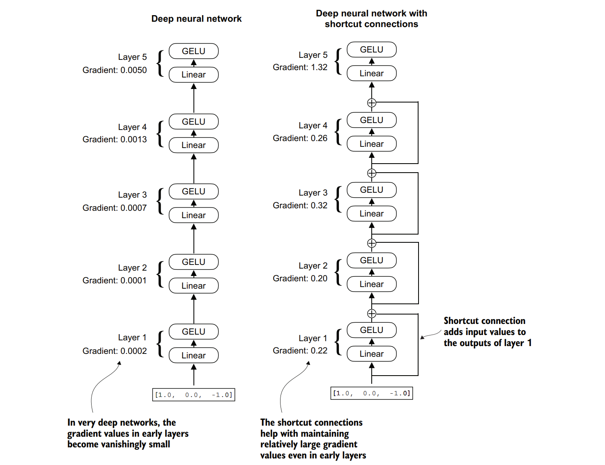

### 4.4 添加快捷连接
&nbsp;&nbsp;&nbsp;&nbsp;让我们讨论一下快捷连接（也称为跳跃连接或残差连接）背后的概念。最初，快捷连接是为计算机视觉中的深度网络（特别是残差网络）提出的，以解决梯度消失的挑战。梯度消失问题指的是在反向传播过程中，梯度（在训练过程中指导权重更新）逐层递减，导致难以有效地训练前面的层。

&nbsp;&nbsp;&nbsp;&nbsp;图4.12显示，快捷连接通过跳过一层或多层，为梯度在网络中的流动创建了一条替代的、更短的路径，这是通过将某一层的输出与后面某一层的输出相加来实现的。这就是为什么这些连接也被称为跳跃连接。它们在训练过程中的反向传播阶段对于保持梯度的流动起着至关重要的作用。

&nbsp;&nbsp;&nbsp;&nbsp;在下面的列表中，我们将实现图4.12中的神经网络，以查看如何在前向传播方法中添加快捷连接。


&nbsp;&nbsp;&nbsp;&nbsp;**图4.12 展示了一个由五层组成的深度神经网络在没有快捷连接（左侧）和有快捷连接（右侧）之间的对比。快捷连接涉及将某一层的输入与其输出相加，从而有效地创建了一条绕过某些层的替代路径。图中的梯度表示每一层的平均绝对梯度，我们将在列表4.5中计算这些梯度。**


&nbsp;&nbsp;&nbsp;&nbsp;**代码块4.5带有捷径连接的神经网络示例**
```python
class ExampleDeepNeuralNetwork(nn.Module):
    def __init__(self, layer_sizes, use_shortcut):
        super().__init__()
        self.use_shortcut = use_shortcut
        self.layers = nn.ModuleList([
            nn.Sequential(nn.Linear(layer_sizes[0], layer_sizes[1]), GELU()),
            nn.Sequential(nn.Linear(layer_sizes[1], layer_sizes[2]), GELU()),
            nn.Sequential(nn.Linear(layer_sizes[2], layer_sizes[3]), GELU()),
            nn.Sequential(nn.Linear(layer_sizes[3], layer_sizes[4]), GELU()),
            nn.Sequential(nn.Linear(layer_sizes[4], layer_sizes[5]), GELU())
        ])
 
    def forward(self, x):
        for layer in self.layers:
            layer_output = layer(x)
            if self.use_shortcut and x.shape == layer_output.shape:
                x = x + layer_output
            else:
                x = layer_output
        return x
```

&nbsp;&nbsp;&nbsp;&nbsp;以下代码实现了一个深度神经网络，该网络包含五层，每层由一个线性层和一个GELU激活函数组成。在前向传播过程中，我们迭代地将输入通过各层，如果self.use_shortcut属性设置为True，则可以选择性地添加捷径连接。


&nbsp;&nbsp;&nbsp;&nbsp;接下来，我们使用此代码初始化一个没有捷径连接的神经网络。每层都被初始化为接受具有三个输入值的示例，并返回三个输出值，而最后一层返回一个输出值。

```python
layer_sizes = [3, 3, 3, 3, 3, 1]
sample_input = torch.tensor([[1., 0., -1.]])
torch.manual_seed(123)
model_without_shortcut = ExampleDeepNeuralNetwork(layer_sizes, use_shortcut=False)
```
&nbsp;&nbsp;&nbsp;&nbsp;接下来，我们实现一个函数，用于计算模型中反向传播的梯度：

```python
def print_gradients(model, x):
    output = model(x)
    target = torch.tensor([[0.]])
    loss = nn.MSELoss()
    loss = loss(output, target)
    loss.backward()
    for name, param in model.named_parameters():
        if 'weight' in name:
            print(f"{name} has gradient mean of {param.grad.abs().mean().item()}")
```
&nbsp;&nbsp;&nbsp;&nbsp;此代码指定了一个损失函数，用于计算模型输出和用户指定的目标（此处为简化起见，取值为0）之间的接近程度。然后，在调用loss.backward()时，PyTorch会计算模型中每层的损失梯度。我们可以通过model.named_parameters()迭代权重参数。假设某一层具有3×3的权重参数矩阵，则该层将有3×3的梯度值，我们打印这些梯度值的绝对平均值，以获得每层的单个梯度值，以便更容易地比较各层之间的梯度。

&nbsp;&nbsp;&nbsp;&nbsp;简而言之，.backward()方法是PyTorch中的一个便捷方法，用于计算损失梯度，这些梯度在模型训练期间是必需的，而无需我们自己实现梯度计算的数学运算，从而使深度神经网络的使用变得更加容易。

&nbsp;&nbsp;&nbsp;&nbsp;注意：如果您不熟悉梯度和神经网络训练的概念，建议您阅读附录A中的A.4和A.7节。

&nbsp;&nbsp;&nbsp;&nbsp;现在，我们使用print_gradients函数并将其应用于没有捷径连接的模型：

```python
print_gradients(model_without_shortcut, sample_input)
```
&nbsp;&nbsp;&nbsp;&nbsp;输出结果为：

```
layers.0.0.weight has gradient mean of 0.00020173587836325169
layers.1.0.weight has gradient mean of 0.0001201116101583466
layers.2.0.weight has gradient mean of 0.0007152041653171182
layers.3.0.weight has gradient mean of 0.001398873864673078
layers.4.0.weight has gradient mean of 0.005049646366387606
```
&nbsp;&nbsp;&nbsp;&nbsp;print_gradients函数的输出结果显示，随着我们从最后一层（layers.4）向第一层（layers.0）推进，梯度逐渐变小，这是一种称为梯度消失问题的现象。

&nbsp;&nbsp;&nbsp;&nbsp;现在，我们实例化一个带有捷径连接的模型，并看看其表现如何：

```python
torch.manual_seed(123)
model_with_shortcut = ExampleDeepNeuralNetwork(layer_sizes, use_shortcut=True)
print_gradients(model_with_shortcut, sample_input)
```
&nbsp;&nbsp;&nbsp;&nbsp;输出结果为：
```
layers.0.0.weight has gradient mean of 0.22169792652130127
layers.1.0.weight has gradient mean of 0.20694105327129364
layers.2.0.weight has gradient mean of 0.32896995544433594
layers.3.0.weight has gradient mean of 0.2665732502937317
layers.4.0.weight has gradient mean of 1.3258541822433472
```
&nbsp;&nbsp;&nbsp;&nbsp;最后一层（layers.4）的梯度仍然比其他层大。但是，随着我们向第一层（layers.0）推进，梯度值趋于稳定，并不会缩小到接近零的值。

&nbsp;&nbsp;&nbsp;&nbsp;总之，捷径连接对于克服深度神经网络中梯度消失问题所带来的限制至关重要。捷径连接是大型模型（如大型语言模型）的核心组成部分，它们将在我们训练下一章的GPT模型时，通过确保各层之间的梯度流动一致，从而促进更有效的训练。

&nbsp;&nbsp;&nbsp;&nbsp;接下来，我们将之前介绍的所有概念（层归一化、GELU激活函数、前馈模块和捷径连接）整合到一个Transformer块中，这是构建GPT架构所需的最后一个构建块。