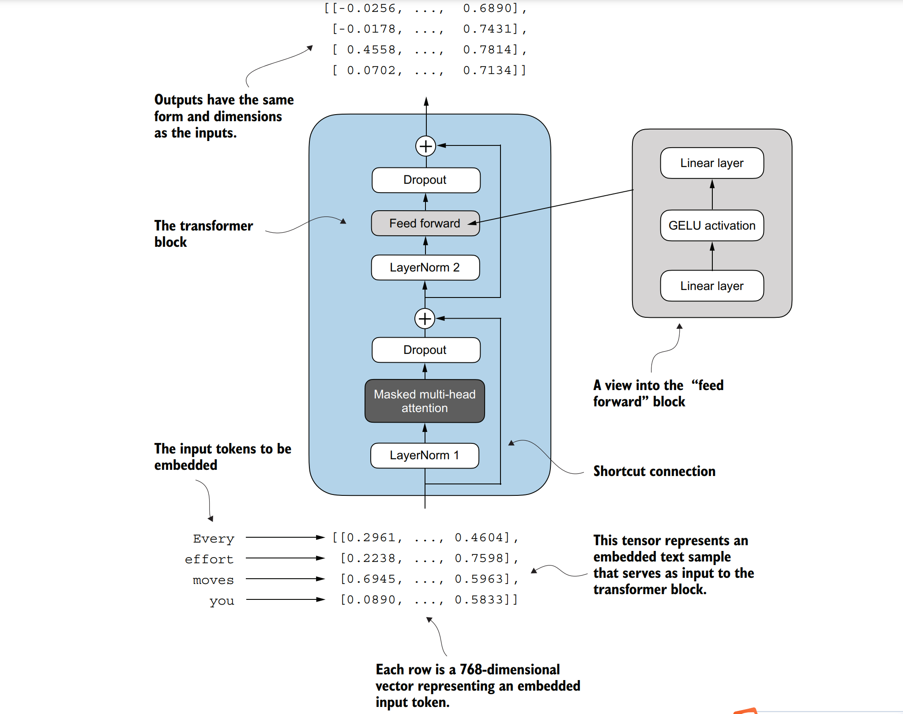
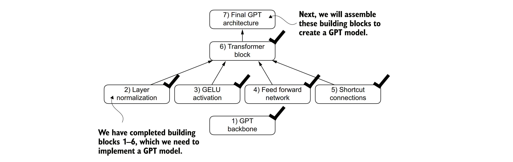

### 4.5 在Transformer模块中连接注意力层和线性层
&nbsp;&nbsp;&nbsp;&nbsp;现在，让我们来实现Transformer模块，这是GPT和其他大型语言模型（LLM）架构的基本构建块。在拥有12.4亿参数的GPT-2架构中，这个模块被重复了十几次。它结合了我们之前讨论过的几个概念：多头注意力、层归一化、丢弃（dropout）、前馈层和GELU（高斯误差线性单元）激活函数。稍后，我们将把这个Transformer模块连接到GPT架构的其余部分。

&nbsp;&nbsp;&nbsp;&nbsp;图4.13展示了一个Transformer模块，它结合了多个组件，包括带掩码的多头注意力模块（见第3章）和我们之前实现的前馈模块（见第4.3节）。当Transformer模块处理一个输入序列时，序列中的每个元素（例如，一个单词或子词标记）都由一个固定大小的向量表示（在这种情况下，是768维）。Transformer模块内的操作，包括多头注意力和前馈层，旨在以保留这些向量维度的方式对它们进行变换。

&nbsp;&nbsp;&nbsp;&nbsp;这个思路是，多头注意力块中的自注意力机制能够识别和分析输入序列中元素之间的关系。相比之下，前馈网络在每个位置上分别修改数据。这种组合不仅使模型能够更细致地理解和处理输入，还增强了模型处理复杂数据模式的整体能力。


&nbsp;&nbsp;&nbsp;&nbsp;**图4.13 Transformer模块的示意图。输入标记（tokens）已被嵌入到768维的向量中。每一行对应一个标记的向量表示。Transformer模块的输出是与输入相同维度的向量，这些向量随后可以被输入到大型语言模型（LLM）的后续层中。**

&nbsp;&nbsp;&nbsp;&nbsp;我们可以使用代码来创建TransformerBlock类。

**代码块4.6GPT中的transformer模块**

```python
from chapter03 import MultiHeadAttention
class TransformerBlock(nn.Module):
    def __init__(self, cfg):
        super().__init__()
        # 初始化多头注意力机制
        self.att = MultiHeadAttention(
            d_in=cfg["emb_dim"],       # 输入维度
            d_out=cfg["emb_dim"],      # 输出维度
            context_length=cfg["context_length"],  # 上下文长度
            num_heads=cfg["n_heads"],  # 头数
            dropout=cfg["drop_rate"],  # 丢弃率
            qkv_bias=cfg["qkv_bias"]   # 是否为查询（Q）、键（K）、值（V）添加偏置
        )
        # 初始化前馈网络
        self.ff = FeedForward(cfg)
        # 初始化两个层归一化层
        self.norm1 = LayerNorm(cfg["emb_dim"])
        self.norm2 = LayerNorm(cfg["emb_dim"])
        # 初始化丢弃层，用于正则化
        self.drop_shortcut = nn.Dropout(cfg["drop_rate"])
 
    def forward(self, x):
        # 保存原始输入x作为短路连接
        shortcut = x
        # 对输入x进行第一个层归一化
        x = self.norm1(x)
        # 将归一化后的x输入到多头注意力机制中
        x = self.att(x)
        # 对注意力机制的输出进行丢弃正则化
        x = self.drop_shortcut(x)
        # 将正则化后的输出与原始输入x（短路连接）相加
        x = x + shortcut
        # 再次保存相加后的结果作为新的短路连接
        shortcut = x
        # 对新的短路连接进行第二个层归一化
        x = self.norm2(x)
        # 将归一化后的x输入到前馈网络中
        x = self.ff(x)
        # 对前馈网络的输出进行丢弃正则化
        x = self.drop_shortcut(x)
        # 将正则化后的输出与之前的短路连接（shortcut）相加，得到最终输出
        x = x + shortcut
        return x
```
&nbsp;&nbsp;&nbsp;&nbsp;上述代码在PyTorch中定义了一个TransformerBlock类，该类包含了一个多头注意力机制（MultiHeadAttention）和一个前馈网络（FeedForward）。这两个组件都是基于提供的配置字典（cfg）进行配置的，例如GPT_CONFIG_124M这样的配置。

&nbsp;&nbsp;&nbsp;&nbsp;在每个组件之前都应用了层归一化（LayerNorm），并且在它们之后应用了丢弃（dropout）来正则化模型并防止过拟合。这种方法被称为前置层归一化（Pre-LayerNorm）。相比之下，早期的架构（如原始的Transformer模型）是在自注意力机制和前馈网络之后应用层归一化的，这种方法被称为后置层归一化（Post-LayerNorm），它通常会导致更差的训练动态。

&nbsp;&nbsp;&nbsp;&nbsp;该类还实现了前向传播，其中每个组件后面都跟着一个短路连接（shortcut connection），该连接将块的输入与其输出相加。这一关键特性有助于在训练过程中使梯度在网络中流动，并改进深度模型的学习（参见第4.4节）。

&nbsp;&nbsp;&nbsp;&nbsp;使用我们之前定义的GPT_CONFIG_124M字典，我们来实例化一个Transformer块，并为其提供一些样本数据：

```python
torch.manual_seed(123)
x = torch.rand(2, 4, 768)  # 生成一个形状为[2, 4, 768]的随机张量作为输入
block = TransformerBlock(GPT_CONFIG_124M)  # 实例化一个Transformer块
output = block(x)  # 将输入传递给Transformer块并获取输出
print("Input shape:", x.shape)  # 打印输入形状
print("Output shape:", output.shape)  # 打印输出形状
```
&nbsp;&nbsp;&nbsp;&nbsp;输出结果为：

```
Input shape: torch.Size([2, 4, 768])
Output shape: torch.Size([2, 4, 768])
```
&nbsp;&nbsp;&nbsp;&nbsp;如我们所见，Transformer块在输出中保持了输入的维度，这表明Transformer架构在处理数据序列时，在整个网络中不会改变其形状。

&nbsp;&nbsp;&nbsp;&nbsp;在整个Transformer块架构中保持形状不变并不是偶然的，而是其设计的一个关键方面。这种设计使其能够有效地应用于各种序列到序列的任务中，其中每个输出向量直接对应于一个输入向量，保持了一对一的关系。然而，输出是一个上下文向量，它封装了整个输入序列的信息（参见第3章）。这意味着，当序列通过Transformer块时，虽然其物理维度（长度和特征大小）保持不变，但每个输出向量的内容都被重新编码，以整合来自整个输入序列的上下文信息。

&nbsp;&nbsp;&nbsp;&nbsp;随着Transformer块的实现，我们现在拥有了实现GPT架构所需的所有构建块。如图4.14所示，Transformer块结合了层归一化、前馈网络、GELU激活函数和短路连接。最终我们会看到，这个Transformer块将构成GPT架构的主要组件。




&nbsp;&nbsp;&nbsp;&nbsp;**图4.14 构建GPT架构所需的构建块。黑色勾选标记表示我们已经完成的块。**

