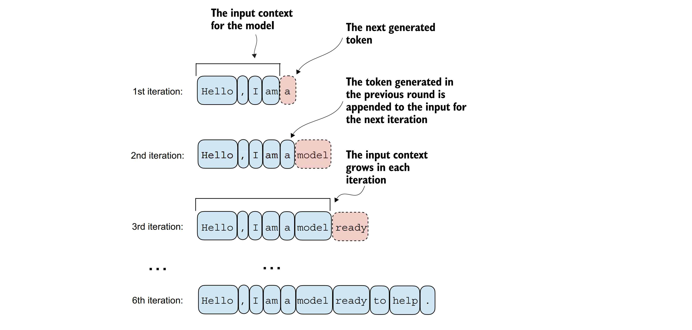
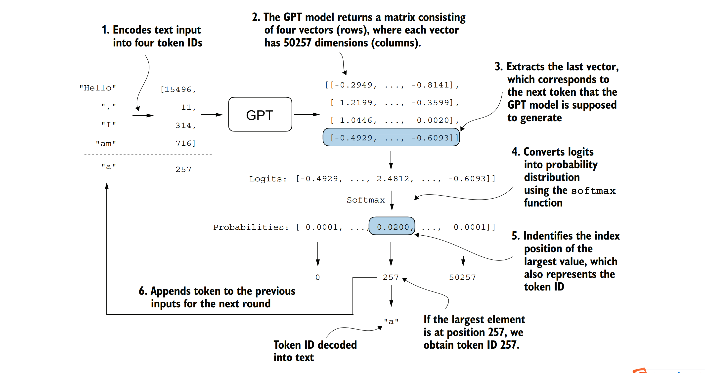
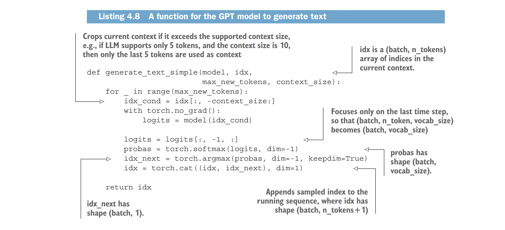
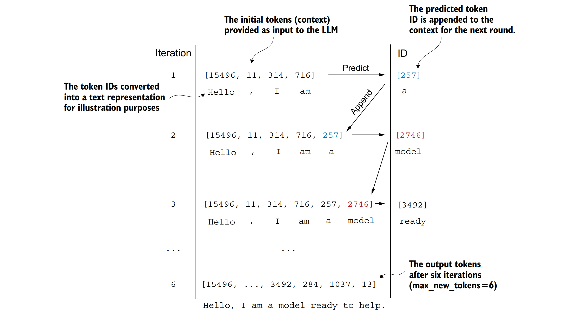

### 4.7 产生文字
&nbsp;&nbsp;&nbsp;&nbsp;现在，我们将实现将GPT模型的张量输出转换回文本的代码。在开始前，让我们简要回顾一下像大型语言模型（LLM）这样的生成模型是如何一次一个单词（或标记）地生成文本的。

&nbsp;&nbsp;&nbsp;&nbsp;图4.16展示了GPT模型在给定输入上下文（如“Hello, I am.”）的情况下生成文本的逐步过程。随着每次迭代，输入上下文不断增长，从而使模型能够生成连贯且上下文相关的文本。到第六次迭代时，模型已经构造了一个完整的句子：“Hello, I am a model ready to help.” 我们已经看到，当前的GPTModel实现输出的张量形状为[batch_size, num_token, vocab_size]。现在的问题是：GPT模型是如何从这些输出张量得到生成的文本的？


&nbsp;&nbsp;&nbsp;&nbsp;**图4.16 大型语言模型（LLM）逐步生成文本的过程，一次一个标记。从初始输入上下文（“Hello, I am”）开始，模型在每次迭代中预测一个后续的标记，并将其附加到输入上下文中，以便进行下一轮的预测。如图所示，第一次迭代添加了“a”，第二次添加了“model”，第三次添加了“ready”，逐步构建出完整的句子。**

&nbsp;&nbsp;&nbsp;&nbsp;GPT模型从输出张量得到生成文本的过程涉及几个步骤，如图4.17所示。这些步骤包括解码输出张量、基于概率分布选择标记以及将这些标记转换为人类可读的文本。

&nbsp;&nbsp;&nbsp;&nbsp;图4.17中详细描述的下一个标记生成过程展示了GPT模型在给定输入的情况下生成下一个标记的一个步骤。在每个步骤中，模型输出一个矩阵，其中向量表示可能的下一个标记。提取与下一个标记对应的向量，并通过softmax函数将其转换为概率分布。在包含结果概率分数的向量中，找到最高值的索引，该索引对应于标记ID。然后，将此标记ID解码回文本，从而产生序列中的下一个标记。最后，将此标记附加到之前的输入中，形成后续迭代的新的输入序列。这个逐步过程使模型能够顺序地生成文本，从初始输入上下文构建连贯的短语和句子。

&nbsp;&nbsp;&nbsp;&nbsp;在实际操作中，我们重复这个过程多次迭代，如图4.16所示，直到达到用户指定的生成标记数量。在代码中，我们可以按以下示例实现标记生成过程。


&nbsp;&nbsp;&nbsp;&nbsp;**图4.17 展示了GPT模型中文本生成的机制，通过描绘标记生成过程中的一个单次迭代来说明。该过程始于将输入文本编码为标记ID，然后将这些标记ID输入到GPT模型中。模型的输出随后被转换回文本，并附加到原始输入文本之后。**



&nbsp;&nbsp;&nbsp;&nbsp;这段代码展示了使用PyTorch为语言模型实现一个简单的生成循环。它迭代生成指定数量的新标记，裁剪当前上下文以适应模型的最大上下文大小，计算预测，然后根据最高概率预测选择下一个标记。

&nbsp;&nbsp;&nbsp;&nbsp;在编写generate_text_simple函数时，我们使用softmax函数将logits转换为概率分布，然后通过torch.argmax找到具有最高值的位置。softmax函数是单调的，意味着当输入转换为输出时，它会保留输入的顺序。因此，实际上softmax步骤是多余的，因为softmax输出张量中得分最高的位置与logit张量中的位置相同。换句话说，我们可以直接将torch.argmax函数应用于logit张量并得到相同的结果。然而，我提供了转换的代码来展示将logits转换为概率的完整过程，这可以增加一些直观理解，以便模型生成最可能的下一个标记，这被称为贪婪解码。

&nbsp;&nbsp;&nbsp;&nbsp;当我们在下一章实现GPT训练代码时，将使用额外的采样技术来修改softmax输出，以便模型不总是选择最可能的标记。这会在生成的文本中引入可变性和创造性。

&nbsp;&nbsp;&nbsp;&nbsp;使用generate_text_simple函数一次生成一个标记ID并将其附加到上下文中的过程在图4.18中进一步说明。（每次迭代的标记ID生成过程在图4.17中详细描述。）我们以迭代的方式生成标记ID。例如，在第1次迭代中，模型接收到对应于“Hello, I am”的标记，预测下一个标记（ID为257，即“a”），并将其附加到输入中。这个过程一直重复，直到模型在六次迭代后生成完整的句子“Hello, I am a model ready to help”。

&nbsp;&nbsp;&nbsp;&nbsp;现在，让我们使用“Hello, I am”作为模型输入的上下文来尝试generate_text_simple函数。首先，我们将输入上下文编码为标记ID：

```python
start_context = "Hello, I am"
encoded = tokenizer.encode(start_context)
print("encoded:", encoded)
encoded_tensor = torch.tensor(encoded).unsqueeze(0)
print("encoded_tensor.shape:", encoded_tensor.shape)
```
&nbsp;&nbsp;&nbsp;&nbsp;编码后的ID是：

```
encoded: [15496, 11, 314, 716]
encoded_tensor.shape: torch.Size([1, 4])
```


&nbsp;&nbsp;&nbsp;&nbsp;**图4.18 展示了标记预测循环的六次迭代过程。在这个过程中，模型以一系列初始标记ID作为输入，预测下一个标记，并将这个标记附加到输入序列中，以供下一次迭代使用。（为了更好地理解，标记ID也被翻译成了它们对应的文本。）**

&nbsp;&nbsp;&nbsp;&nbsp;接下来，我们将模型设置为评估（.eval()）模式。这会禁用仅在训练期间使用的随机组件，如dropout，并在编码后的输入张量上使用generate_text_simple函数：

```python
model.eval()
out = generate_text_simple(
    model=model,
    idx=encoded_tensor,
    max_new_tokens=6,
    context_size=GPT_CONFIG_124M["context_length"]
)
print("输出:", out)
print("输出长度:", len(out[0]))
```
得到的输出标记ID是：

```
输出: tensor([[15496, 11, 314, 716, 27018, 24086, 47843, 30961, 42348, 7267]])
输出长度: 10
```

&nbsp;&nbsp;&nbsp;&nbsp;使用tokenizer的.decode方法，我们可以将ID转换回文本：

```python
decoded_text = tokenizer.decode(out.squeeze(0).tolist())
print(decoded_text)
```
模型输出的文本格式是：

```
“Hello, I am Featureiman Byeswickattribute argue”
```

&nbsp;&nbsp;&nbsp;&nbsp;如我们所见，模型生成了无意义的胡言乱语，这与连贯的文本“Hello, I am a model ready to help”截然不同。这是怎么回事呢？模型之所以无法生成连贯的文本，是因为我们还没有对它进行训练。到目前为止，我们只实现了GPT架构，并用初始随机权重初始化了一个GPT模型实例。模型训练本身是一个很大的话题，我们将在下一章进行探讨。

&nbsp;&nbsp;&nbsp;&nbsp;**练习4.3 使用独立的丢弃率参数**
&nbsp;&nbsp;&nbsp;&nbsp;在本章开头，我们在GPT_CONFIG_124M字典中定义了一个全局的drop_rate设置，用于在整个GPTModel架构中的不同位置设置丢弃率。请修改代码，以便为模型架构中各个丢弃层指定独立的丢弃率值。（提示：我们在三个不同的地方使用了丢弃层：嵌入层、快捷层和多头注意力模块。）

**总结**

- 层归一化通过确保每层的输出具有一致的平均值和方差来稳定训练。
- 快捷连接（或跳跃连接）是通过直接将一层的输出馈送到更深层来跳过一层或多层的连接，这有助于缓解训练深度神经网络（如大型语言模型）时的梯度消失问题。
- Transformer块是GPT模型的核心结构组件，结合了掩码多头注意力模块和使用GELU激活函数的全连接前馈网络。
- GPT模型是具有数百万到数十亿个参数的大型语言模型，包含许多重复的Transformer块。
- GPT模型有不同的大小，例如1.24亿、3.45亿、7.62亿和15.42亿个参数，我们可以使用相同的GPTModel Python类来实现它们。
- 类似GPT的大型语言模型的文本生成能力涉及根据给定的输入上下文顺序预测一个标记，并将输出张量解码为人类可读的文本。
- 未经训练的GPT模型会生成不连贯的文本，这强调了模型训练对于生成连贯文本的重要性。