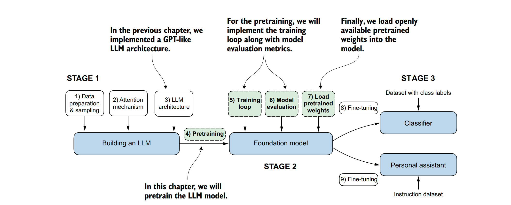
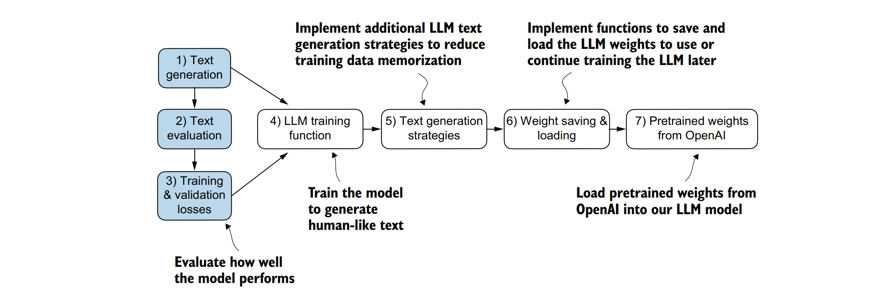
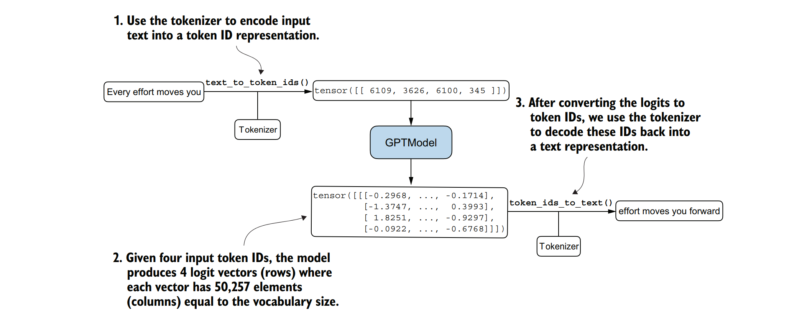

### 第五章 在无标签数据上进行预训练

&nbsp;&nbsp;&nbsp;&nbsp;这一章的内容涵盖以下几个方面：
- 计算训练集和验证集的损失，用于在训练过程中评估大型语言模型（LLM）所生成文本的质量。
- 实现训练函数并进行LLM的预训练
- 保存和加载模型权重以继续训练LLM
- 从OpenAI加载预训练权重

&nbsp;&nbsp;&nbsp;&nbsp;到目前为止，我们已经实现了数据采样和注意力机制，并编写了大型语言模型（LLM）的架构代码。现在，是时候实现训练函数并对LLM进行预训练了。我们将学习基本的模型评估技术，以衡量生成文本的质量，这是在训练过程中优化LLM的必然要求。此外，我们还将讨论如何加载预训练权重，为LLM的微调提供一个坚实的起点。图5.1展示了我们的整体计划，并突出了本章将要讨论的内容。


&nbsp;&nbsp;&nbsp;&nbsp;**图5.1展示了编写大型语言模型（LLM）的三个主要阶段。本章重点讨论第2阶段：对LLM进行预训练（步骤4），这包括实现训练代码（步骤5）、评估性能（步骤6）以及保存和加载模型权重（步骤7）。**


**权重参数**
&nbsp;&nbsp;&nbsp;&nbsp;在大型语言模型（LLMs）和其他深度学习模型的背景下，权重指的是学习过程中会进行调整的可训练参数。这些权重也被称为权重参数或简称为参数。在像PyTorch这样的框架中，这些权重被存储在线性层（linear layers）中；我们在第3章中使用它们来实现多头注意力模块，在第4章中实现GPTModel。在初始化一个层（例如，new_layer = torch.nn.Linear(...)）之后，我们可以通过.weight属性（即new_layer.weight）访问其权重。此外，为了方便起见，PyTorch允许通过model.parameters()方法直接访问模型的所有可训练参数，包括权重和偏置，我们将在后续实现模型训练时使用这个方法。

### 5.1 评估文字生成模型

&nbsp;&nbsp;&nbsp;&nbsp;在简要回顾了第4章的文本生成内容之后，我们将为文本生成设置我们的大型语言模型（LLM），然后讨论评估生成文本质量的基本方法。接下来，我们将计算训练和验证损失。图5.2展示了本章所涵盖的主题，并特别强调了前三个步骤。


&nbsp;&nbsp;&nbsp;&nbsp;图5.2展示了本章所涵盖主题的概览。我们首先回顾文本生成（步骤1），然后讨论基本的模型评估技术（步骤2），以及训练和验证损失（步骤3）。

#### 5.1.1 使用GPT产生文字

&nbsp;&nbsp;&nbsp;&nbsp;现在，我们来设置大型语言模型（LLM），并简要回顾一下我们在第4章中实现的文本生成过程。首先，我们将使用GPTModel类和GPT_CONFIG_124M字典（参见第4章）来初始化GPT模型，以便后续进行评估和训练：

```python
import torch
from chapter04 import GPTModel
 
GPT_CONFIG_124M = {
 "vocab_size": 50257,
 "context_length": 256,
 "emb_dim": 768,
 "n_heads": 12,
 "n_layers": 12,
 "drop_rate": 0.1,
 "qkv_bias": False
}
 
torch.manual_seed(123)
model = GPTModel(GPT_CONFIG_124M)
model.eval()
```
&nbsp;&nbsp;&nbsp;&nbsp;与上一章相比，在GPT_CONFIG_124M字典中，我们唯一做出的调整是将上下文长度（context_length）减少到了256个标记（tokens）。这一修改降低了模型训练的计算需求，使得在标准笔记本电脑上也能进行训练。

&nbsp;&nbsp;&nbsp;&nbsp;原本，具有1.24亿参数的GPT-2模型被配置为可以处理多达1,024个标记。在训练过程结束后，我们将更新上下文大小设置，并加载预训练权重，以便与配置为1,024个标记（token）上下文长度的模型一起工作。使用GPTModel实例，我们采用了第4章中的generate_text_simple函数，并引入了两个实用的函数：text_to_token_ids和token_ids_to_text。这两个函数促进了文本和标记表示之间的转换，这是我们在本章中将一直使用的技术。


&nbsp;&nbsp;&nbsp;&nbsp;**图5.3 文本生成过程涉及将文本编码为标记ID（token IDs），大型语言模型（LLM）将这些标记ID处理为逻辑向量（logit vectors）。然后，这些逻辑向量再被转换回标记ID，并最终去标记化（detokenized）为文本表示。**

&nbsp;&nbsp;&nbsp;&nbsp;图5.3展示了使用GPT模型进行文本生成的三个步骤。首先，分词器（tokenizer）将输入文本转换为一系列标记ID（参见第2章）。其次，模型接收这些标记ID并生成相应的逻辑值（logits），这些逻辑值是向量，表示词汇表中每个标记的概率分布（参见第4章）。最后，这些逻辑值被转换回标记ID，分词器将这些标记ID解码为人类可读的文本，从而完成了从文本输入到文本输出的循环。

&nbsp;&nbsp;&nbsp;&nbsp;我们可以实现如下的文本生成过程，如以下代码所示。


```python
import tiktoken  # 假设这是一个提供GPT2分词器的库（实际中可能需要使用transformers库）
from chapter04 import generate_text_simple  # 导入自定义的文本生成函数

# 将文本转换为标记ID的函数
def text_to_token_ids(text, tokenizer):
    """
    将给定的文本转换为标记ID，并增加一个batch维度。
    
    参数:
    text (str): 要转换的文本。
    tokenizer (TikTokenEncoder): 用于编码文本的分词器。
    
    返回:
    torch.Tensor: 包含标记ID的张量，形状为(1, n)。
    """
    encoded = tokenizer.encode(text, allowed_special={'<|endoftext|>'})
    encoded_tensor = torch.tensor(encoded).unsqueeze(0)
    return encoded_tensor

# 将标记ID转换为文本的函数
def token_ids_to_text(token_ids, tokenizer):
    """
    将给定的标记ID转换为文本。
    
    参数:
    token_ids (torch.Tensor): 包含标记ID的张量，形状为(1, n)或(n,)。
    tokenizer (TikTokenEncoder): 用于解码标记ID的分词器。
    
    返回:
    str: 解码后的文本。
    """
    flat = token_ids.squeeze(0)  # 移除batch维度（如果存在）
    return tokenizer.decode(flat.tolist())

# 初始上下文文本
start_context = "Every effort moves you"

# 加载GPT2的分词器（假设tiktoken库提供了这样的功能）
tokenizer = tiktoken.get_encoding("gpt2")

# 使用自定义的文本生成函数生成文本
# 注意：model和GPT_CONFIG_124M需要在代码的其他部分定义或导入
token_ids = generate_text_simple(
    model=model,  # GPT模型实例
    idx=text_to_token_ids(start_context, tokenizer),  # 转换后的初始上下文标记ID
    max_new_tokens=10,  # 生成的最大新标记数量
    context_size=GPT_CONFIG_124M["context_length"]  # 上下文长度配置
)

# 打印生成的文本
print("Output text:\n", token_ids_to_text(token_ids, tokenizer))
```

&nbsp;&nbsp;&nbsp;&nbsp;输出文本：

```
“Every effort moves you rentingetic wasn? refres RexMeCHicular stren”
```

&nbsp;&nbsp;&nbsp;&nbsp;显然，该模型尚未生成连贯的文本，因为它还没有经过训练。为了定义什么样的文本是“连贯的”或“高质量的”，我们必须实现一种数值方法来评估生成的内容。这种方法将使我们能够在整个训练过程中监控并提高模型的性能。

&nbsp;&nbsp;&nbsp;&nbsp;接下来，我们将为生成的输出计算一个损失指标。这个损失指标作为训练进度和成功与否的指示器。此外，在后面的章节中，当我们对大型语言模型（LLM）进行微调时，我们将回顾评估模型质量的其他方法。

